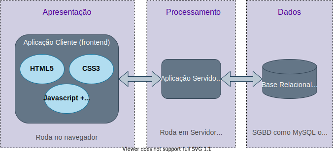
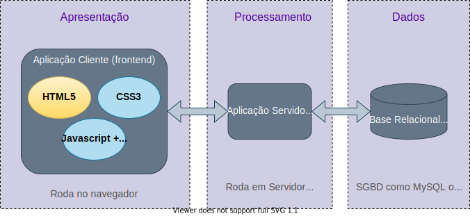
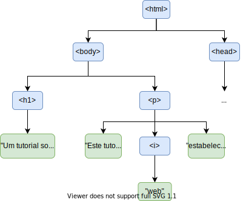
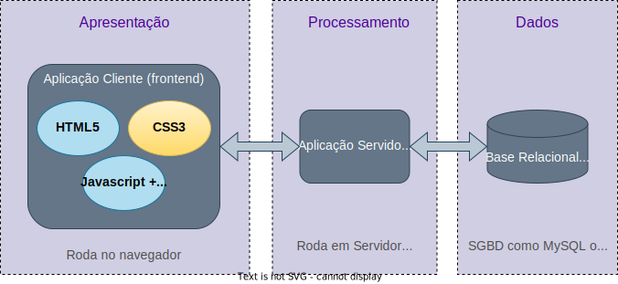

# Conceitos Básicos{.part}


# Aplicação Web: Definição

:::::{.columns}
::::{.column style="width:45%; padding-top: 100px;"}
- Aplicação computacional **distribuída**.
	- **Partes** executadas em **dispositivos diferentes**.
- Nomeadamente:
	- Cliente (navegador).
	- Servidor.
- Comunicação utiliza HTTP.
	- Requisições e respostas.
::::
::::{.column width=55%}

:::::::{.center}
{#appWeb width="50%"}
:::::::

::::

:::::

# Aplicações Web: Comunicação

- Protocolo HTTP:
	- Utilizado desde a década de 1990 para acesso web.
		- Inicialmente, conteúdos estáticos.
		- Adaptado ao dinamismo das aplicações web atuais.
	- Dois tipos básicos de mensagem:
		- **Requisição**: pedido feito pelo _browser_ ao servidor.
		- **Resposta**: retorno do servidor.
	- Mensagens operam sobre **objetos**:
		- **Recursos** armazenados ou disponibilizados pelo servidor.
		- Originalmente, ficheiros. Hoje, mais abstratos.

# O Protocolo HTTP {.part}


# O Protocolo HTTP: Requisições

- Diferentes tipos de pedido suportados.
- Os mais comuns:

| Tipo   | Descrição                                           |
| ------ | --------------------------------------------------- |
| GET    | Obter um objeto armazenado no servidor              |
| POST   | Enviar um dado a um objeto armazenado no servidor   |
| HEAD   | Similar ao GET, mas servidor envia apenas metadados |
| PUT    | Armazenar um objeto no servidor                     |
| DELETE | Remover um objeto atualmente armazenado no servidor |

# O Protocolo HTTP: Componentes de uma Requisição

- Requisição HTTP carrega uma série de informações. Exemplos:

| Componente         | Descrição                                              |
| ------------------ | ------------------------------------------------------ |
| Tipo de requisição | GET, POST, HEAD, ...                                   |
| Caminho do objeto  | Onde objeto é armazenado no servidor                   |
| Cabeçalhos         | Metadados da requisição (_e.g._, codificação esperada) |
| Corpo              | Dados a serem enviados ao servidor (se algum)          |


# O Protocolo HTTP: Respostas

:::::{.columns}
::::{.column  style="padding-top:0px; width: 50%;"}

- Resposta traz uma série de informações:
	- Status (sucesso, fracasso, explicações).
	- Metadados (_e.g._, tamanho da resposta, validade, codificação de caracteres)
	- Corpo (conteúdo requisitado, se houver).
- Servidor pode ou não conseguir atender a uma requisição.
	- Informado no campo de _status_.
	- Alguns exemplos de valores comuns na tabela:
::::
::::{.column width=5%}
<br>
::::
::::{.column width=45%}

:::{.center style="font-size: 20px; line-height: 12px;"}

| Código | Descrição                       |
| ------ | ------------------------------- |
| 2XX    | Sucesso                         |
| 200    | Objeto retornado                |
| 204    | Nenhuma resposta necessária     |
| 3XX    | Redirecionamento                |
| 301    | Objeto foi movido               |
| 304    | Objeto não foi modificado       |
| 4XX    | Erro do cliente                 |
| 401    | Acesso não autorizado           |
| 404    | Objeto não encontrado           |
| 5XX    | Outros erros                    |
| 500    | Erro interno do servidor        |
| 501    | Funcionalidade não implementada |

:::
::::

:::::

# O Protocolo HTTP: Exemplo de Interação

:::::{.columns}
:::{.column width=70%}
:::{.center}
{#requisicaoSimples}
:::
:::
:::{.column style="width: 30%; padding-top: 10%;"}
- Detalhes:
	- Servidor: `www.midiacom.uff.br`.
	- Requisição do tipo `GET`.
	- _Status_ da resposta 200.
	- Corpo contém HTML do objeto requisitado.
:::
:::::

# Aplicações Web: _Frontend_

- Porção da aplicação executada no _browser_.
- Funções típicas:
	- Renderização do conteúdo.
	- Interface (entrada e saída) com o usuário.
	- Pequenos processamentos.
		- Em geral, para dinamização do conteúdo exibido.

- Três linguagens tipicamente envolvidas:
	- HTML: renderização (estrutura do documento).
	- CSS: renderização (estilo do documento).
	- **Javascript**: processamento (dinamização do documento).

# Aplicações Web: _Backend_

:::::{.columns}
::::{.column width=50%}
- Porção da aplicação executada no servidor.
- Funções típicas:
	- Armazenamento de dados.
	- Processamento de regras de negócio.
	- Armazenamento e serviço de conteúdos estáticos.
		- Logotipos, _scripts_, folhas de estilo, ...
::::
::::{.column width=50%}
- Várias linguagens/tecnologias populares:
	- CGI (pouco ou não usado atualmente).
	- PHP.
	- ASP/C# (.net).
	- JSP/Servlets/JSF (Java).
	- Node.js.
	- Ruby.
	- **Flask (Python)**.
	- ...
::::

:::::

# Um Exemplo de Sistema Web

:::::::{.center}
{#appWeb width="80%"}
:::::::

# Começamos por HTML...

:::::::{.center}
{#appWeb width="80%"}
:::::::

# HTML {.part}


# HTML: Visão Geral

:::::{.columns}
::::{.column width=50%}
- Linguagem de **marcação** para documentos **hipertexto**.
	- **Marcação**: anotação feita no conteúdo para alterar suas propriedades.
		- _e.g._, fonte, cor de fundo, tamanho, ...
	- **Hipertexto**: texto que contém referências a outros textos, imagens, sons, ...
::::
::::{.column width=50%}
- Permite criar documentos contendo:
	- Texto.
	- Formatações especiais.
	- Imagens.
	- Tabelas.
	- Vídeos.
	- Sons.
	- Referências a outros documentos.
	- ...
::::

:::::

# HTML: Estrutura de um Documento (I)

- No nível mais alto de abstração, documento HTML contém duas seções:
	- `head`: 
		- Metadados.
		- Configurações.
		- Definições gerais.
	- `body`:
		- O conteúdo textual propriamente dito.


```{.html .numberLines style="width: 40%; position: absolute; right: 60px; bottom: 80px; font-size: 18px;"}
<html>
	<head>
		...
	</head>

	<body>
		...
	</body>
</html>
```

# HTML: Estrutura de um Documento (II)

:::::{.columns}
:::{.column width=60%}

- Documento organizado de forma hierárquica (em árvore).
- Cada nó da hierarquia corresponde a uma _tag_.
	- Exemplo: `<nomeDaTag> filhos </nomeDaTag>`.
- _Tags_ são aninhadas, criando a hierarquia.

```{.html .numberLines style="font-size: 18px;"} 
<html>
	<head>
	</head>

	<body>
		<h1>Um tutorial sobre HTML</h1>

		<p>Este documento <i>web</i> estabelece alguns...</p>
	</body>
</html>
```

:::
:::{.column width=40%}
- Hierarquia:

{style="width: 90%;"}

:::
:::::

# HTML: _Tags_ Aplicáveis ao `head`

| Nome da _Tag_ | Propósito                                            |
| ------------- | ---------------------------------------------------- |
| `script`      | Carrega ou define _script_ executado sobre a página  |
| `title`       | Define um título para a página                       |
| `style`       | Define estilos aplicados aos elementos da página     |
| `meta`        | Define metadados sobre a página                      |
| `link`        | Carrega algum recurso externo à página (_e.g._, CSS) |

# HTML: _Tags_ Típicas de Formatação

:::::{.columns}
:::{.column width=47%}
::::{style="font-size: 16px; line-height: 90%; padding-top: 2%;"}
| Nome da _Tag_         | Propósito                                                    |
| --------------------- | ------------------------------------------------------------ |
| `h1`, `h2`, ..., `h6` | Definir cabeçalhos (_e.g._, de seções)                       |
| `i`, `b`, `s`, `u`    | Fonte em itálico, negrito, tachado, sublinhado               |
| `p`                   | Define um parágrafo                                          |
| `table`               | Define uma tabela                                            |
| `th`                  | Define a linha de cabeçalho de uma tabela                    |
| `tr`                  | Define uma linha normal de tabela                            |
| `td`                  | Define uma célula em uma linha de tabela                     |
| `br`                  | Quebra uma linha                                             |
| `span`                | Define um trecho de texto (_e.g._, para formatação especial) |
| `a`                   | Cria um hiperlink para outro documento                       |
| `ul`, `ol`            | Criam listas de itens (sem ou com numeração)                 |
| `li`                  | Cria um item em uma lista.                                   |

::::
:::
:::{.column width=53%}

```{.html .numberLines style="font-size: 14px;"}
<html>
	<head>
	</head>
	<body>
		<h1>Título</h1>
        <h2>Seção</h2>
        Uma <b>tabela</b>:<br>
		<table>
            <tr><th>Col 1</th><th>Col 2</th></tr>
            <tr><td><s>val 1</s></td><td><u>val 2</u></td></tr>
            <tr><td><a href="outraPagina.html">val 3</a></td><td>val 4</td></tr>
        </table>
		<ul><li>Um item</li><li>Segundo item</li></ul>
	</body>
</html>
```

<iframe src="iframes/Exemplo1.html" style="width: 90%; height: 280px;">

</iframe>

:::
:::::

# HTML: _Tags_ de Elementos Multimídia

:::::{.columns}
:::{.column width=50%}

| Nome da _Tag_ | Propósito          |
| ------------- | ------------------ |
| `img`         | Inserção de imagem |
| `video`       | Inserção de vídeo  |
| `audio`       | Inserção de áudio  |

:::
:::{.column width=50%}

```{.html .numberLines style="font-size: 14px;"}
<html>
	<head>
	</head>
	<body>
		</img>
	</body>
</html>
```

<iframe src="iframes/Exemplo2.html" style="width: 90%; height: 220px;">

</iframe>

:::
:::::

# HTML: Campos das _Tags_

- Várias _tags_ recebem parâmetros através de seus **campos**.
- Os campos são do tipo `nomeCampo="valor"` e aparecem após o nome da _tag_.
	- Exemplo: ``
	- Campo `src` define o caminho da imagem a ser exibida.
- Cada _tag_ tem seus campos possíveis padronizados.
<!--	- Alguns exemplos típicos: -->

::::{.center style="font-size: 15px; line-height: 80%;"}
| Nome do campo | Propósito                                    | Algumas _tags_ às quais se aplica |
| ------------- | -------------------------------------------- | --------------------------------- |
| `src`         | Caminho do recurso associado ao elemento     | `img`, `audio`, `video`, `script` |
| `id`          | Define identificador do elemento             | Muitos                            |
| `class`       | Associa elemento a uma classe                | Muitos                            |
| `style`       | Altera características de estilo do elemento | Muitos                            |
| `width`       | Configura a largura do elemento              | Muitos                            |
| `height`      | Configura a altura do elemento               | Muitos                            |
::::

# HTML: Campos das _Tags_ (Exemplo)

:::::{.columns}
:::{.column width=50%}

```{.html .numberLine style="font-size: 16px;"}
<html>
	<head>
	</head>
	<body>
        <table class="tipoTabela" id="tab1" width="50px">
            <tr><th>Col 1</th><th>Col 2</th></tr>
            <tr><td><s>val 1</s></td><td><u>val 2</u></td></tr>
            <tr><td>val 3</td><td>val 4</td></tr>
        </table>

        <table class="tipoTabela" id="tab2" style="width: 150px">
            <tr><th>Col 1</th><th>Col 2</th></tr>
            <tr><td><s>val 1</s></td><td><u>val 2</u></td></tr>
            <tr><td>val 3</td><td>val 4</td></tr>
        </table>

    </body>
</html>
```

:::
:::{.column width=50%}

<iframe src="iframes/Exemplo3.html" style="width: 90%; height: 220px;">

</iframe>

:::
:::::


# HTML: A _Tag_ `div`


::::{}
- Um `div` é um elemento que agrega outros elementos.
	- Cria uma **divisão** no documento contendo uma parte do conteúdo.
- São muito úteis para organizar logicamente o documento.
- Em certas situações, permitem também aplicar regras de estilo a vários elementos de uma só vez.
	- Os elementos filhos do `div`.

::::

:::::{.columns}
:::{.column width=50%}

```{.html .numberLine style="font-size: 16px;"}
<html>
	<head>
	</head>
	<body>
        <div style="color: red; border: 1px solid;">
            <p>Primeiro parágrafo</p>
            <p>Segundo parágrafo</p>
        </div>
    </body>
</html>
```


:::
:::{.column width=50%}

<iframe src="iframes/Exemplo4.html" style="width: 90%; height: 220px;">

</iframe>

:::
:::::

# HTML: Formulários (I)

- Criados com a _tag_ `form`.
- Permitem obter entradas do usuário.
	- Em geral, para envio ao servidor.
- Podem conter elementos como botões, entradas de texto, _checkboxes_, _radiobuttons_, ...
	- Criados com a _tag_ `input`, variando-se o campo `type`.
	- Exemplos:

::::{.center style="font-size: 15px; line-height: 80%;"}
| `type`     | Propósito              | Exemplo                                        |
| ---------- | ---------------------- | ---------------------------------------------- |
| `button`   | Cria um botão          | `<input type="button" value="Carregue aqui!">` |
| `text`     | Cria uma caixa de texto | `<input type="text">`                         |
| `password` | Cria uma caixa de palavra-passe | `<input type="password">`  |
| `checkbox` | Cria um _checkbox_     | `<input type="checkbox" value="opcao1">`       |
::::


# HTML: Formulários (II)

::::{}
- Na maioria dos casos, um `input` pode/deve ter um `label` associado.
	- Associa um texto ao `input`.
- Exemplo:

::::

:::::{.columns}
:::{.column width=50%}

```{.html .numberLines style="font-size: 16px;"}

<html>
	<head>
	</head>
	<body>
        <form>
            <label for="fname">Nome:</label>
            <input type="text" id="nome"><br><br>
            <label for="lname">Apelido:</label>
            <input type="text" id="apelido"><br><br>            
            <input type="checkbox" id="pais1" value="Angola">
            <label for="pais1">Nasci em Angola</label><br>
            <input type="checkbox" id="pais2" value="Brasil">
            <label for="pais2">Nasci no Brasil</label><br>
            <input type="checkbox" id="pais3" value="Portugal">
            <label for="pais3">Nasci em Portugal</label>
        </form> 
	</body>
</html>

```

:::
:::{.column width=50%}

<iframe src="iframes/Exemplo5.html" style="width: 90%; height: 220px;">

</iframe>

:::
:::::

# HTML: Submetendo um Formulário (I)

- Informações de formulário são geralmente submetidas a algum objeto HTTP.
	- Um _software_ do _backend_ responsável por processá-lo.
- No HTML, isso é feito em duas partes:
	1. Preenchimento do campo `action` do elemento `form`.
	2. Inclusão de um `input` de tipo `submit`.

# HTML: Submetendo um Formulário (II)

:::::{.columns}
:::{.column width=55%}

```{.html .numberLines style="font-size: 18px;"}
<html>
	<head>
	</head>
	<body>
        <form action="/processaForm.php">
            <label for="nome">Nome:</label>
            <input type="text" id="nome"><br><br>
            <label for="apelido">Apelido:</label>
            <input type="text" id="apelido"><br><br>            
            <input type="checkbox" id="pais1" value="Angola">
            <label for="pais1">Nasci em Angola</label><br>
            <input type="checkbox" id="pais2" value="Brasil">
            <label for="pais2">Nasci no Brasil</label><br>
            <input type="checkbox" id="pais3" value="Portugal">
            <label for="pais3">Nasci em Portugal</label><br>
            <input type="submit" value="Enviar">
          </form> 
	</body>
</html>
```


:::
:::{.column width=45%}
<br> <br>
<iframe src="iframes/Exemplo6.html" style="width: 90%; height: 220px;">

</iframe>
:::
:::::

# HTML: Criando um Simples Botão

- Botão é útil para criar interação com o usuário e disparar eventos.
- Existe input com o type="button".

```{.html .numberLines style="font-size: 18px;"}
	        <input type="button" value="Clique aqui");">

```

- Existem também a _tag_ **button**.

```{.html .numberLines style="font-size: 18px;"}
			<button type="button">Clique aqui!</button>
```

# Agora, avançamos para CSS...

:::::::{.center}
{#appWeb width="80%"}
:::::::

# CSS {.part}

# CSS: _Cascading Style Sheets_

- Linguagem usada para aplicar estilos a elementos HTML.
- Permite alterar **diversas** propriedades:
	- Cor, fonte, espaçamento, fundo, ...
- Pode ser usada de três formas:
	1. Diretamente no campo `style` do elemento.
		- Exemplo: `<p style="color: blue;">Algum texto</p>`.
	2. Como conteúdo de uma _tag_ `style` (geralmente no `head`).
	3. Como um ficheiro separado carregado através da _tag_ `link` no `head`.

::::::{.block .centered}
:::{.blocktitle}
Observação
:::
- Duas últimas formas permitem aplicar o mesmo estilo a múltiplas instâncias de uma _tag_ de uma única vez.
::::::

# CSS: Propriedades e Valores

- A sintaxe para alterar um aspecto de estilo de um elemento é simples.
	- Usa a notação `nome-da-propriedade: valor;`
- Cada elemento HTML tem propriedades padronizadas.
- Cada propriedade aceita valores de determinados tipos.
- Exemplos:

::::{.center style="font-size: 15px; line-height: 80%;"}
| Nome da Propriedade | Propósito                                  | Exemplo                 |
| ------------------- | ------------------------------------------ | ----------------------- |
| `width`             | Largura do elemento                        | `width: 70px;`          |
| `height`            | Altura do elemento                         | `height: 50px;`         |
| `color`             | Cor (do elemento ou da fonte)              | `color: green;`         |
| `font-size`         | Tamanho da fonte                           | `font-size: 12px;`      |
| `border`            | Cor, tipo e espessura da borda do elemento | `border: 1px red solid` |
::::

# CSS: Seletores (I)

- Quando usado em um ficheiro separado ou dentro de um `<style>`, devemos indicar a qual ou quais elementos estamos nos referindo.
	- Feito através dos **seletores**.
- Nesses contextos, código CSS toma a seguinte formal geral:

```{.css .numberLines style="font-size: 16px;"}
seletor [, seletor2, ...][:pseudo-classe] {
  propriedade: valor;
 [propriedade: valor;
  ...]
}

seletor [, seletor2, ...][:pseudo-classe] {
  propriedade: valor;
 [propriedade: valor;
  ...]
}

/* Podemos ter um número arbitrário de blocos como os acima. */
```

- Seletores especificam elementos aos quais as regras de um bloco se aplicam.

# CSS: Seletores (II)

- Mas qual é o formato de um seletor?
	- _i.e._, como especificar os elementos selecionados?
- De forma simplificada, elementos pode ser selecionados através:
	1. De seu **id** (**elemento específico**); ou
	2. De seu **tipo** (**todos os elementos daquele tipo**); ou
	3. De sua class (**todos os elementos de uma class**).
- É possível também fazer combinações desses critérios.
<!-- - Exemplos: -->

::::{.center style="font-size: 15px; line-height: 80%;"}
| Seletor       | Descrição                                                      |
| ------------- | -------------------------------------------------------------- |
| p             | Seleciona **todos** os elementos `<p>` no documento            |
| #meuElemento  | Seleciona o elemento de **id** `meuElemento`                   |
| .minhaClasse  | Seleciona **todos** os elementos da classe `minhaClasse`       |
| p.minhaClasse | Seleciona **todos** os elementos `<p>` da classe `minhaClasse` |
::::

# CSS: Um Exemplo

:::::{.columns}
:::{.column width=50%}

```{.html .numberLines style="font-size: 16px;"}
<html>
	<head>
        <style>
            table {color: blue;}
            table, td, th {
				border: 1px solid; 
				border-collapse: collapse;
			}
            .tabelaEspecial {color: red;}
            #tab3 {color: green;}
        </style>
	</head>
	<body>
        <table id="tab1">
            <tr><th>Col 1</th><th>Col 2</th></tr>
            <tr><td><s>val 1</s></td><td><u>val 2</u></td></tr>
        </table>

        <table class="tabelaEspecial" id="tab2">
            <tr><th>Col 1</th><th>Col 2</th></tr>
            <tr><td><s>val 1</s></td><td><u>val 2</u></td></tr>
        </table>

        <table class="tabelaEspecial" id="tab3">
            <tr><th>Col 1</th><th>Col 2</th></tr>
            <tr><td><s>val 1</s></td><td><u>val 2</u></td></tr>
        </table>
    </body>
</html>
```


:::
:::{.column width=50%}

<iframe src="iframes/Exemplo7.html" style="width: 90%; height: 220px;">

</iframe>

:::
:::::

# CSS: Seletores Baseados em Hierarquia

- Quarta forma de selecionar elementos:
	- Posição na hierarquia do documento.
	- Relações com outros elementos.
	- Exemplos:
		- "Selecione elementos do tipo `p` filhos de elementos do tipo `div`".
		- "Selecione elementos do tipo `p` descendentes de elementos do tipo `div`".
		- "Selecione elementos do tipo `p` que são os terceiros filhos de seus pais.
		 
# CSS: Exemplos de Seletores Baseados em Hierarquia

:::::::{.center style="font-size: 15px; line-height: 80%;"}

| Seletor          | Descrição                                                                    |
| ---------------- | ---------------------------------------------------------------------------- |
| `div` > `p`      | Seleciona elementos `<p>` filhos diretos de elementos `<div>`                |
| `div` `p`        | Seleciona elementos `<p>` descendentes (diretos ou não) de elementos `<div>` |
| `div` + `p`      | Seleciona elementos `<p>` declarados imediatamente após elementos `<div>`    |
| `div` ~ `p`      | Seleciona elementos `<p>` declarados após elementos `<div>`                  |
| `p`:first-child  | Seleciona elementos `<p>` que sejam o primeiro filho de seus pais            |
| `p`:last-child   | Seleciona elementos `<p>` que sejam o último filho de seus pais              |
| `p`:nth-child(n) | Seleciona elementos `<p>` que sejam o n-ésimo filho de seus pais             |
| `p`:empty        | Seleciona elementos `<p>` que não tenham filhos.                             |


:::::::

# CSS: Outros Seletores Úteis

- A gama de seletores disponíveis é bem grande. Outros exemplos:


:::::::{.center style="font-size: 15px; line-height: 80%;"}

| Seletor               | Descrição                                                                               |
| --------------------- | --------------------------------------------------------------------------------------- |
| `p[title]`            | Seleciona elementos `<p>` que possuam o atributo `title` definido                       |
| `p[title="teste"]`    | Seleciona elementos `<p>` cujo atributo `title` tenha valor "teste"                     |
| `*`                   | Seleciona **todos** os elementos do documento                                           |
| `p:not(.minhaClasse)` | Seleciona elementos `<p>` que não sejam da classe `minhaClasse`                         |
| `input:checked`       | Seleciona elementos do tipo `input` que estão no estado marcados (_e.g._, _checkboxes_) |


:::::::

# CSS: Carragando CSS de um Ficheiro Externo

- Em geral, melhora a organização.
- Carregamento feito na seção `head`:


```{.html .numberLines style="font-size: 16px;"}
<html>
	<head>
		<link href="caminho/para/o/ficheiro.css" rel="stylesheet" type="text/css">
	</head>
	<body>
		...
    </body>
</html>			
```

# Exercício

1. Criar uma página HTML simples de registo.
	- Campos: e-mail, nome do utilizador e palavra-passe.
	- Botão para cancelar e outro para enviar (ainda sem ação associada).
2. Criar uma página HTML simples de login.
	- Campos: e-mail e palavra-passe.
	- Checkbox "Lembrar-me" (ainda sem ação associada).
	- Botão para cancelar e outro para enviar (ainda sem ação associada).
3. Criar um ficheiro de estilo para cada página (um para cada ou apenas um para os dois).
