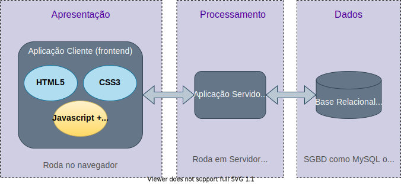

# Estudaremos Agora o Javascript...

:::::::{.center}
{#appWeb width="80%"}
:::::::

# Javascript {.part}

# Javascript: Conceitos Básicos

- Linguagem **interpretada** pelo _browser_.
- Permite **execução** de códigos que **interagem com o HTML/CSS** da página.
	- Leitura e modificação.
	- Alteração de conteúdo e/ou forma.
	- Associação de funções Javascript a eventos da página.
- Permite dinamismo sem (necessariamente) envolvimento do servidor.
	- Baixa latência.
	- **Bom tempo de resposta**.

::::::{.block .centered}
:::{.blocktitle}
Node.js
:::
- Ambiente para execução de Javascript em _backend_.
::::::


# Javascript: Características

- Sintaxe similar a Java, C.
	- Embora com várias peculiaridades.
- Suporta paradigmas **imperativo**, **orientado a objetos** e **funcional**.
- Tipagem dinâmica:
	- Variáveis podem ter tipos diferentes em momentos diferentes com base em seus valores atuais.
- _Case-sensitive_: maiúsculas e minúsculas **fazem diferença**.

# Javascript: _Hello World_

```{.html .numberLines style="font-size: 20px;"}
<html>
	<head>
        <script type="text/javascript">
			alert("Hello World!");
        </script>
	</head>
	<body>
	</body>
</html>
```

<iframe src="iframes/HelloWorld.html" style="width: 90%; height: 50px; border: 0;">

</iframe>

# Javascript: Comentários

- Idêntico a C, Java.
- Dois tipos:
	- Comentários de linha: qualquer coisa após `//` até o final de uma linha.
	- Comentários de bloco: qualquer coisa entre `/*` e `*/`.

# Javascript: Variáveis

- Devem **sempre** ser declaradas antes da primeira utilização.
- Há três formas:
	- Com `const`: variável com valor constante, somente leitura.
	- Com `var`: variável que pode ser lida ou escrita declarada no escopo da função ou global.
	- Com `let`: variável que pode ser lida ou escrita declarada no escopo do bloco atual.
- Nos três casos, a declaração é similar:

```{.javascript .numberLines style="font-size: 18px;"}
var a, b = 3;
const c = 50;
let d;
```

- Por ora, focaremos nas variáveis declaradas com `var`.

# Javascript: Operadores

- Operadores básicos em Javascript são os mesmos de C, Java.
	- Mas há operadores adicionais.

:::::{.columns}
:::{.column width=33%}

:::::::{.center}
**Aritméticos**

::::{.center style="font-size: 15px; line-height: 80%;"}
| Operador | Descrição                |
| -------- | ------------------------ |
| `+`      | Soma                     |
| `*`      | Multiplicação            |
| `-`      | Subtração                |
| `/`      | Divisão                  |
| `%`      | Resto da divisão inteira |
| `++`     | Incremento               |
| `--`     | Decremento               |
| `**`     | Exponenciação            |
::::

:::::::
:::
:::{.column width=33%}

:::::::{.center}
**Lógicos/Booleanos**

::::{.center style="font-size: 15px; line-height: 80%;"}
| Operador | Descrição |
| -------- | --------- |
| `&&`     | `and` lógico    |
| `||`     |  `or` lógico    |
| `!`      | `not` lógico    |
::::
:::::::

:::

:::{.column width=33%}

:::::::{.center}
**Comparação**

::::{.center style="font-size: 15px; line-height: 80%;"}
| Operador | Descrição                |
| -------- | ------------------------ |
| `==`     | Igual a (valor)          |
| `===`    | Igual e mesmo tipo       |
| `!=`     | Diferente (valor)        |
| `!==`    | Diferente (valor e tipo) |
| `<`      | Menor que                |
| `>`      | Maior que                |
| `<=`     | Menor ou igual           |
| `>=`     | Maior ou igual           |
::::
:::::::

:::
:::::

# Javascript: Comparações de Tipo

- Atenção aos operadores `===` e `!==`:
	- Não existem em Java, C.
	- Nem sempre têm o mesmo efeito dos operadores `==` e `!=`.
- Exemplo:

```{.javascript .numberLines style="font-size: 20px;"}
var a = 0;
var b = "";
alert("a == b? " + (a == b));
alert("a === b? " + (a === b));
```

<iframe src="iframes/IgualMesmoTipo2.html" style="width: 100%; height: 50px; border: 0;">

</iframe>

# Javascript: Afetação

- Variáveis podem ter seus valores alterados através da operação de afetação.
	- Exceto pelas declaradas com `const`!
	- Resulta em exceção/erro de execução.
- Operador de afetação é o caractere `=`, comando de afetação sempre terminado em `;`.
- O valor apetado pode ser uma outra variável, uma constante literal, ou qualquer expressão (_e.g._, lógica, aritimética).
- Afetação pode ser combinada com operadores aritméticos.

```{.javascript .numberLines style="font-size: 20px;"}
var a, b = 3;
var c;

a = 15;
a += a - b**2;
a /= 3;
```

# Javascript: Strings

:::::{.columns}
:::{.column width=60%}

- Permitem armazenar informações textuais.
- Denotadas por sequências de caracteres entre aspas.
	- Duplas ou simples:
		- `"uma string"`.
		- `'outra string'`.
- Podem ser concatenadas com o operador `+`: 
	- `"string" + " concatenada"`.
- Comprimento de uma string pode ser verificado com a propriedade `length`.
:::

:::{.column width=2%}
:::

:::{.column width=38%}

- Exemplo:

```{.javascript .numberLines style="font-size: 20px;"}
var a = "Teste "
var b = "Javascript";
var mensagemCompleta = a + b;
var l = mensagemCompleta.length;
console.log("Tamanho: " + l)
```
:::
:::::

# Javascript: Estruturas de Seleção

:::::{.columns}
:::{.column width=60%}
- Testes de condições podem ser feitos com:
	- Estruturas do tipo `if/else`.
	- Estruturas do tipo `switch/case`.
	- O operador ternário `?`.
- Em todos os casos, sintaxe idêntica a de linguagens como C e Java.
:::

:::{.column width=40%}

- Exemplos:

```{.javascript .numberLines style="font-size: 18px;"}
if (a > 0) b = 3;
if (c == 4 && b <= 1) {
	a += 10;
}
else a -= 10;
```

```{.javascript .numberLines style="font-size: 18px;"}
switch(a) {
	case 1:
		b = 10;
		break ;
	case 2:
		b *= 2;
		break ;
	default: 
		b = 0;
}
```

```{.javascript .numberLines style="font-size: 18px;"}
b = (a < 0) ? -a : a; 
```

:::

:::::

<!--
# Javascript: Pontos de Atenção com Estruturas de Seleção 

:::::{.columns}
:::{.column width=50%}

:::::::{.center}
### if
:::::::

- Uso do `else` é opcional.
- Tanto no `if` quanto no `else` pode-se usar **chavetas**.
	- Definem **bloco** de comandos a ser executados em cada caso.
	- Se for um único comando, chavetas são opcionais.

:::
:::{.column width=50%}

:::::::{.center}
### switch/case
:::::::
- Cláusula `default`: 
	- Executada se nenhuma condição é verdadeira.
- Palavra-chave `break`:
	- Sai imediatamente do `switch/case`.
	- Sem `break`, **execução continua** para as linhas abaixo, **mesmo associadas a outras condições**:

```{.javascript .numberLines style="font-size: 16px;"}
switch(a) {
	case 1:
		b = 10; // b recebe 10 aqui, mas execução continua.
	case 2:
		b *= 2; // Executado mesmo se a == 1.
		break ;
	default: 
		b = 0;
}
```	

:::
:::::
-->

# Javascript: Estruturas de Repetição

- Linguagem suporta repetições definidas e indefinidas:
	- Definidas usando a palavra-chave `for`.
		- Iteração por uma quantidade definida de elementos.
	- Indefinidas usando a palavra-chave `while` ou a construção `do/while`.
		- Não se sabe _a priori_ quantas iterações haverá.

# Javascript: Repetições com `for`


:::::{.columns}

:::{.column width=50%}

- Ao contrário de C, Javascript tem três variantes do `for`.
	- O `for` "básico".
	- O `for in`.
	- O `for of`.
- Num primeiro momento, focaremos apenas no primeiro caso.

:::

:::{.column width=50%}

:::::::{.center}
### Sintaxe Geral
:::::::

```{.javascript .numberLines style="font-size: 18px;"}
for (cmd1 ; cond ; cmd2) {
	// Bloco de código a ser executado.
}
```	

::::::{style="font-size: 20px;"}
- `cmd1` é executado **antes da primeira iteração**.
- `cond` é uma condição testada **antes de cada iteração**.
- `cmd2` é executado **após cada iteração**.
	- Mas **antes do teste** da condição.
::::::

:::

:::::

# Javascript: Exemplo de Repetição com `for`

- Calcular $\displaystyle\sum_{a=0}^{9}{a^2}$:
```{.javascript .numberLines style="font-size: 22px;"}
var a, b = 0;
for (a = 0; a < 10; a++) {
	b += a**2;
}
```	

<!--
- Nota: chavetas são opcionais se corpo da repetição tem apenas um comando.
-->

# Javascript: Repetição com `while`

- Sintaxe geral:

```{.javascript .numberLines style="font-size: 22px;"}
while(cond) {
	// Comandos
}
```	

<!--
- Nota: chavetas são opcionais se corpo da repetição tem apenas um comando.
-->
- Exemplo:
```{.javascript .numberLines style="font-size: 20px;"}
var a = 0, b = 0;
while (a < 10) {
	b += a**2;
	a++;
}
```	

# Javascript: Repetição com `do/while`

- Similar à repetição com `do`, mas teste é realizado **após** cada iteração.
	- Garante que **ao menos uma iteração** é executada.
- Sintaxe geral:

```{.javascript .numberLines style="font-size: 22px;"}
do {
	// Comandos
} while(cond);
```	

<!--
- Note: assim como no `if` e no `for`, chaves são opcionais se corpo da repetição tem apenas um comando.
-->
- Exemplo:
```{.javascript .numberLines style="font-size: 20px;"}
var a = 0, b = 0;
do {
	b += a**2;
	a++;
} while(a < 10);
```	

# Javascript: Funções

- A sintaxe para definição de funções é um pouco diferente em relação a C, Java:
```{.javascript .numberLines style="font-size: 22px;"}
function nome([arg1 [, arg2 [, ...]]]) {

	// Corpo da função
	// Opcionalmente, função pode retornar algo:
	return valor;
}
```	

::::::{.block .centered}
:::{.blocktitle}
Observações:
:::
- Funções podem ou não ter argumentos.
	- Ainda que tenham, tipos dos argumentos **não** são declarados.
- Funções podem ou não retornar valores.
	- Ainda que retornem valores, tipo do retorno **não** é declarado.
::::::

# Javascript: Chamada de Funções

- A sintaxe para chamada de funções é idêntica a C, Java:
```{.javascript .numberLines style="font-size: 22px;"}
nome([arg1 [, arg2 [, ...]]]);
```	

::::::{.block .centered}
:::{.blocktitle}
Observações
:::
- Se a função retorna algo, valor pode ser atribuído a uma variável.
	- Ou testada como parte de condição de `if` ou `while`.
::::::

# Javascript: Exemplo de Uso de Funções

```{.javascript .numberLines style="font-size: 22px;"}
function maior(a, b) {

	if (a > b) return(a);
	else return(b);
}

var a, b, c;

a = 13;
b = 5;
c = maior(a, b);
```	


# Javascript: Algumas Funções Nativas Úteis

| Função      | Propósito                            | Exemplo        |
| ----------- | ------------------------------------ | -------------- |
| string()    | Converte números em strings          | string(3)      |
| Number()    | Converte string em número            | Number("3")    |
| Math.sin()  | Calcula o seno do argumento          | Math.sin(3.14) |
| Math.cos()  | Calcula o coseno do argumento        | Math.cos(3.14) |
| Math.sqrt() | Calcula a raiz quadrada do argumento | Math.sqrt(17)  |


# Javascript: Funções de Saída

- Muitas vezes, é útil "imprimirmos" valores ou mensagens.
	- Para alertar o usuário de certas condições.
	- Ou para auxiliar na depuração do código.
- Duas funções simples para esse propósito:
	- `alert()`: apresenta uma caixa de alerta para o usuário com a mensagem especificada como argumento.
	- `console.log()`: imprime a mensagem especificada como argumento no _console_ do _browser_
- Exemplo da `console.log()`:

```{.javascript .numberLines style="font-size: 16px;"}
var a = 1;
console.log("O valor de a é: ");
console.log(a);
```	

<iframe src="iframes/consoleLog.html" style="width: 100%; height: 50px; border: 0;">

</iframe>

# Javascript: Função de Entrada Simples

- Para entrada, uma alternativa simples é usar o comando `prompt()`.
	- Irá aparecer uma janela para o usuário.
	- Valor do texto digitado é retornado.
	- Texto inserido entre parênteses aparece na janela.
- Exemplo:

```{.javascript .numberLines style="font-size: 16px;"}
var nome;
nome = prompt("Digite seu nome:");
alert('Olá ' + nome + '!')
```	

<iframe src="iframes/prompt.html" style="width: 100%; height: 50px; border: 0;">

</iframe>


# Javascript: Mais sobre Funções

- Em Javascript, funções são **valores de primeira classe**.
	- Funções podem:
		- Ser passadas como parâmetros de outras funções.
		- Ser retornadas como valores de retorno de outras funções.
		- Ser atribuídas e armazenadas em variáveis.
- Exemplo:

```{.javascript .numberLines style="font-size: 20px;"}
function sub(a, b) {
	return(a - b);
}
function soma(a, b) {
	return(a + b);
}
function sel(f1, f2, s) {
	return(s == 0 ? f1 : f2);
}
var f = sel(sub, soma, 1); // retorna função soma.
f(10, 4); // executa a função soma.
```	

# Javascript: Recursão

- Javascript também suporta **recursão**.
	- Função chama a própria função.
	- Gera-se uma repetição de chamadas de funções.
		- São necessários critérios de paragem para o término da recursão.
- Exemplo: calcular o Fibonacci de um dado n:
```{.javascript .numberLines style="font-size: 20px;"}
function fib(n) {
	if (n == 0) return 0;
	if (n == 1) return 1;
	return(fib(n-1) + fib(n-2));
}
var n = prompt("Fibonacci - Entre com n: ");
if (n >= 0)
	alert("Fib(" + n + ") = " + fib(n));
else
	alert("Não é possível calcular o fib(" + n + ")!");
```	

<iframe src="iframes/fib.html" style="width: 100%; height: 50px; border: 0;">

</iframe>


<!--
# Exercícios

1. Escreva um programa em JS e HTML que obtenha um número do usu
2.
-->

# Exercícios (I)

1. Crie uma página web simples que contenha um código Javascript que mostre a tabuada de 1 a 10.
	- Imprima o resultado no console do _browser_ ou use a função `alert()`.
3. Crie uma página web que contenha um código Javascript que calcule o fatorial de um número n.
	- Obtenha n com o comando `prompt()`.
	- Use repetição (`while` ou `for`) para calcuar o fatorial.
	- Mostre o resultado com a função `alert()`.
3. Altere o item anterior para usar recursão ao invés da repetição.

<!--
# Javascript e HTML

## Iteração com um botão

- Em HTML, podemos incluir um elemento chamado `button`.
-->

# Javascript: Objetos

- Frequentemente, variáveis em Javascript armazenam **objetos**.
- Objetos podem armazenar **múltiplos valores** na forma de **propriedades**:

```{.javascript .numberLines style="font-size: 16px;"}
var carro = {
	fabricante: "Fiat",
	modelo: "Punto",
	ano: 2015,
	portas: 4
};
```	

- Podemos acessar as propriedades de um objeto usando o operador `.` (_i.e._, ponto):
	- _e.g._, `carro.fabricante`.
- Notação alternativa:
	- `carro["fabricante"]`.

# Javascript: Métodos

- Objetos podem armazenar também funções.
	- Nesse caso, chamadas de **métodos**.
- Dentro do **escopo** de um método, palavra-chave `this` referencia o objeto que o contém.

```{.javascript .numberLines style="font-size: 16px;"}
var carro = {
	fabricante: "Fiat",
	modelo: "Punto",
	ano: 2015,
	portas: 4,
	log: function() {
		console.log(this.fabricante + " " + this.modelo + " fabricado em " + string(this.ano));
	} 
};
```	

- Podemos executar o método de um objeto usando o operador `.` (_i.e._, ponto):
	- _e.g._, `carro.log()`.

# Javascript: Vetores

- Vetores permitem armazenar sequências ou conjuntos de valores relacionados.
- Para incializar um vetor vazio, há várias formas:
```{.javascript .numberLines style="font-size: 16px;"}
var vetorA = [];
var vetorB = Array();
```	
- Pode-se também criar um vetor já preenchido:
```{.javascript .numberLines style="font-size: 16px;"}
var carros = ["Fiat", "BMW", "Volvo"];
var outrosCarros = Array("Fiat", "BMW", "Volvo");
```	

# Javascript: Acesso a Elementos de Vetores

- Elementos de um vetor são referenciados por seu índice usando parênteses retos:
```{.javascript .numberLines style="font-size: 16px;"}
console.log(carros[1]);
```	
- Note que os índices são contados **a partir do 0**.
- Elementos também podem ser adicionados livremente com essa notação:
```{.javascript .numberLines style="font-size: 16px;"}
var carros = ["Fiat", "BMW", "Volvo"];
carros[3] = "Opel";
carros[10] = "Jeep";
```	

# Javascript: Outras Caracterísitcas dos Vetores

::::::{.block .centered}
:::{.blocktitle}
Importante
:::
- Assim como variáveis, vetores em Javascript não tem um tipo explícito.
- Logo, um mesmo vetor pode armazenar, em dado momento, elementos de vários tipos!
- Exemplo:

```{.javascript .numberLines style="font-size: 16px;"}
var carros = ["Fiat", "BMW", "Volvo"];
carros[3] = 57;
```	

::::::

- Internamente, vetores são armazenados como objetos.
- Uma das propriedades armazenadas é a `length`.
	- Armazena o tamanho atual do vetor.

# Javascript: Repetições com `for...of`

- A estrutura `for ... of` varre elementos de um objeto **iterável**.
	- _e.g._, um vetor.
- Sintaxe geral:
```{.javascript .numberLines style="font-size: 16px;"}
for (variavel of vetor) {
  // Faça algo com 'variavel'
}
```	
- Exemplo:

```{.javascript .numberLines style="font-size: 16px;"}
var carros = ["Fiat", "BMW", "Volvo"];
var carro;
for (carro of carros) alert(carro);
```	

<iframe src="iframes/forOf.html" style="width: 100%; height: 50px; border: 0;">

</iframe>

# Javascript: Repetições com `for...in`

- Similar ao `for...of`, mas itera por **propriedades de um objeto**.
- Exemplo:

```{.javascript .numberLines style="font-size: 16px;"}
var carro = {
	fabricante: "Fiat",
	modelo: "Punto",
	ano: 2015,
	portas: 4,
};
var i;
for (i in carro) alert(i + ": " + String(carro[i]));
```	

<iframe src="iframes/forIn.html" style="width: 100%; height: 50px; border: 0;">

</iframe>

::::::{.block .centered}
:::{.blocktitle}
Importante
:::
- Propriedades são percorridas na ordem em que foram incluídas no objeto.
::::::

# Javascript: Escopo de Função

- Até 2015, um código Javascript só possuia dois escopos:
	- Global.
	- Função.
	- _i.e._, variáveis declaradas dentro de uma função são diferentes das globais.

```{.javascript .numberLines style="font-size: 16px;"}
var a = 3;
function f1() {
	var a = 5;
	alert("Em f1, a = " + String(a));
}
function f2() {
	alert("Em f2, a = " + String(a));
}
f1();
f2();
```	

<iframe src="iframes/escopoFuncao.html" style="width: 100%; height: 50px; border: 0;">

</iframe>

# Javascript: Escopo de Bloco

- Atualmente, Javascript conta também com os **escopos de blocos**
	- **Chavetas** definem um novo bloco.
		- Inclusive em estruturas de **seleção** e **repetição**.
	- Variáveis declaradas com `let` pertencem apenas ao escopo do bloco.

```{.javascript .numberLines style="font-size: 16px;"}
var a = 1;
{
	let a = 5;
	alert("Dentro do bloco, a = " + String(a));
}
alert("Fora do bloco, a = " + String(a));
```	

<iframe src="iframes/escopoBloco.html" style="width: 100%; height: 50px; border: 0;">

</iframe>

- Uso típico em repetições:

```{.javascript .numberLines style="font-size: 16px;"}
var i = 5;
...
for (let i = 0; i < 10; i++){
	...
}
```	

# Javascript: `const`

- Como `var` e `let`, a palavra-chave `const` permite declarar variáveis.
- Como `let`, variáveis declaradas com `const` são de escopo de bloco.
- Diferente das outras duas, `const` torna a variável **somente-leitura**.
	- _i.e._, não pode ser atribuída após a inicialização.

```{.javascript .numberLines style="font-size: 16px;"}
const a = 4;
a = 1;	// Resulta em erro!
```	

<iframe src="iframes/constErro.html" style="width: 100%; height: 50px; border: 0;">

</iframe>

::::::{.block .centered}
:::{.blocktitle}
Importante
:::
- `const` torna a variável somente-leitura, mas não necessariamente imutável!
::::::

# Javascript: Alterando Variável Declarada com `const`


```{.javascript .numberLines style="font-size: 16px;"}
const a = ["Fiat", "Jaguar"];
const b = {prop1 : 10, prop2 : 20};
a[0] = "Honda";	// Sem em erro!
console.log(a);
b.prop1 = 50; // Sem erro!
b["prop3"] = 100; // Sem erro!
console.log(b);
a = []; // Erro!
```	

<iframe src="iframes/constMutavel.html" style="width: 100%; height: 50px; border: 0;">

</iframe>

# Javascript: Temporizadores

- Em alguns casos, queremos executar após um determinado tempo.
- Para isso, criamos um **temporizador**, associamos uma duração e uma _callback_.
	- Feito com a função `setTimeout()`.
	- Retorna um objeto representando o temporizador.
- Podemos cancelar o temporizador criado usando a função `clearTimeout()`.

# Javascript: Exemplo de Temporizador

```{.javascript .numberLines style="font-size: 16px;"}
var timer;
var vezes = 0;
timer = setTimeout(timerCallback, 1000);
function timerCallback() {
	alert("Vezes = " + String(++vezes));
	if (vezes == 3)
		clearTimeout(timer);
	else
		timer = setTimeout(timerCallback, 1000);
}
```

<iframe src="iframes/Temporizador.html" style="width: 100%; height: 50px; border: 0;">

</iframe>

# Javascript: Parâmetros por Valor e Referência

- Via de regra, parâmetros são passados por **valor**:
```{.javascript .numberLines style="font-size: 15px;"}
var a = 1;
function f(arg) {
	arg *= 3;
	alert("Na função, arg = " + String(arg));
}
f(a);
alert("Após a função, a = " + String(a));
```

<iframe src="iframes/PassagemParametro.html" style="width: 100%; height: 35px; border: 0;">

</iframe>

- Entretanto, **objetos**  e **vetores** são passados por **referência**:

```{.javascript .numberLines style="font-size: 15px;"}
var a = ["Fiat", "Jaguar"];
var b = {prop1 : 10, prop2 : 20};
function f(arg1, arg2) {
	arg1[0] = "Opel";
	arg2.prop1 = 30;
	alert("Na função, arg1[0] = " + String(arg1[0]));
	alert("Na função, arg2.prop1 = " + String(arg2.prop1));
}
f(a,b);
alert("Após a  função, a[0] = " + String(a[0]));
alert("Após a  função, b.prop1 = " + String(b.prop1));
```

<iframe src="iframes/PassagemObjeto.html" style="width: 100%; height: 35px; border: 0;">

</iframe>

# Javascript: Parâmetros com Valor Padrão

- Em determinados casos, podemos querer definir uma função que pode ou não receber certos parâmetros.
	- Provê mais flexibilidade.
	- Maior possibilidade de reutilização de código.
- Javascript **não** verifica os parâmetros na chamada de função.
	- Nem a **quantidade**, nem os **tipos**.
- Logo, nada impede simplesmente chamarmos a função sem um ou mais dos parâmetros.
- No entanto, nesse caso, valor do parâmetro não passado fica **indefinido**.
- Comumente, queremos um **valor padrão** nesses casos.

# Javascript: Parâmetros com Valor Padrão (II)

- Duas alternativas:

:::::{.columns}
:::{.column width=50%}

#### Antes do ECMAScript 2015

```{.javascript .numberLines style="font-size: 15px;"}
function f(a, b) {

	if (b === undefined) {
		b = 3;
	}
	...
}
```

:::
:::{.column width=50%}

#### Depois do ECMAScript 2015

```{.javascript .numberLines style="font-size: 15px;"}
function f(a, b = 3) {

	...
}
```

:::
:::::

# Javascript: Funções com Parâmetros Variáveis

- Javascript também permite a definição de funções que podem ser chamadas com um número arbitrário de parâmetros.
	- Parâmetros acessados pelo vetor `arguments`.

```{.javascript .numberLines style="font-size: 15px;"}
function somaArgs() {
	var s = 0;
	for (let i = 0; i < arguments.length; i++) s += arguments[i];
	return s;
}
alert(somaArgs(1, 5, 2, 7));
```

<iframe src="iframes/varArgs.html" style="width: 100%; height: 35px; border: 0;">

</iframe>

# Exercícios (II)

1. Crie uma página web que contenha um código Javascript que calcule um vetor que contenha até o centésimo termo de Fibonacci.
	- Em seguida, obtenha do usuário (via _prompt_) um número N entre 0 e 100.
	- Imprima (via _alert_) o valor do termo N na sequência.
2. Crie dois objetos em Javascript distintos para representar um funcionário de uma empresa.
	- Inclua campos para o nome, apelido, ano do nascimento e salário.
	- Inclua um método que calcule a idade do funcionário com base no ano atual (recebido como argumento) e no seu ano de nascimento.
	- Imprima (via _alert_) o nome, apelido, idade e salário deste funcionário.

# Javascript: Voltando aos Objetos

- Já vimos como podemos criar **objetos** em Javascript.
	- Definimos cada atributo do objeto, um a um.
	- Ou na inicialização, ou posteriormente.

```{.javascript .numberLines style="font-size: 16px;"}
var carro = {
	fabricante: "Fiat",
	modelo: "Punto",
	ano: 2015,
	portas: 4
};
```	

- Nessa abordagem, se quisermos criar outro objeto carro, temos que **manualmente** definir cada propriedade novamente.

# Javascript: Classes

- Classes proveêm uma forma de criarmos um modelo/template para objetos.
- Uma vez definida a classe, podemos facilmente **instanciar** múltiplos objetos similares.
- Sintaxe geral:

```{.javascript .numberLines style="font-size: 16px;"}
class NomeDaClasse {
  constructor() { ... }
  metodo_1() { ... }
  metodo_2() { ... }
  metodo_3() { ... }
}
```	

- Uma classe pode ser **instanciada** com o auxílio da palavra-chave `new`:

```{.javascript .numberLines style="font-size: 16px;"}
var a = new NomeDaClasse();
```	

# Javascript: Construtores

- Métodos são opcionais em classes, mas em geral é importante adicionar um **construtor**.

::::::{.block .centered}
:::{.blocktitle}
Construtor
:::
- Método especial que:
	- É chamado quando um objeto da classe é instanciado.
	- Recebe os argumentos passados na instanciação.
	- Precisa ser nomeado `constructor`.
	- É usado para inicializar propriedades do objeto.
::::::

# Javascript: Exemplo de uma Classe Carro

```{.javascript .numberLines style="font-size: 16px;"}
class Carro {
	constructor(fabricante, modelo, ano, portas) { 
		this.fabricante = fabricante;
		this.modelo = modelo;
		this.ano = ano;
		this.portas = portas;
	}
	log() {
		console.log(this.fabricante + " " + this.modelo + " fabricado em " + string(this.ano));
	} 
};

var carro1 = new Carro("Fiat", "Punto", 2015, 4);
var carro2 = new Carro("Jaguar", "S Type", 2008, 4);
carro1.log();
```	

# Javascript: Herança

- É possível criar classes que são **especializações** de outras classes.
	- Herdam todas as propriedades/métodos.
	- Mas podem estender/alterar certas características.
- Feito com a palavra-chave `extends`:

```{.javascript .numberLines style="font-size: 16px;"}
class Carrinha extends Carro {
	constructor(fabricante, modelo, ano, portas, lugares) { 
		super(fabricante, modelo, ano, portas);	// Chama construtor da classe original
		this.lugares = lugares;	// Complementa com uma nova propriedade
	}
	ocupacao(passageiros) {	// Complementada também com métodos novos
		return lugares - passageiros;
	} 
};
```	

# Javascript: Métodos Estáticos

- Métodos associados a uma **classe**, mas não a uma instância.

```{.javascript .numberLines style="font-size: 18px;"}
class Carro {
	constructor(fabricante, modelo, ano, portas) { 
		this.fabricante = fabricante;
		this.modelo = modelo;
		this.ano = ano;
		this.portas = portas;
	}
	static help() {
		console.log("Classe que define informações e comportamentos básicos de um carro.");
	} 
};

var carro1 = new Carro("Fiat", "Punto", 2015, 4);
Carro.help();	// Permitido
carro1.help(); // Erro!
```	

# Exercícios (III)

1. Crie uma classe em Javascript para representar um funcionário de uma empresa (similar ao Exercício II).
	- Inclua um método que calcule a idade do funcionário com base no ano atual (recebido como argumento) e no seu ano de nascimento.
1. Crie (instancie) dois objetos distintos em Javascript utilizando a classe criada no item 1.
	- Mostre o nome, apelido, idade e salário do objeto criado.
