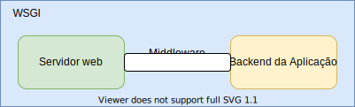
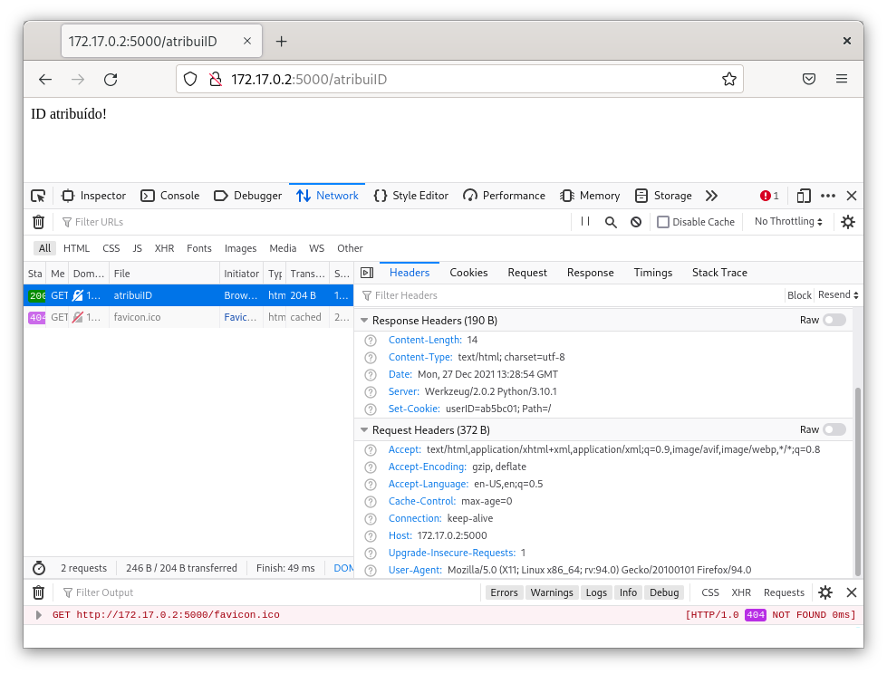

# Flask {.part}

# Flask: Introdução

- **O que é?**
	- _Framework_ em Python que permite implementação de _web services_.
- **O que provê?**
	- Um Web Server Gateway Interface (WSGI).
	- Uma _template engine_.
	- Funcionalidades para lidar de forma segura com _strings_ recebidas do utilizador.
	- ...

# Flask: WSGI

:::::::{.center}
{width="40%"}
:::::::

- Conjunto de convenções para **encaminhamento de requisições** de servidores web para aplicações web.
- Aplicações expõem funcionalidades que podem ser chamadas pelo servidor web.
- Funcionalidades são mapeadas para **recursos** web.
	- _i.e._, objetos HTTP.
- Ao **receber requisição**, servidor determina funcionalidade associada e **chama a função** da aplicação.

# Flask: _Template Engine_

- Flask usa o conceito de _templates_.
	- Modelos de resposta que podem ser personalizados.
	- Em geral, páginas _web_ com elementos pontuais que podem ser substituídos.
	- _e.g._, um elemento da página que apresenta o nome do utilizador.

# Flask: Ideia Geral

- Aplicação desenvolvida em Flask contém funções de _backend_.
- Uma ou mais funções são **mapeadas** para URLs de um servidor web.
- Ao fazer uma requisição para a URL, cliente na verdade executa a função.
- Função retorna uma resposta ao cliente.
	- Em alguns casos, uma página HTML.
	- Em outros dados brutos em algum formato utilizados pelo _frontend_.

# Flask: _Hello World_

```{.Python .numberLines style="font-size: 18px;"}
from flask import Flask 	# Importa-se a biblioteca do Flask
app = Flask(__name__)		# Cria-se uma "Aplicação Flask"

@app.route("/")				# O decorator app.route() associa a função ao caminho "/" no servidor
def hello():
    return "Hello World"	# Valor retornado é simplesmente uma string enviada como (corpo) da resposta HTTP.

if __name__ == "__main__":
    app.run(debug=False)
```	

- O que faz?
	1. Cria uma função (a `hello()`) que sempre retorna `"Hello World"`
	2. Associa essa função ao caminho/objeto `/` no servidor web.
		- Sempre que cliente requisita o caminho `/`, `hello()` é executada, retornando a _string_ ao cliente.

# Flask: Instalação

- Como qualquer biblioteca/componente Python, Flask pode ser instalado via pip/pip3:

```{.Bash .numberLines style="font-size: 20px;"}
pip install flask
```
- No VS Code:
	- <https://code.visualstudio.com/docs/python/tutorial-flask#_create-a-project-environment-for-the-flask-tutorial>

- No PyCharm: 
	- <https://www.jetbrains.com/help/pycharm/installing-uninstalling-and-upgrading-packages.html#packages-tool-window>

# Flask: Execução

- Uma vez instalado, _scripts_ Python usando Flask podem ser executados normalmente:

```{.Text .numberLines style="font-size: 18px;"}
# python HelloWorld.py
 * Serving Flask app 'HelloWorld' (lazy loading)
 * Environment: production
   WARNING: This is a development server. Do not use it in a production deployment.
   Use a production WSGI server instead.
 * Debug mode: off
 * Running on http://127.0.0.1:5000/ (Press CTRL+C to quit)
```

- Observe as várias mensagens impressas no terminal:
	1. Executado dessa forma, o Flask cria automaticamente um servidor web.
	2. Por padrão, servidor ouve na porta 5000 e **apenas conexões locais**.
		- Para testes!
		- Há servidores WSGI para **ambientes de produção**.

# Flask: Alterando a Porta do Servidor

- Se necessário, pode-se executar o servidor web do Flask em outra porta.
- Duas alternativas:
	1. Alterando o código:
		- Passar a porta desejada como argumento do método `app.run()`. 
		- Exemplo: `app.run(debug=False, port=6000)`
	2. Executando a aplicação com o comando `flask`:
		- Renomeie o `script` para `app.py`.
		- Executar o comando `flask run` com o parâmetro `--port`.
		- Exemplo: `flask run --port 6000`

# Flask: Permitindo Conexões de Fora do _Host_ Local

- Pode ser feito com:
	- O parâmetro `host` do método `app.run()`.
		- Exemplo: `app.run(debug=False, host=0.0.0.0)`
	- O argumento `--host` do comando `flask`:
		- Exemplo: `flask run --host 0.0.0.0`

# Flask: Aceder ao Servidor

:::::{.columns}
:::{.column width=60%}
{width=100%}
:::
:::{.column width=40%}
<br> <br>

- Note:
	- _Browser_ faz um `GET` em `/`.
	- _Browser_ mostra _string_ retornada pela função.
		- **Não é um código HTML**, apenas a _string_.
:::
:::::

# Flask: Definindo Múltiplos Recursos (I)

- Uma aplicação Flask pode expor tantas funções quanto necessário para o servidor.
- Exemplo:
	- Suponha uma aplicação web de gerência de uma instituição de ensino.
	- O _backend_ deve oferecer um _end point_ que liste os alunos matriculados.
	- Outro _end point_ deve listar as cadeiras disponíveis.
- Um **end point** é um  identificador que é associado a uma função que tratará uma requisição.

# Flask: Definindo Múltiplos Recursos (II)
   
```{.Python .numberLines style="font-size: 18px;"}
from flask import Flask 
app = Flask(__name__)

@app.route("/cadeiras")				
def lista_cadeiras():
    return "Programação avançada, Linguagem de Programação, Estatística, Redes de Computadores"	


@app.route("/alunos")				
def lista_alunos():
    return "António, Carla, Daniel, João, Paula, Tiago"	

if __name__ == "__main__":
    app.run(debug=False)
```	

- Decorador `route()`: associa caminho a função no código Flask.
	- Um decorador é um recurso da linguagem Python.

# Flask: Caminhos Variáveis

- Suponha uma aplicação de _webmail_.
	- Queremos disponibilizar a caixa de entrada e a caixa de _spam_ ao utilizador.

```{.Python .numberLines style="font-size: 20px;"}
from markupsafe import escape

@app.route("/<name>/inbox")
def inbox(name):
	# conteudoInbox = ...
    return f"Conteudo do inbox do usuario {escape(name)}: ..."

@app.route("/<name>/spam")
def spam(name):
	# conteudoSpam = ...
    return f"Conteudo da caixa de spam do usuario {escape(name)}: ..."
```	

- Decorador `route()`: define _templates_ de caminhos contendo o modificador `<name>`.
	- Caminhos como `/fernanda/spam` e `/fernanda/inbox` são automaticamente mapeados para as funções certas.
	- E `fernanda` é mapeado para o parâmetro `name` das funções.

::::::{.block .centered style="position: absolute; right: 2%; bottom: 30%; width: 35%;"}
:::{.blocktitle}
Importante!
:::
- Note o uso da função `escape()` da biblioteca _markupsafe_.
	- Sanitiza a string (passada pelo utilizador) contra possíveis ataques de injeção de código.
::::::

# Flask: Caminhos Variáveis (II)

- É possível também especificar restrições adicionais ao formato dos _templates_.
	- Exemplo: parte da URL deve ser o ID do utilizador contendo apenas números.

:::::{.columns}
:::{.column width=50%}
```{.Python .numberLines style="font-size: 20px;"}
@app.route("/login/<int:id>")
def login(id):
    return f"ID recebido foi: {id}"
```

- Nesse caso, acesso a `/login/12345` funciona, mas a `/login/fernanda` não.
	- Retorna erro 404.
:::
:::{.column width=50%}

::::{.center style="line-height: 90%; font-size: 60%;"}
| Modificador | Significado                     |
| ----------- | ------------------------------- |
| `int`       | Números inteiros positivos      |
| `float`     | Números reais positivos         |
| `string`    | Qualquer texto sem barras       |
| `path`      | Qualquer texto mesmo com barras |
| `uuid`      | Strigs no formato de UUID       |
::::
:::
:::::

# Atividade I

- Faça um programa em Flask que implemente o _backend_ de uma aplicação que:
	- calcula o IMC (Índice de Massa Corporal) de uma pessoa pela fórmula $imc = \frac{peso}{altura^2}$
	- peso em kg, altura em m, IMC em kg/m²
	- O programa deve receber o peso e altura por um caminho variável (pela url).
		- *e.g.*, /imc/60.0/1.65 
	- O retorno pode ser simplesmente um texto com o valor do IMC.

# Flask: Caminhos Terminados em `/`

- Considere o seguinte trecho de código:

```{.Python .numberLines style="font-size: 70%;"}
@app.route("/teste/minhaFuncao/")
def f():
    return "Qualquer coisa"
```

- Claramente, função é acessível pelo caminho `/teste/minhaFuncao/`.
- Mas **também** é acessível pelo caminho `/teste/minhaFuncao`
- Por outro lado:
```{.Python .numberLines style="font-size: 70%;"}
@app.route("/teste/minhaFuncao2")
def f2():
    return "Qualquer coisa"
```

- `f2` **só** é acessível pelo caminho `/teste/minhaFuncao2`.

# Flask: Múltiplos Caminhos para a Mesma Função

- É possível associar mais que um caminho para uma mesma função.
- Exemplo:

```{.Python .numberLines style="font-size: 80%;"}
@app.route("/teste/minhaFuncao2")
@app.route("/teste/outroNome")
def f():
    return "Qualquer coisa"
```

- Requisições feitas tanto para `/teste/minhaFuncao2` quanto para `/teste/outroNome` mapeadas para `f()`.

# Flask: Obter Caminhos para Certas Funções

- Por vezes, pode ser necessário a uma função obter o caminho de outra.
	- Por exemplo, para responder a uma requisição com um redirecionamento.
- Podemos simplesmente colocar o caminho da outra função como uma _string_ _hardcoded_.
- Mas uma alternativa melhor é usar a função `url_for()`.
- Recebe como argumentos:
	- Nome da função desejada.
	- (Opcionalmente) Argumentos no formato `nome=valor`.
- Retorna: o caminho da função especificada, incluindo potenciais argumentos.

# Flask: Exemplo Simples de Uso de `url_for()`

- Usaremos `redirect` e `url_for` neste exemplo (devem ser importados!).

```{.Python .numberLines style="font-size: 70%;"}
from flask import Flask, redirect, url_for

appFlask = Flask(__name__)

@appFlask.route('/conta/premium')
def contaPremium():
	return "Esta é uma conta premium"

@appFlask.route('/conta/<float:preco>')
def conta(preco):
	return f"Esta é uma conta básica no valor de {preco} Euros"

@appFlask.route('/utilizador/<nome>')
def utilizador(nome):
	if nome =='premium':
		return redirect(url_for('contaPremium'))
	else:
		return redirect(url_for('conta', preco = 5.99))

if __name__ == '__main__':
   appFlask.run(debug = True)
```

# Flask: Tipos de requisição

- Até aqui, vimos apenas exemplos de funções que devolvem conteúdos ao utilizador.
	- Em geral, mapeadas para requisições HTTP do tipo `GET`.
- Por padrão, o Flask associa as funções apenas a requisições `GET`.
- Entretanto, podemos solicitar que outros tipos de requisição sejam direcionados às nossas funções.
- Exemplo:

```{.Python .numberLines style="font-size: 70%;"}
from flask import request

@app.route('/alunos', methods=['GET', 'POST'])
def alunos():
    if request.method == 'POST':	# Objeto build-in request contém informações sobre a requisição
        return cadastraAluno()		# Se é um POST, cadastramos um novo aluno
    else:
        return listaAlunos()		# Se é um GET, listamos alunos cadastrados
```

# Flask: Tipos de requisição (II)

- Note que o mesmo caminho pode ser atribuído a duas funções.
	- Desde que associado a **tipos de requisição diferentes**.
- Exemplo:

```{.Python .numberLines style="font-size: 80%;"}
@app.route('/alunos2', methods=['GET'])
def alunosGET():
    return listaAlunos()

@app.route('/alunos2', methods=['POST'])
def alunosPOST():
    return cadastraAluno()
```

- Veremos exemplos mais concretos em próximos slides...

# _Templates_ e Conteúdos Estáticos {.part}

# Flask: Ficheiros Estáticos e _Templates_

- Por ora, temos retornado _strings_ simples em todos os exemplos.
- Mas, em geral, queremos apresentar a informação retornada em páginas sofisticadas.
	- HTML determinando a disposição das informações.
	- CSS determinando o estilo da página.
	- Javascript para processamentos no frontend e dinamização do conteúdo.
- Flask permite a integração desses elementos através da criação de dois diretórios:
	- `static`: conteúdos totalmente estáticos.
		- _i.e._, que não variam de acordo com a resposta gerada.
		- _e.g._, CSS, Javascript.
	- `templates`: modelos preenchidos com informações geradas dinamicamente.
		- _e.g._, páginas HTML com pequenos pontos a serem preenchidos.

# Flask: Renderizando _Templates_

- Considere novamente nossa aplicação calculadora.
- Além das funções que calculam individualmente cada operação, queremos uma função que retorne os resultados de **todas** as 4 operações sobre os dois operandos especificados.
- Para facilitar a visualização, queremos organizar os resultados em uma **tabela**.
- Podemos implementar isso através das seguintes etapas:
	1. Criamos um _template_ para a página de resultado.
		- Contém uma tabela e _placeholders_ para os elementos.
	2. Criamos a função python que calcula os resultados da operações.
		- Retorna o _template_ substituindo os _placeholders_ pelos valores.

# Flask: Exemplo de Uso de _Templates_

:::::{.columns}
:::{.column width=50%}
```{.HTML .numberLines style="font-size: 60%;"}
<html>
    <head></head>
    <body>
        <table>
            <tr><th>Operação</th><th>Resultado</th></tr>
            <tr>
				<td>{{ x }} X {{ y }}</td>
				<td>{{ multiplicacao }}</td>
			</tr>
            <tr>
				<td>{{ x }} / {{ y }}</td>
				<td>{{ divisao }}</td>
			</tr>
            <tr>
				<td>{{ x }} + {{ y }}</td>
				<td>{{ soma }}</td>
			</tr>
            <tr>
				<td>{{ x }} - {{ y }}</td>
				<td>{{ subtracao }}</td>
			</tr>
        </table>
    </body>
</html>
```
:::
:::{.column width=50%}

```{.Python .numberLines style="font-size: 60%;"}
from flask import Flask, render_template
app = Flask(__name__)

@app.route("/todas/<float:x>/<float:y>")
def todas(x, y):
    return render_template('calculadora.html', x=x, y=y, 
                            multiplicacao=x*y, 
                            divisao=x/y, 
                            soma=x+y, 
                            subtracao=x-y)

if __name__ == "__main__":
    app.run(debug=False)
```

:::
:::::

- Código HTML deve ser colocado no ficheiro `templates/calculadora.html`

# Flask: Trechos Condicionais em _Templates_

- Além dos _placeholders_, _templates_ podem conter outros elementos especiais.
- Um deles são estruturas do tipo `if...else`.
	- Permitem a inclusão condicional de partes do _template_.
- Exemplo:
	- Suponha que nossa calculadora teste se o divisor é zero.
	- Se for, o resultado da divisão não é calculado.
	- Nesse caso, queremos omitir a linha da divisão da tabela.

# Flask: Trechos Condicionais em _Templates_ (II)

- Nova versão da calculadora:

:::::{.columns}
:::{.column width=48%}
```{.HTML .numberLines style="font-size: 60%;"}
<html>
    <head></head>
    <body>
        <table>
            <tr><th>Operação</th><th>Resultado</th></tr>
            <tr>
				<td>{{ x }} X {{ y }}</td>
				<td>{{ multiplicacao }}</td>
			</tr>
			
            <tr>
				<td>{{ x }} / {{ y }}</td>
				<td>{{ divisao }}</td>
			</tr>
			
            <tr>
				<td>{{ x }} + {{ y }}</td>
				<td>{{ soma }}</td>
			</tr>
            <tr>
				<td>{{ x }} - {{ y }}</td>
				<td>{{ subtracao }}</td>
			</tr>
        </table>
    </body>
</html>
```
:::
:::{.column width=52%}

```{.Python .numberLines style="font-size: 60%;"}
from flask import Flask, render_template
app = Flask(__name__)

@app.route("/todas/<float:x>/<float:y>")
def todas(x, y):
    if y == 0:
        return render_template('calculadora.html', x=x, y=y, 
                            multiplicacao=x*y, 
                            soma=x+y, 
                            subtracao=x-y)
    else:
        return render_template('calculadora.html', x=x, y=y, 
                            multiplicacao=x*y, 
                            divisao=x/y, 
                            soma=x+y, 
                            subtracao=x-y)

if __name__ == "__main__":
    app.run(debug=False)
```

:::
:::::

# Flask: Iterações em _Templates_

- Se algum objeto iterável é passado por um template, é possível utilizar uma estrutura do tipo `for`.
- Exemplo de refatoração da aplicação calculadora com dicionário:

:::::{.columns}
:::{.column width=50%}
```{.HTML .numberLines style="font-size: 60%;"}
<html>
    <head></head>
    <body>
        <table>
            <tr><th>Operação</th><th>Resultado</th></tr>
            
            <tr>
				<td>{{ x }} {{ op }} {{ y }}</td>
				<td>{{ resultados[valor] }}</td>
			</tr>
            
        </table>
    </body>
</html>
```
:::
:::{.column width=50%}

```{.Python .numberLines style="font-size: 60%;"}
from flask import Flask, render_template
app = Flask(__name__)

@app.route("/todas/<float:x>/<float:y>")
def todas(x, y):

    resultados = {
        "x": x*y,
        "+": x+y, 
        "-": x-y
    }
    if y != 0:
        resultados["/"] = x/y
    return render_template('calculadora_v3.html', x=x, 
								y=y, resultados=resultados) 

if __name__ == "__main__":
    app.run(debug=False)
```

:::
:::::

# Flask: Referenciar Recursos Estáticos (I)

- Suponha que desejemos melhorar um pouco a visualização dos resultados da calculadora.
- Em particular, queremos colocar bordas na tabela/células.
- Para isso, crimos um pequeno ficheiro CSS chamado `calculadora.css`:
```{.CSS .numberLines style="font-size: 80%;"}
table, td, th {
    border: 1px solid;
    border-collapse: collapse;
    border-color: gray;
}
```

# Flask: Referenciar Recursos Estáticos (II)

- Problema: como referenciar esse CSS no _template_?
- Solução ideal:
	1. Colocar `calculadora.css` no diretório `static`.
	2. Ao carregar o CSS no template, usar a função `url_for()`.

```{.HTML .numberLines style="font-size: 80%;"}
<link rel="stylesheet" type="text/css"
	href={{url_for('static', filename='calculadora.css')}} />
```


::::::{.block .centered style="position: absolute; bottom: 10%; right: 2%; width: 33%;"}
:::{.blocktitle}
Nota
:::
- `url_for` não é estritamente necessário.
- `/static/calculadora.css` funcionaria na maioria dos casos.
- Mas certos cenários podem necessitar de caminhos diferentes.
- Uso é recomendável.
::::::

# Atividade II

1. Baseado nos slides anteriores, implemente uma calculadora no *backend*, com o *frontend* na forma de tabela.
	- Use o css sugerido ou outro.
2. Gere um template para apresentar o resultado da calculadora de IMC.
	- Adicione na resposta a classificação de acordo com: [https://www.adexo.pt/tratamento/imc](https://www.adexo.pt/tratamento/imc)

# Interação com Requisições em Flask {.part}

# Flask: Receber Dados da Requisição

- Comumente, aplicações web precisam obter arguments/parâmetros do utilizador.
- Exemplo: operandos da aplicação _calculadora_.
- Vimos uma forma de fazer isso:
	- Usando **caminhos variáveis**.
- Mas há duas formas mais **adequadas** e **padronizadas**:
	- Argumentos da URL.
	- Campos de formulário.

# Flask: Argumentos da URL

- _Query String_:
	- Parte da URL que atribui valores a parâmetros.
	- Localizada **no final** da URL, separada pelo caractere `?`
	- Parâmetros codificados no formato `chave=valor`
	- Múltiplos parâmetros separados pelo caractere `&`
- Exemplo: `https://www.google.com/search?client=firefox-b-d&q=flask`
	- Dois parâmetros:
		- `client`: tem valor `firefox-b-d`
		- `q`: tem valor `flask`

# Flask: Leitura de Parâmetros da URL

:::::{.columns}
:::{.column width=60%}
- Flask faz o _parse_ automaticamente da _query string_.
- Parâmetros e seus valores podem ser acessados pelo objeto `request`.
	- Lembre-se: objeto que contém **informações sobre a requisição**.
- Mais especificamente, argumentos são armazenados no **dicionário** `request.args`.
- Exemplo: versão alternativa da calculadora.
	- **Exercício**: tente acessar o caminho `/calc?x=3&y=2&op=*`
:::
:::{.column width=40%}

```{.Python .numberLines style="font-size: 60%;"}
from flask import Flask, request
app = Flask(__name__)

@app.route("/calc")
def calculadora():
    x = float(request.args.get('x'))
    y = float(request.args.get('y'))
    op = request.args.get('op')

    if op == '+':
        res = x + y
    elif op == '-':
        res = x - y
    elif op == '*':
        res = x * y
    else:
        res = x / y

    return f"{x} {op} {y} = {res}"

if __name__ == "__main__":
    app.run(debug=False)
```
:::
:::::

# Atividade III

- Use _Query String_ para reimplementar o *backend* da calculadora de IMC.

# Flask: Campos de formulário

- Uma forma mais **elegante** e **segura** de obter dados do utilizador é através dos **campos de formulário**.
	- Normalmente, gerados através de um _submit_ associado a um formulário em uma página HTML.
	- Por sua vez, causa uma **requisição** do tipo `POST`.
	- Parâmetros (campos do formulário) e seus valores codificados no **corpo** da requisição.
- Do ponto de vista do Flask, podem ser acessados pelo **dicionário** `request.form`

# Flask: Utilizando o `request.form`

- Exemplo: protótipo de página de _login_:

:::::{.columns}
:::{.column width=50%}
```{.Python style="font-size: 60%;"}
from flask import Flask, request, render_template
app = Flask(__name__)

def verificaLogin(username, password):

   if username == "pedro" and password == "123456":
      return True
   return False

@app.route("/login", methods=['GET', 'POST'])
def login():

   if request.method == 'POST':
      if verificaLogin(request.form['username'], 
         request.form['password']):
         return 'Login bem sucedido!'
      else:
         return 'Nome do utilizador ou palavra-passe inválidos!'
   return render_template('login.html')

if __name__ == "__main__":
   app.run(debug=False)
```
:::
:::{.column width=50%}
```{.html style="font-size: 60%;"}
<html>
    <head></head>
    <body>
        <h1>Bem-vindo ao sistema!</h1>

        Por favor, forneça suas credenciais:<br>
        <form action="/login" method="post">
            <label for="username">Nome do utilizador:</label>
			<br>
            <input type="text" 
				id="username" 
				name="username" value=""><br>
            <label for="password">Palavra-passe:</label><br>
            <input type="password" 
				id="password" 
				name="password" value=""><br><br>
            <input type="submit" value="Enviar">
        </form>
	</body>
</html>
```
:::
:::::

# Atividade IV

1. Copie os exemplos dos dois últimos slides (login) e faça-o funcionar.
2. Em seguida, melhore a página principal com CSS, Javascript/jQuery (se achar relevante).

# Sessões e _Cookies_ {.part}

# Flask: Aplicações _Stateful_

:::::{.columns}
:::{.column width=60%}
- Até aqui, vimos apenas exemplos de aplicações **_stateless_**.
	- Respostas são geradas apenas com base na requisição.
	- Não levam em conta nenhum **histórico** de interação do utilizador.
		- _i.e._, **interações passadas não influenciam** respostas futuras.
- Porém, aplicações mais sofisticadas comumente são **_stateful_**.
	- **Estado** das interações do utilizador tem que ser considerado.
	- _e.g._, estado do cesto de compras, id do utilizador logado no _webmail_, ...

:::
:::{.column width=40%}
::::::{.block .centered}
:::{.blocktitle}
Problema
:::
- HTTP é inerentemente _stateless_.
	- _i.e._, **requisições idênticas recebem respostas idênticas**. 
::::::
:::
:::::


# Flask: Cookies

- Mecanismo usado sobre o HTTP para permitir aplicações _stateful_.
- Servidor pode **solicitar** ao navegador que **armazene** _cookies_.
	- Pequenos pedaços de informação.
	- Par `(nome, valor)`.
- Navegador se compromente a **incluir** cookies em todas as **requisições futuras**.
	- Apenas os pertinentes àquela página.

::::::{.block .centered}
:::{.blocktitle}
Note
:::
- Em geral, _cookies_ armazenam **pequenas** informações.
- _e.g._, conteúdo do cesto **não** é armazenado no _cookie_.
	- Armazena-se ID do utilizador.
	- Servidor mantém base de dados no _backend_ com cestos de cada utilizador.
::::::

# Flask: Definindo e Lendo Cookies

- _Cookies_ podem ser **definidos nas respostas**.
	- Um objeto resposta tem que ser **explicitamente** criado com `make_respose()`.
	- Depois, _cookies_ podem ser adicionados com o método `set_cookie()`
- _Cookies_ enviados pelo navegador podem ser **lidos nas requisições**.
	- Do objeto `request`.
	- Contém um **dicionário** chamado _cookies_.

# Flask: Exemplo de Cookies

:::::{.columns}
:::{.column width=50%}
```{.Python style="font-size: 60%;"}
from flask import Flask, request, make_response
app = Flask(__name__)

cestos = {}
@app.route("/adicionaAoCesto")
def adicionaAoCesto():

    prodID = request.args.get('prodID')
    userID = request.cookies.get('userID')
    cestos[userID].append(prodID)
    return f"Produto adicionado! Cesto contém:<br> {cestos[userID]}"

@app.route("/atribuiID")
def atribuiID():

    novoID = 'ab5bc01'
    cestos[novoID] = []
    resp = make_response('ID atribuído!')
    resp.set_cookie('userID', novoID)
    return resp

if __name__ == "__main__":
    app.run(debug=False)
```

:::
:::{.column width=50%}
- Protótipo de _backend_ de comércio eletrônico.
- No primeiro acesso ao sistema, utilizador acessa `/atribuiID`
	- Gera um ID.
		- Por simplicidade, estático. 
		- Na prática, único para cada utilizador.
- Ao carregar em botões "Adicionar ao Cesto" no _frontend_, requisições são feitas para `/adicionaAoCesto`
	- ID do produto passado como argumento na forma de _query string_.
	- ID do utilizador extraído a partir do _cookie_.
:::
:::::

# Flask: Exemplo de Cookies em Ação

:::::{.columns}
:::{.column width=50%}
{width=100%}

:::
:::{.column width=50%}
{width=100%}

:::
:::::

# Flask: Sessões

- Além do suporte de baixo nível a _cookies_, Flask disponibiliza um mecanismo de alto nível de **sessões**.
	- Construído sobre _cookies_, porém mais prático e seguro.
- Um objeto `session` é disponibilizado para todos os métodos, identificando a sessão correspondente à requisição.
	- **Sessão**: sequência de requisições de um mesmo utilizador/navegador.
- Aplicação pode gravar dados no objeto `session` e lê-los em outras requisições da mesma sessão.
	- `session` é um dicionário.
- Internamente, dados no `session` são salvos como _cookies_.
	- Mas de forma **transparente**.
	- E **criptografados** para maior segurança.

# Flask: Cesto de Compras com Sessões

:::::{.columns}
:::{.column width=56%}
```{.Python .numberLines style="font-size: 60%;"}
from flask import Flask, request, session
app = Flask(__name__)
app.secret_key = b'((s23e__#i54e/*!'
cestos = {}
@app.route("/adicionaAoCesto")
def adicionaAoCesto():

    prodID = request.args.get('prodID')
    userID = session['userID']
    cestos[userID].append(prodID)
    return f"Produto adicionado! Cesto contém:<br> {cestos[userID]}"

@app.route("/atribuiID")
def atribuiID():

    novoID = 'ab5bc01'
    cestos[novoID] = []
    session['userID'] = novoID
    return 'ID atribuído!'

if __name__ == "__main__":
    app.run(debug=False)
```

:::
:::{.column width=44%}
- Mesma lógica anterior, mas sem uso explícito de _cookies_.
- Para usar o `session` é **obrigatório definir uma chave secreta**.
	- _String_ em `app.secret_key`.
:::
:::::

# Flask: Exemplo de `Session` em Ação

:::::{.columns}
:::{.column width=50%}
{width=100%}

:::
:::{.column width=50%}
{width=100%}

:::
:::::

- **Note**: valor armazenado no _cookie_ (ID do utilizador) é **criptografado**.

# Flask: Redirecionamentos

:::::{.columns}
:::{.column width=40%}
- Muitas vezes, é útil redirecionar o utilizador para outra página/_endpoint_ do sistema.
- Exemplo: 
	- Sistema com autenticação.
	- Redirecionar utilizador não autenticado para página de _login_.
	- Após login bem sucedido, redirecionar para página principal.
:::
:::{.column width=3%}
:::
:::{.column width=57%}
```{.Python .numberLines style="font-size: 55%;"}
from flask import Flask, request, render_template, session, redirect, url_for
app = Flask(__name__)
app.secret_key = b'((s23e__#i54e/*!'
def verificaLogin(username, password):

    if username == "pedro" and password == "123456":
        return True
    return False

@app.route("/login", methods=['GET', 'POST'])
def login():

    if request.method == 'POST':
        if verificaLogin(request.form['username'], 
                request.form['password']):
            session['username'] = request.form['username']
            return redirect(url_for('principal'))
        else:
            return 'Nome do utilizador ou palavra-passe inválidos!'
    return render_template('login.html')

@app.route("/")
def principal():

    if 'username' in session:
        return f"Seja bem-vindo, {session['username']}"
    else:
        return redirect(url_for('login'))

if __name__ == "__main__":
    app.run(debug=False)
```
:::
:::::

# Atividade V

1. Altere a página de login da Atividade IV e inclua o uso de *cookies*.
2. De forma similar à página de login, desenvolva uma página de registo.
	- No Python, o registo deve ser feito em um dicionário: par (utilizador, palavra-passe).
	- Deve-se verificar se cadastro existe.
		- Nesse caso, redirecionar utilizador para página de login.
3. Desenvolva também uma página principal ao qual o utilizador tenha acesso quando o login é bem sucedido.
	- A página pode ser simplesmente de boas vindas.


# Flask: Tipos de Resposta

- Em todos os exemplos anteriores, as respostas eram sempre _strings_ planas ou HTML.
	- Renderizadas diretamente para o utilizador.
- Aplicações reais muitas vezes solicitam **serviços** do _backend_ que geram **dados**, e não diretamente o conteúdo a ser renderizado.
- Dados podem ser qualquer coisa:
	- Imagens, arquivos executáveis, um vetor de dados, ...
- Em particular, é comum que _endpoints_ retornem dados em formato **JSON**.
	- Formato facilmente interpretável com Javascript.
	- Suportado **nativamente** pelo Flask.
		- Conversão automática de **dicionários**.
		- Ou conversão explícita de outros tipos com o `jsonify`.

# Flask: Respostas com JSON

:::::{.columns}
:::{.column width=50%}
```{.Python .numberLines style="font-size: 70%;"}
from flask import Flask
app = Flask(__name__)

@app.route("/carro")
def carro():
    
	return {
			"Fabricante": "Fiat",
			"Modelo": "500",
			"Peso": 940
		}

if __name__ == "__main__":
    app.run(debug=False)
```
:::
:::{.column width=50%}
```{.Python .numberLines style="font-size: 70%;"}
from flask import Flask, jsonify
app = Flask(__name__)

@app.route("/primos")
def primos():
    lista = [2, 3, 5, 7, 11, 13, 17]
	return jsonify(lista)
		
if __name__ == "__main__":
    app.run(debug=False)
```
:::
:::::


