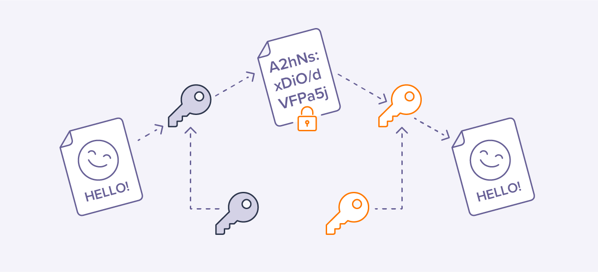
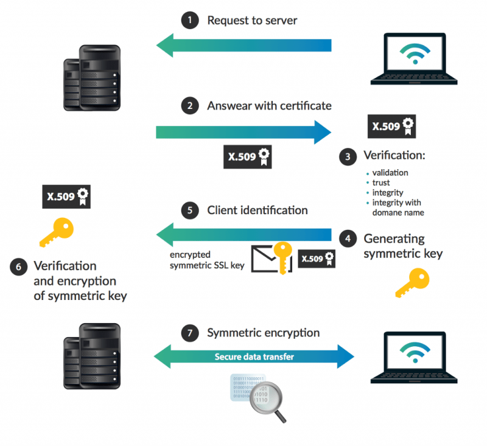
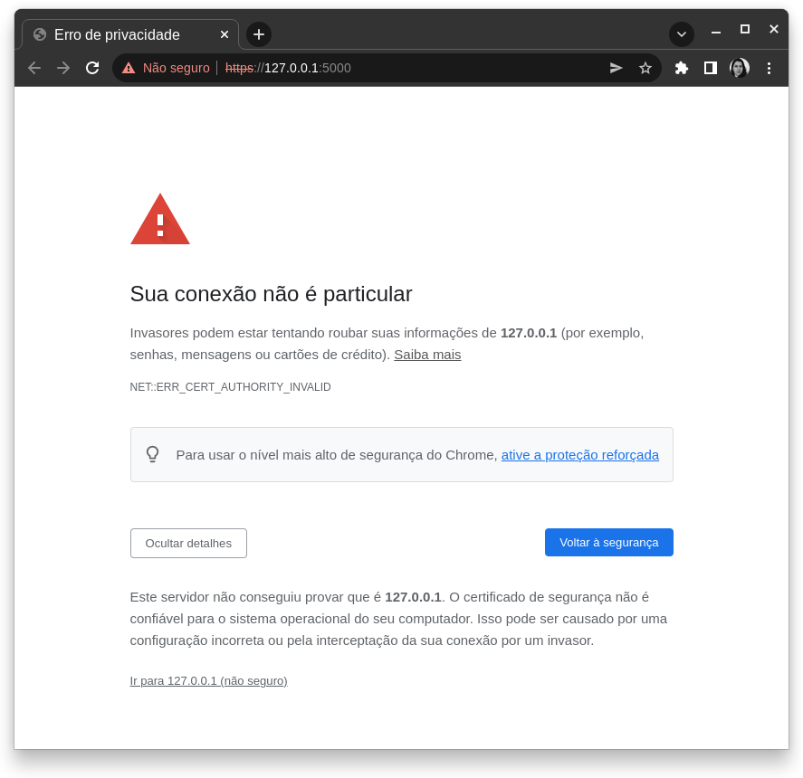
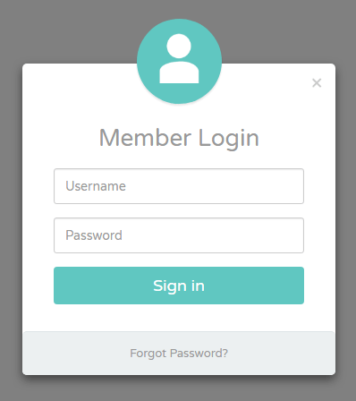

# Segurança no HTTP {.part}

# HTTPS: HTTP Secure

- Versão segura do HTTP.
- HTTP envia texto plano dos objetos do cliente para o servidor e vice-e-versa.
	- Informações podem ser interceptadas e facilmente visualizadas.
- Uso do protocolo SSL/TLS.
	- Conexão **criptografada**.
	- Verificação de autenticidade do servidor e do cliente por meio de **certificados digitais**. 
- URL das páginas inicia com `https://`.

# HTTPS: Criptografia

- Algoritmo criptográfico cifra *objeto original* com *chave*.
	- Gera *objeto criptografado*.
- Algoritmo criptográfico descifra *objeto criptografado* com *chave*.
	- Gera *objeto original*.
	- Algoritmos de cifragem e descifragem devem ser correspondentes.

# HTTPS: Criptografia (II)

<br>

:::::{.columns}
:::{.column width=50%}
- Simétrica:
	- mesma chave (privadas) no cliente e no servidor.

:::::{.center}
{width=100%}
:::::

:::
:::{.column width=50%}
- Assimétrica:
	- par de chaves, uma pública e outra privada.

:::::{.center}
{width=100%}
:::::

:::
:::::

# HTTPS: Criptografia (III)

:::::{.columns}
:::{.column width=45%}
<br>

- Combinação de criptografia simétrica e assimétrica.
	- Simétrica é melhor para criptografar objetos grandes.
	- E assimétrica é usada para criptografar chave simétrica.
:::
:::{.column width=55%}
{width=100%}
:::
:::::

# HTTPS: Certificados e Autoridades Certificadoras

<br>

:::::{.columns}
:::{.column width=40%}
:::::{.center}
{width=80%}
:::::
:::
:::{.column width=60%}

- Em HTTPS, normalmente, chaves públicas são distribuídas por **certificados digitais**.
- Certificado precisa ser **autenticado**.
	- Isto é, **validados** e **assinados digitalmente**.
- Quem autentica?
	- Autoridades certificadoras confiáveis (terceira parte).
	- Validam e assinam digitalmente o certificado.
	- Empresas especializadas, governo, ...
	- Há uma **relação de confiança**.
:::
:::::

# Autenticação de Certificados nos Navegadores

<br>

:::::{.center}
{width=45%}
:::::

# HTTPS no Flask

:::::{.columns}
:::{.column width=55%}
<br>

- Instalar o OpenSSL no Python 3 com pip ou pip3.
```{.Bash style="font-size: 18px;"}
pip3 install pyopenssl
```
- Ele provê o uso do SSL e manipulação de certificados digitais.
- Um teste simples utilizando o contexto *adhoc*:

```{.Python .numberLines style="font-size: 18px;"}
from flask import Flask
app = Flask(__name__)
@app.route("/")
def hello():
    return "Hello World!"
if __name__ == "__main__":
    app.run(ssl_context='adhoc')
```
:::
:::{.column width=45%}
<br>
{width=100%}
:::
:::::

# Gerar Certificado Digital Auto-assinado

- O contexto *adhoc* faz o Flask gerar certificados a cada vez que a página é carregada.
	- Utilizador deve aceitar a cada atualização da página.
- É possível gerar nosso próprio **certificado auto-assinado**.
- Gerar com o OpenSSL ou em sites como: [https://certificatetools.com/](https://certificatetools.com/)
	- Trocar 'CSR only' para 'Self-sign' em '*CSR Options*'.
	- Preencher '*Common Names*' com 'localhost', por exemplo (para teste).
	- Submeter.
	- Salvar '*Private Key*' e '*PEM Certificate*' no diretório de sua aplicação .py.

# Usar Certificado Digital Auto-assinado no Flask

- Assuma que os respetivos ficheiros são:
	- Para *private key*: `cert.key`
	- Para *PEM Certificate*: `cert.crt`

```{.Python .numberLines style="font-size: 18px;"}
from flask import Flask
app = Flask(__name__)
@app.route("/")
def hello():
    return "Hello World!"
if __name__ == "__main__":
    app.run(debug=True, ssl_context=('cert.crt', 'cert.key'))
```

- Para versão de produção, é preferível usar certificado registado em **autoridades certificadoras**.

# Atividade I

1. Adicione o HTTPS com certificados auto-assinados a sua aplicação web de login.

# Autenticação e Segurança de Palavra-Passe {.part}

# Fatores de Autenticação

- Vimos que o envio da palavra-passe é criptografado pelo HTTPS.
	- Resolve problema do *men-in-the-middle*.
- Agora, como o utilizador se autentica em um sistema web?
	- Isto é, prova a sua identidade?
- Existem 3 tipos comuns de fatores de autenticação:
	1. Baseado em algo que sabe (*Something you know*)
		- Exemplo: uma palavra-passe.
	2. Baseado em algo que tem (*Something you have*)
		- Exemplo: um cartão de acesso.
	3. Baseado em algo que é (*Something you are*)
		- Exemplo: uso de biometria.

# Autenticação por Palavra-Passe

:::::{.columns}
:::{.column width=65%}
<br>

- Um dos métodos mais comuns em sistemas web atualmente.
- Utilizador regista identificador e palavra-passe no sistema.
	- Identificadores podem ser e-mail ou um nome que não exista no sistema.
	- Servidor regista chave de autenticação (identificador, palavra-passe).
- Utilizador submete suas credenciais: identificador e palavra-passe.
	- Servidor checa as credenciais submetidas contra aquelas registadas.
	- Se casar, utilizador ganha permissão para acessar ao sistema.
:::
:::{.column width=35%}
<br><br>
{width=85%}
:::
:::::

# Armazenamento de Palavra-Passe

- No entanto, temos um outro problema:
	- Uma vez que a palavra-passe chega no servidor, como ela deve ser armazenada?

::::{.center style="font-size: 16px; line-height: 80%;"}
Utilizador   | Palavra-passe
------------ | ------
Ana			 | `matrix`
Pedro		 | `KgY1q!o6`
João		 | `123456`
Maria		 | `minhasenhasegura`
Joana		 | `123456`
::::

- O que aconteceria se um atacante tivesse acesso a base de utilizadores e palavras-passes?
	- Atacante pode facilmente aceder ao sistema se passando por um utilizador legitimamente registado.

# Exemplo em Python com Armazenamento em Memória

```{.Python .numberLines style="font-size: 18px;"}
def verificaPalavraPasse(passwd_dic, passwd_input):
    return(passwd_dic == passwd_input)

# Dicionario que guarda os utilizadores
dic = {}

user = "Maria"
passwd = "teste123"

dic[user] = passwd

# Assumindo que user é Maria...
passwd_in = input("Palavra-passe: ")
print(verificaPalavraPasse(dic[user], passwd_in))
```

- Não usar este tipo de armazenamento pois quem tem acesso a base obtém facilmente as palavras-passe dos utilizadores.
	- Péssima política de segurança!

# Armazenamento de Hash Criptográfico

- **Hash**: função que recebe dado e retorna bytes de tamanho fixo (*e.g.*, 256 bits).
	- Exemplos de *hashes*: MD5, SHA1, SHA256, ...
	- O *digest* (binário do *hash*) pode ser apresentado em hexadecimal.
	- Propriedade requerida do *hash*: ser **irreversível**.
		- Isto é, a partir dele, não se pode recuperar o dado original.

::::{.center style="font-size: 16px; line-height: 80%;"}
Utilizador   | Palavra-passe (SHA256)
------------ | ------
Ana			 | `6e00cd562cc2d88e238dfb81d9439de7ec843ee9d0c9879d549cb1436786f975`
Pedro		 | `9f89aa1497044d9bfe03543fa0b02310b8c78dcba0eff6a3923710c85fad1d5f`
João		 | `8d969eef6ecad3c29a3a629280e686cf0c3f5d5a86aff3ca12020c923adc6c92`
Maria		 | `0591942e447a74c0ea310f39bb3760f3d5382a74866b08e5cfe210419ffe9be6`
Joana		 | `8d969eef6ecad3c29a3a629280e686cf0c3f5d5a86aff3ca12020c923adc6c92`
::::

# Exemplo em Python: Hash


```{.Python .numberLines style="font-size: 18px;"}
import hashlib

def verificaPalavraPasse(hash, passwd):
    bytes = passwd.encode()
    return(hashlib.sha256(bytes).digest() == hash)
    
def geraHash(passwd):
    # Gera o hash (SHA 256) da palavra-passe
    hash = hashlib.sha256(passwd.encode())
    # Obtém o hexadecimal e retorna
    return (hash.digest())

# Dicionario que guarda os utilizadores
dic = {}

user = "Maria"
passwd = "teste123"

dic[user] = {} # Vamos usar agora o formato {"Maria":{"hash":"3d43..."}}
# Insere hash da palavra-passe para o utilizador
dic[user]["hash"] = geraHash(passwd)

# Assumindo que user é Maria...
passwd_in = input("Palavra-passe: ")
print(verificaPalavraPasse(dic[user]["hash"], passwd_in))
```

# Ataques de Força Bruta

- Atacante checa exaustivamente todas as possíveis palavra-passes.
	- Online: explora o sistema de autenticação da aplicação web.
	- Offline: através de vazamento de base de dados.
- Um exemplo de algoritmo simples:
	- gerar todas as combinações de strings de vários tamanhos;
	- para cada uma delas, gerar seu hash e checar contra a palavra-passe armazenada.
- Coforme aumenta-se o número de caracteres, este processo tende a demorar muito.
- Para tentativas submetidas repetidamente ao sistema web de login:
		- há soluções de verificar múltiplas tentativas e bloquear temporariamente o acesso.
		- Exemplo: contador de tentativas com bloqueio e uso de CAPTCHA (teste de Turing).

# Ataques de Força Bruta: Dicionário

- Ao invés de tentar todas as combinações de strings, o uso de dicionário reduz o espaço de busca.
	- Objetivo de tentar palavras comumente utilizadas para palavras-passe.
	- Dicionário contém essas palavras.
- Uso de um dicionário:
	- em uma linguagem específica (*e.g.*, português);
	- lista de palavras-passe comumente utilizadas.
- Exemplo de palavras-passe comuns:
	- [https://github.com/duyet/bruteforce-database](https://github.com/duyet/bruteforce-database)

# Soluções para Ataques de Força-Bruta

- Usar palavras-passe difíceis:
	- 8 ou mais caracteres;
	- Inclusão de alguns caracteres não alfa-numéricos;
	- Não usar palavras comuns em dicionários...
- Forçar utilizador a criar palavras-passe deste modo.
	- Fazer verificação no cliente via Javascript?

# Ataque de *Rainbow Table*

- Considere a seguinte situação em que atacante tem posse da base.
	- Palavras-passe armazenadas pelo seu *hash*.
	- Atacante possui também tabela com uma lista de *hashes* pré-calculados.
- Atacante pode, então, conhecer a palavra-passe se o *hash* dela estiver contido nesta tabela.
- **Rainbow Tables** (tabelas arco-íris): dicionário de palavras-passes e seus valores *hash* pré-computados.
- Para palavras-passe longas, esta abordagem de ataque é preferível.
	- Em relação a ataques de força-bruta e dicionário.
- Processo de gerar a tabela é custoso!

# Salt (I)

- Servidor gera e armazena junto a palavra-passe do utilizador, uma string chamada de *salt*.
	- É uma string única por utilizador.
	- Pode ser gerada aleatoriamente.
- Palavra-passe armazenada é concatenada ao *salt*.
	- Hash é calculado sobre [*salt* + palavra-passe] e armazenado dessa forma.

::::{.center style="font-size: 16px; line-height: 80%;"}
Utilizador   | *Salt*   | Palavra-passe (SHA256)
------------ | -------- | ------
Ana			 | `AMx1#w` | `4e35262a19af80608d46baceaab7067f2fb9634f7eddd8c157261eab5db829b8`
Pedro		 | `8fdSPc` | `dc5a70dd56d86bf612d8719819cd7b358f151e0d8ef67f4b05428a3549c904fb`
João		 | `!vk9$A` | `e727a738b144b3ffeb7e746c27a4284feabb7735ab626a25558922dc97887844`
Maria		 | `04dRTT` | `52c3a526f66eccacd2f570112eb026a11d35b7b287baa8403e461c89c79d452c`
Joana		 | `u)Ln56` | `9e1943d1be8296d677fca3b6d2bc81137d69045f0f14b627f589647b0ddd2780`
::::

# Salt (II)

- O *salt* é usado para dificultar ataques de *rainbow table*.
	- *salt* dificulta (bastante!) associar palavra-passe a *hash* diretamente.
- Resolve também problema de João e Joana, que tem o mesmo *hash*.
	- Porque eles tem a mesma palavra-passe.
- Alguns sistemas usam *pepper* também.
	- Esse valor vem do cliente e não é gerado no servidor.
	- hash(*pepper* + *salt* + palavra-passe)

# Exemplo em Python: Uso de *Salt* (I)

```{.Python .numberLines style="font-size: 18px;"}
import hashlib, string, random

# Verifica se hashSHA256(salt+passwd) é igual ao hash do argumento
def verificaPalavraPasse(salt, hash, passwd):
    bytes = (salt+passwd).encode()
    return(hashlib.sha256(bytes).digest() == hash)

# Gera um salt aleatoriamente, o hash(salt+passwd).
# Retorna uma tupla com o salt e os bytes do hash   
def geraHash(passwd):
    caracteres = string.ascii_letters+string.digits+string.punctuation
    # Gera um salt de 16 bits aleatoriamente
    salt = ''.join(random.choices(caracteres, k=16))
    # Gera o hash (SHA 256) do salt + palavra-passe
    hash = hashlib.sha256((salt+passwd).encode())
    return (salt, hash.digest())
```

# Exemplo em Python: Uso de *Salt* (II)

- Programa principal:

```{.Python .numberLines style="font-size: 18px;"}
# Dicionario que guarda os utilizadores
dic = {}

user = "Maria"
passwd = "teste123"

dic[user] = {} # Ex.: {'Maria': {'salt' = '...', 'hash': '...'}}
# Insere hash da palavra-passe para o utilizador
dic[user]["salt"], dic[user]["hash"] = geraHash(passwd)

# Assumindo que user é Maria...
passwd_in = input("Palavra-passe: ")
print(verificaPalavraPasse(dic[user]["salt"], dic[user]["hash"], passwd_in))
```

# Atividade II

1. Incluir o armazenamento de *hash* na lógica de registo de sua aplicação web.
2. Incluir também o armazenamento do *salt*.
3. Alterar a verificação das palavras-passe.