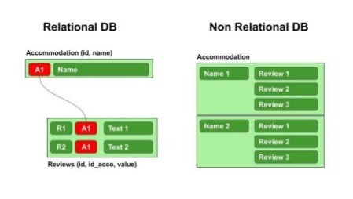
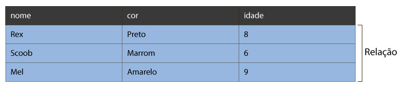
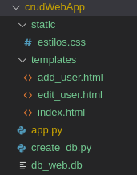
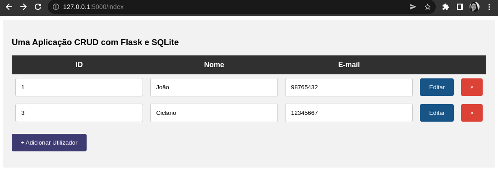
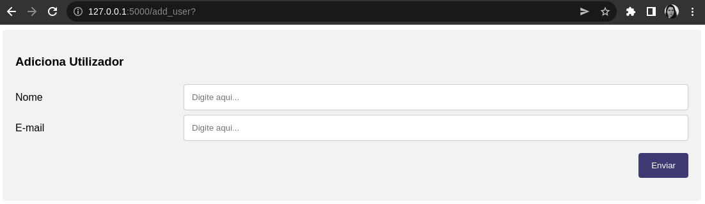
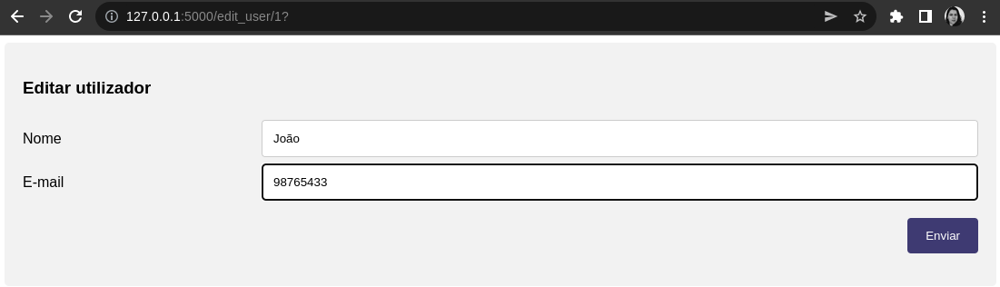
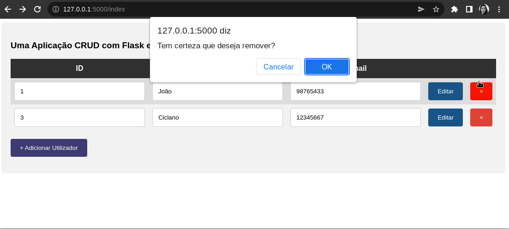

# Base de Dados {.part}

# Tipos  de Bases de Dados

- Atualmente existem dois grandes tipos de bases de dados:
	- Relacional: geralmente usa SQL.
	- Não relacional: NoSQL (*Not only SQL*). 

::::{.center}
{width=40%}
::::

# Bases de Dados Relacional

- Dados são armazenados em estruturas lógicas de tabelas.
	- Tabelas podem ser associadas entre si.
- Linguagem comum para manipular dados: SQL.
	- SQL: *Structured Query Language*.

::::{.center}
{width=70%}
::::

# Sistemas Gerenciadores de Bases de Dados

- Existem vários sistemas:
	- Oracle Database
	- MySQL
	- PostgreSQL
	- Microsoft SQL Server
	- SQLite
	- ...
- Por simplicidade, iremos trabalhar com o **SQLite 3**.
<!-- TODO: Pôr figura do logo do sqlite -->

# SQLite e Python

- SQLite é um programa externo ao Python.
- Instalação no sistema:
	- [https://www.sqlitetutorial.net/download-install-sqlite/](https://www.sqlitetutorial.net/download-install-sqlite/)
- Testar se SQLite está instalado:
	- em linha de comando, digitar `sqlite3`

# Exemplo de Criação de Tabela

- Programa: createTable.py

```{.Python .numberLines style="font-size: 18px;"}
import sqlite3
con = sqlite3.connect('minhaBase.db')

# Criar cursor para realizar operações SQL
cur = con.cursor()

# Comando SQL para criar a tabela de linguagens de programação.
sql_create_table = '''CREATE TABLE lp (id INT PRIVATE KEY AUTOINCREMENT,
    nome text, anoCriacao int, percUso real)'''

# Cria uma tabela para guardar...
cur.execute(sql_create_table)

# Guarda (commit) as mudanças
con.commit()

# Ao final, fechar a conexão com a base.
# Assegure-se de que todos os commits tenham sido feitos.
con.close()
```

# CRUD

Acrônimo      | Descrição					    | Comando de SQL
--------------|---------------------------------|----------------
Create  	  | cria/insere dado na tabela.     | INSERT
Read/Retrieve | obtém dado da tabela.		    | SELECT
Update		  | atualiza dado já existente na tabela.  | UPDATE
Delete 		  | apaga dado da tabela.		 	| DELETE

# Inserção de Dados (*Create*)

```{.Python .numberLines style="font-size: 18px;"}
import sqlite3
con = sqlite3.connect('minhaBase.db')

cur = con.cursor()

# Insere linhas na tabela
cur.execute("INSERT INTO lp VALUES (0, 'Python',1991, 15.3)")
cur.execute("INSERT INTO lp VALUES (1, 'C',1972, 12.3)")
cur.execute("INSERT INTO lp VALUES (2, 'Java',1994, 11.8)")

# Compromete (commit) as mudanças
con.commit()

# Ao final, fechar a conexão com a base.
# Assegure-se de que todos os commits tenham sido feitos.
con.close()
```

# Consulta de Dados (*Read*)

```{.Python .numberLines style="font-size: 18px;"}
import sqlite3
con = sqlite3.connect('minhaBase.db')

cur = con.cursor()

# Para fazer consultas à base de dados lp em minhaBase.db
# Vamos ordenar as linguagens por ano de criação.
consulta = cur.execute('SELECT * FROM lp ORDER BY anoCriacao')

# 'consulta' é um objeto iterável e cada elemento é uma linha do
# resultado do select.
for i in consulta: print(i)

# Vamos ordenar as linguagens por percentual de uso. 
cur.execute('SELECT * FROM lp ORDER BY percUso')

# fetch all retorna uma lista com o resultado da consulta
lista_consulta = cur.fetchall()
print(lista_consulta)

con.close()
```

# Fetchall, fetchone, fetchmany

- `fetchall()`:
	- Retorna lista completa dos valores retornados pelo SELECT.
- `fetchone()`:
	- Retorna o primeiro valor do SELECT.
- `fetchmany(x)`:
	- Retorna lista dos `x` valores retornados pelo SELECT.

# Atualização de Dados (*Update*)

```{.Python .numberLines style="font-size: 18px;"}
import sqlite3
con = sqlite3.connect('minhaBase.db')

cur = con.cursor()

# Atualiza uma linha específica da tabela
cur.execute("UPDATE lp SET  percUso = 13.1 where id = 1")

# Guarda (commit) as mudanças
con.commit()

# Ao final, fechar a conexão com a base.
# Assegure-se de que todos os commits tenham sido feitos.
con.close()
```

# Remoção de Dados (*Delete*)

```{.Python .numberLines style="font-size: 18px;"}
import sqlite3

con = sqlite3.connect('minhaBase.db')

cur = con.cursor()

# Insere uma linha na tabela
cur.execute("DELETE FROM lp WHERE id=0")

# Guarda (commit) as mudanças
con.commit()

# Ao final, fechar a conexão com a base.
# Assegure-se de que todos os commits tenham sido feitos.
con.close()

print("Remoção concluída...")
```

# Operações com Entrada do Utilizador

- Ao usar input de utilizador, texto SQL fica mais livre.
	- `cur.execute("DELETE FROM lp WHERE id=" + id_input)`
- Por exemplo, utilizador pode injetar código:
	- `0 OR id=1`
	- `0; DROP lp;`
- Por segurança, o correto é usar *placeholders* '?' na função `execute`.
	- `cur.execute("DELETE FROM lp WHERE id=?", (id_input,))`
	- O *placeholder* '?' fica no local onde o texto será substituído;
	- Após a vírgula, incluir uma tupla com os valores. 
- Para previnir de ataques de injeção de código HTML, JS...
	- Uso de função 'escape()' do pacote `markupsafe`.

# Exemplo de *Delete* com *Placeholders* e *Escape*

```{.Python .numberLines style="font-size: 18px;"}
import sqlite3
from markupsafe import escape # Usado para impedir ataque de injeção de código html ou js

con = sqlite3.connect('minhaBase.db')

try:
    cur = con.cursor()

    # Insere uma linha na tabela
    id_input = input("Entre com o id: ")
    cur.execute("DELETE FROM lp WHERE id=?", (id_input,))

    # Guarda (commit) as mudanças
    con.commit()
except Exception as m:
    print(m)
finally:
    # Ao final, fechar a conexão com a base.
    # Assegure-se de que todos os commits tenham sido feitos.
    con.close()

print("Remoção concluída...")
```

# Flask e SQLite {.part}

# CRUD com Flask e SQLite

- Podemos implementar o CRUD no Flask.
- Interface com o utilizador: funciona no navegador (cliente).
- Operações de CRUD: no servidor Flask (Python 3).
	- Base de dados (SQLite) junto ao servidor.
- A seguir, vamos criar uma aplicação Web simples para CRUD.
	- Aplicação que apresenta a base de dados com registo de nome de cliente e e-mail.

# Organização de Ficheiros e Diretórios

:::::{.columns}
:::{.column width=70%}
- Descrição dos ficheiros:
	- static/stilos.css: estilos para a página.
	- templates/add_user.html: página com formulário para adicionar registo.
	- templates/edit_user.html: página com formulário para editar um registo específico.
	- templates/index.html: página principal que mostra a tabela e disponibiliza operações.
	- app.py: servidor flask.
	- create_db.py: programa a parte para criar a base de dados SQLite.
	- db_web.db: a base de dados.

:::
:::{.column width=30%}
{width=75%}

:::
:::::

# Criar a Base em SQLite

- Ficheiro create_db.py.

```{.Python .numberLines style="font-size: 18px;"}
import sqlite3 as sql

#Liga-se à base de dados do SQLite
con = sql.connect('db_web.db')

#Cria o cursor para se fazer as queries SQL
cur = con.cursor()

#Remove a tabela utilizadores se já existir.
cur.execute("DROP TABLE IF EXISTS utilizadores")

#Cria a tabela utilizadores do zero.
sql = "CREATE TABLE utilizadores ('Id' INTEGER PRIMARY KEY AUTOINCREMENT, 'Nome' TEXT, 'Email' TEXT)"
cur.execute(sql)

#'Comita' as mudanças
con.commit()

con.close()
```

# Mostrar Tabela: no Flask

```{.Python .numberLines style="font-size: 18px;"}
# Fazer os imports antes
@app.route("/")
@app.route("/index")
def index():
    con=sql.connect("db_web.db")
    # Permite recuperar retorno de fetchall como dicionário
    con.row_factory=sql.Row
    cur=con.cursor()
    cur.execute("SELECT * FROM utilizadores")
    dado=cur.fetchall()
    return render_template("index.html", dados=dado)
```

# Mostrar Tabela: no Template HTML

- Apenas a parte da tabela e botão de adicionar utilizador:

```{.HTML .numberLines style="font-size: 18px;"}
<table class='table'>
	<tr>
		<th>ID</th> <th>Nome</th> <th>E-mail</th> <th></th> <th></th>
	</tr>
	
	<tr>
		<td> <input type="text" readonly value={{linha.Id}}> </input> </td>
		<td> <input type="text" readonly value={{linha.Nome}}> </input> </td>
		<td> <input type="text" readonly value={{linha.Email}}> </input> </td>
		<td id='fixed-width'> 
			<form method='GET' action='{{url_for("edit_user",uid=linha.Id)}}'> 
				<button class='button1'> Editar </button> </form> 
		</td>
		<td id='fixed-width'>
			<form method='GET' action='{{url_for("delete_user",uid=linha.Id)}}'> 
				<button class='button2' onclick='return confirm("Tem certeza que deseja remover?")'> × </button> 
			</form> 
		</td>
	</tr>
	
</table> <br>
<form action='{{url_for("add_user")}}'> <button class='button3'>+ Adicionar Utilizador</button> <form>  
```

# Mostrar Tabela: Resultado com CSS

- Página principal com o CSS aplicado e alguns dados adicionados a base de dados:

::::{.center}
{width=80%}
::::

# Adicionar Registo: no Flask

```{.Python .numberLines style="font-size: 20px;"}
@app.route("/add_user",methods=['POST','GET'])
def add_user():
    if request.method=='POST':
        nome=request.form['uname']
        email=request.form['contact']
        con=sql.connect("db_web.db")
        cur=con.cursor()
        cur.execute("INSERT INTO utilizadores(Nome,Email) VALUES (?,?)", (nome, email))
        con.commit()
        return redirect(url_for("index"))
    return render_template("add_user.html")
```

# Adicionar Registo: no Template HTML

- Apenas a parte do formulário:

```{.HTML .numberLines style="font-size: 18px;"}
<form method='post' action='{{url_for("add_user")}}'>
	<div class="row"> 
		<div class="col-25"> <label for="fname"> Nome </label> </div>
		<div class="col-75">
		<input type="text" id="fname" name="uname" placeholder="Digite aqui..." required>
		</div>
	</div>
	<div class="row">
		<div class="col-25"> <label for="fcontact"> E-mail </label> </div>
		<div class="col-75">
		<input type="text" id="fcontact" name="contact" placeholder="Digite aqui..." required>
		</div>
	</div>
	<br>
	<div class="row">
		<input type='submit' value='Enviar'>
	</div>
</form>
```

# Adicionar Registo: Resultado com CSS

- Página principal com o CSS aplicado:

::::{.center}
{width=80%}
::::

# Atualizar Registo: no Flask

- Utiliza o id na URL da página.
	- 'id' vem da associação do botão 'Editar' ao id mostrado na tabela.

```{.Python .numberLines style="font-size: 18px;"}
@app.route("/edit_user/<int:id>",methods=['POST','GET'])
def edit_user(id):
    if request.method=='POST':
        nome=request.form['uname']
        email=request.form['contact']
        con=sql.connect("db_web.db")
        cur=con.cursor()
        cur.execute("UPDATE utilizadores SET Nome=?,Email=? WHERE Id=?",(nome, email, id))
        con.commit()
        return redirect(url_for("index"))
    con=sql.connect("db_web.db")
    con.row_factory=sql.Row
    cur=con.cursor()
    cur.execute("SELECT * FROM utilizadores WHERE Id=?",(id,))
    dado=cur.fetchone()
    return render_template("edit_user.html",datas=dado)
```

# Atualizar Registo: no Template HTML

- Apenas a parte do formulário:

```{.HTML .numberLines style="font-size: 18px;"}
<form method='post' action='{{url_for("edit_user",uid=datas.Id)}}'>
	<div class="row">
		<div class="col-25"> <label for="fname">Nome</label> </div>
		<div class="col-75">
		<input type="text" id="fname" name="uname" value='{{datas.Nome}}'>
		</div>
	</div>
	<div class="row">
		<div class="col-25"> <label for="fcontact">E-mail</label> </div>
		<div class="col-75">
		<input type="text" id="fcontact" name="contact" value='{{datas.Email}}'>
		</div>
	</div>
	<br>
	<div class="row">
		<input type='submit' value='Enviar'>
	</div>
</form>
```

# Atualizar Registo: Resultado com CSS

- Página principal com o CSS aplicado:

::::{.center}
{width=80%}
::::

# Remove Registo: no Flask

- Utiliza o id na URL da página.
	- 'id' vem da associação do botão de remoção ao id mostrado na tabela.

```{.Python .numberLines style="font-size: 20px;"}
@app.route("/delete_user/<int:id>",methods=['GET'])
def delete_user(id):
    con=sql.connect("db_web.db")
    cur=con.cursor()
    cur.execute("DELETE FROM utilizadores WHERE Id=?",(id,))
    con.commit()
    return redirect(url_for("index"))
```

# Remover Registo: Botão Delete

::::{.center}
{width=80%}
::::

# Atividades

1. Reproduzir a aplicação web proposta nos slides anteriores.
	- Note que os códigos disponíveis não estão completos!
2. Modifique a aplicação para lidar uma outra base de dados.
	- Tema é livre.