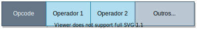
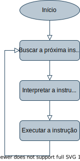
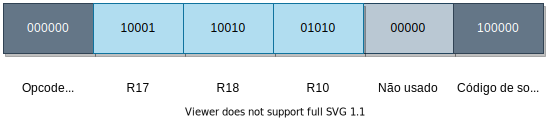
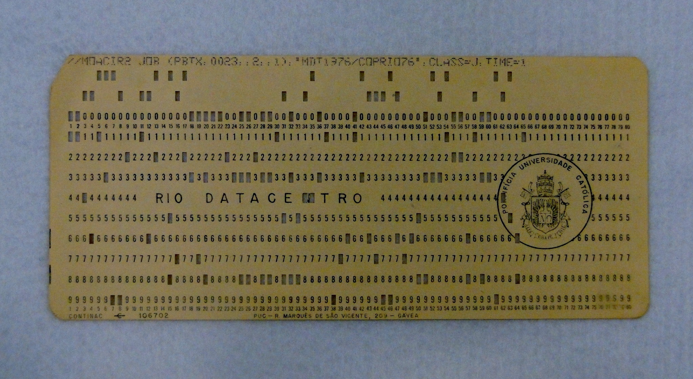
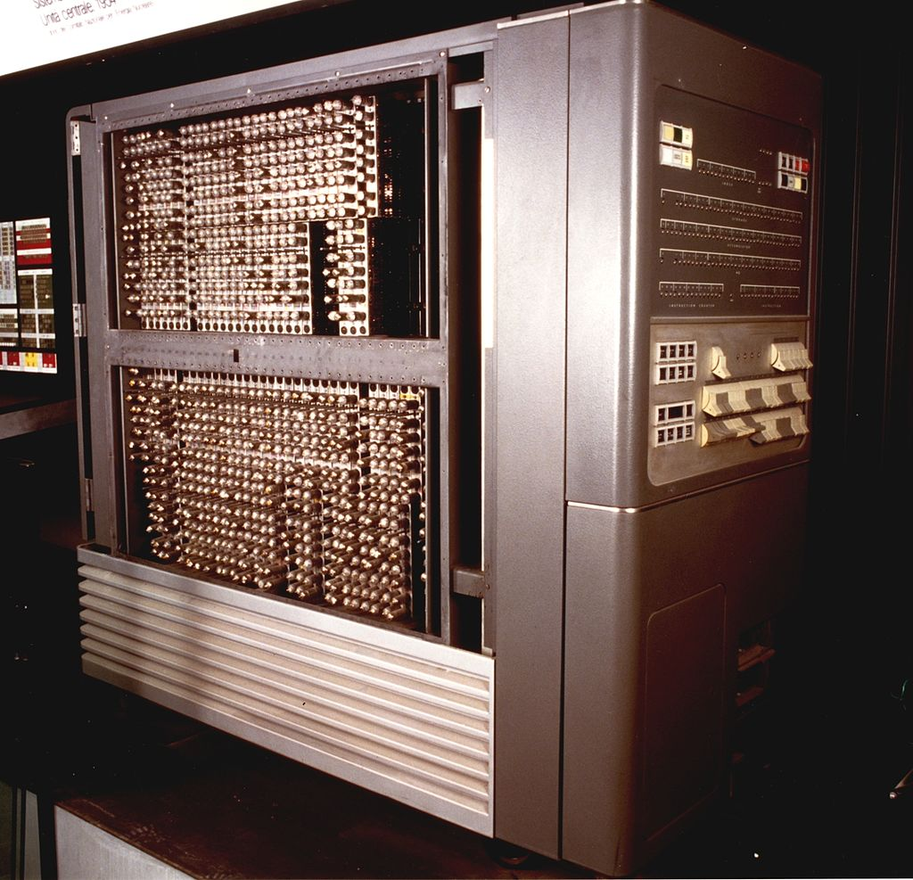
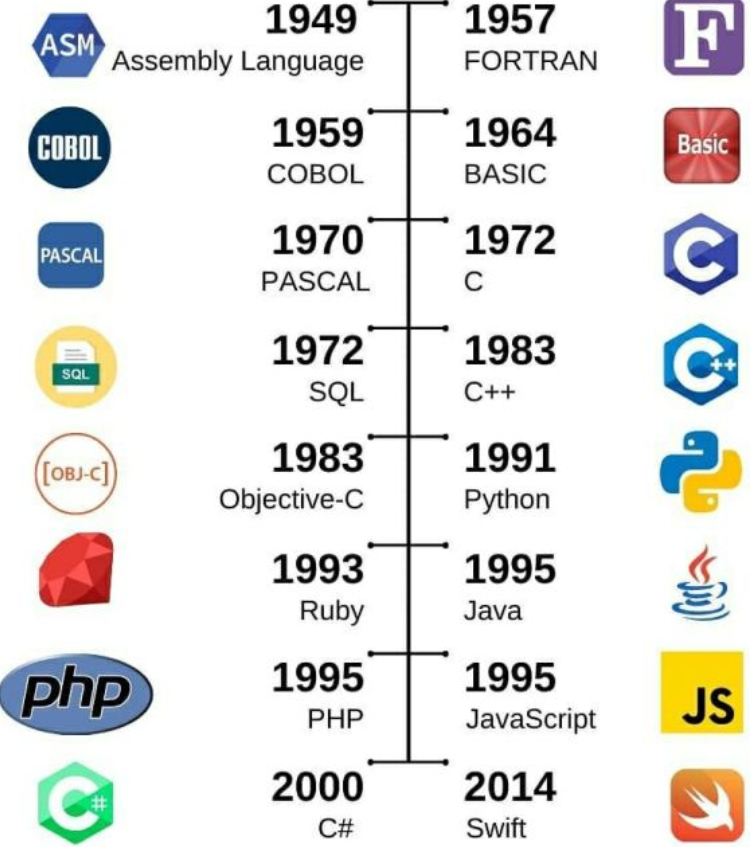
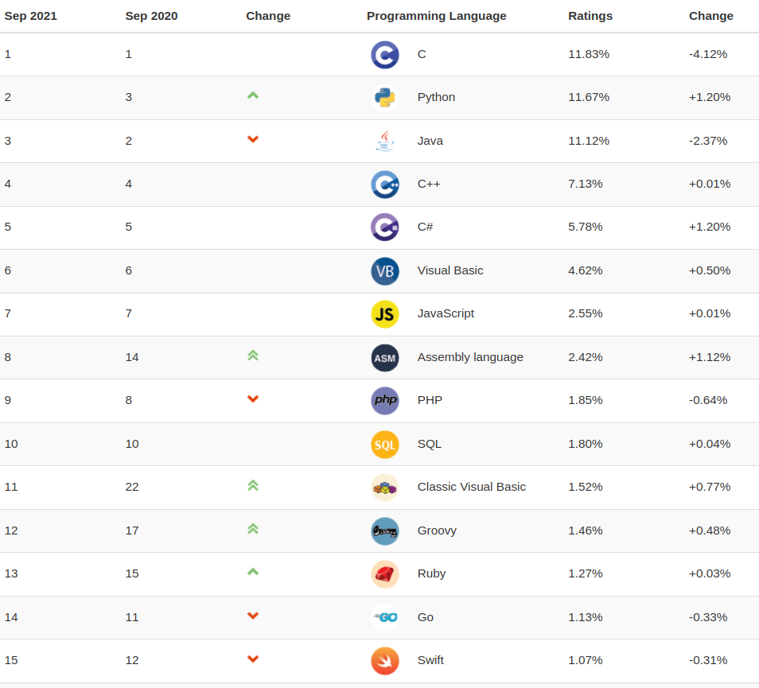

# Estrutura da Unidade Curricular

- Linguagem de Programação (LP).
- Objetivos:
	1. Conhecer os paradigmas de linguagens de programação e suas aplicações.
	2. Compreender a programação de computadores por linguagem estruturada.
	3. Compreender a programação de computadores por linguagem orientada a objetos.
	4. Introduzir técnicas de programação concorrente.
	5. Elaborar e projetar programas de pequeno e médio porte  para resolver problemas reais computacionais.
	6. Analisar técnicas de programação independente de plataforma.

# Informações Gerais

::::::{.block .centered}
:::{.blocktitle}
Horário e Sala
:::
- Sextas de 18:30h às 22:30h
- Lab 
::::::

::::::{.block .centered}
:::{.blocktitle}
Contato
:::
* fpassos@uatlantica.pt
* Moodle:
  * Calendário.
  * Material didático.
  * Listas de Exercícios.
  * **Avisos**.
::::::

# Conteúdo Programático (I)

* Linguagens de Programação e seus paradigmas
	* Paradigma de programação estruturada
	* Paradigma de programação concorrente
	* Paradigma de programação orientada aos objetos
	* Paradigma de programação funcional
	* Paradigma de programação lógico
	* Paradigmas híbridos
	- Linguagens compiladas e linguagens interpretadas

# Conteúdo Programático (II)

- Programação pela Linguagem Python 3
	- Estruturas lógicas e de controle
	- Estrutura de dados básicas (listas, tuplas e dicionários)
	- Módulos e Recursão
	- Entrada e saída e arquivos
	- Tratamento de exceções
	- Objetos, classes e métodos
- Programação pela Linguagem Java Script
	- Páginas Web: HTML, CSS e Java Script
	- Estruturas lógicas e de controle
	- Estruturas de dados básicas e funções
	- Estrutura de documentos Web
	- Tratamento de Eventos

# Conteúdo Programático (III)

* Introdução à Programação concorrente
	* Multiprocessamento
	* *Multithreading*
* Projeto de programas de computadores
	* Elaboração de programas
	* Depuração de programas
	* Escolha e projeto de estrutura de dados
	* Avaliação de desempenho
	* Documentação

# Material de Apoio

::::::{.block .centered}
:::{.blocktitle}
Sobre Linguagem de Programação:
:::
* Livro: Sebesta, R. W. (2018). *Conceitos de Linguagens de Programação.* Edição 11. Bookman Editora.
::::::

::::::{.block .centered}
:::{.blocktitle}
Sobre Python:
:::
  * Menezes, N. N. C. (2019). *Introdução à programação com Python: Algoritmos e lógica de programação para iniciantes.* Edição 3. Novatec.
  * Links na Internet: http://python.org.br
::::::

# Avaliação

* Serão passados 6 trabalhos individuais ao longo do curso.
	* Em laboratório.
	* Pior nota é descartada: média será de 5 dos 6 trabalhos.
	* Nota T1.
* Trabalho em grupo.
	* A ser definido.
	* Com apresentação oral ao final do curso.
	* Nota T2.
* Nota final: $\frac{T1 + T2}{2}$
* Exame Final:
	* Em caso da nota final abaixo de 50%.

# Visão Geral do Curso

- O que são linguagens de programação?
- Por que elas existem?
	- Existe semelhança com as linguagens humanas?
- Quais são as *palavras*, as *formas de escrita*, os *significados*?

# Linguagem de Programação

::::::{.block .centered}
:::{.blocktitle}
LP: uma definição
:::
- Meio sistemático de comunicação para instruir ações aos computadores, formado por regras léxicas, sintáticas e semânticas.
::::::

- Regras léxicas: morfologia (estudo da estrutura), palavras, símbolos. 
- Regras sintáticas: forma de escrita, composição dos elementos léxicos.
- Regras semânticas: significado, o que será feito (programação).

# Funcionamento do Computador

- Computadores atuais entendem apenas 0 e 1.
	- Transmitem internamente pulsos elétricos.
	- Usam transistores, CI, ...
	- Internamente usam sinais que são interpretados como 0 e 1.
- Processadores possuem os elementos eletrônicos e lógicos.
	- ULA, registos, unidade de controle.
	- Executam instruções.
- Diferentes arquiteturas.
	- Forma como componentes são organizados, instruções diferentes.
	- *e.g.* família x86, família ARM, MIPS, powerPC, ...

# Acesso à Memória e Instruções

:::::{.columns}
::::{.column style="width: 70%; padding-top: 7%"}
- Memórias guardam programas e dados.
	- Arquitetura de Von Neumann.
- Processador acessa a memória para buscar instrução.
- Instruções são formadas por nome (*opcode*) e operadores.
	- *Opcode* diz o que fazer: seleciona operação no processador.
	- Operadores indicam os dados ou referência a dados (em registo ou memória).

{style="width: 500px; padding-left: 80px; padding-top: 20px;"}
::::
::::{.column width=30%}
:::::::{.center}
{width=220px}
:::::::

::::
:::::

# Linguagem do Computador

- Linguagem de máquina: 0 e 1.
- Para a máquina (computador), instruções são dadas **em bits**.

:::::::{.center}
{width=60%}
:::::::

- Esta instrução de MIPS soma dois valor de R17 a R18 e guarda resultado em R10.

# Linguagem de Montagem

- Linguagem de Montagem: *Assembly*.
- Montador ou *assembler* transforma bits em caracteres.
	- Caracteres representam diretamente a instrução binária.
- No exemplo anterior:

~~~{#idCode .mips}
add $t0,$s1,$s2
~~~

- Associação direta entre bits e assembly MIPS:
	- add corresponde aos dois códigos (início e fim);
	- $t0 é o registo 10;
	- $s1 é o registo 17;
	- $s2 é o registo 18.

# Linguagem Montagem (II)

- Exemplo de código em assembly do MIPS:

~~~{#idCode .mips}
add $t0,$s1,$s2
add $t1,$s3,$s4
sub $s0,$t0,$t1
~~~

- O mesmo programa em C:
~~~{#idCode .c}
f = (g + h) – (i + j);
~~~

# Linguagem Montagem (III)

:::::{.columns}
::::{.column width=40%}
 
 
 

- Outro exemplo de código em assembly do MIPS:
	- Realiza o cálculo de fatorial de *n*.
	- Apenas para saber¹
::::
::::{.column width=60%}
~~~{#idCode .mips}
# Supor n correspondente a $a0
fact:
  sub  $sp,$sp,8 # ajuste da pilha
  sw   $ra,4($sp) # salva o endereço de retorno
  sw   $a0,0(sp) # salva o argumento n
  slt  $t0,$a0,1 # teste para n<1
  beq  $t0,$zero,L1 # se n>=1, vá para L1
  add  $v0,$zero,1 # retorna 1 se n < 1
  add  $sp,$sp,8 # pop 2 itens da pilha
  jr   $ra
L1:
  sub  $a0,$a0,1 # n>=1, n-1
  jal  fact # chamada com n-1
  lw   $a0,0($sp) # retorno do jal; restaura n
  lw   $ra,4($sp)
  add  $sp,$sp,8
  mult $v0,$a0,$v0 # retorna n*fact(n-1)
  jr   $ra
~~~
::::

:::::

# Linguagens de Alto Nível

- Não é simples programar em linguagens de montagem.
	- Muitos detalhes de arquitetura.
	- Torna difícil a programação, programas são difíceis de ler ...
- Linguagens de máquina e de montagem são de **baixo nível**.

::::::{.block .centered}
:::{.blocktitle}
Linguagem de Alto Nível
:::
- Permite descrever um programa de computador de forma mais acessível às pessoas.
	- Mais simples desenvolver a lógica de programação.
	- Melhor legibilidade.
	- Mais confiável.
	- ...
::::::

# Breve Histórico das Linguagens de Programação{.part}

# Da Linguagem de Máquina a Linguagem de Montagem

- Linguagem de máquina é muito complicada para humanos.
- Computadores trabalham com 0 e 1.
	- Inicialmente, uso de **cartão perfurado**.
- Humanos trabalham com linguagens escrita/falada.
	- Sua língua nata ou outra (*e.g.* Inglês).
- Linguagem de montagem facilita um pouco.
	- Montador *traduz* cada instrução de máquina para texto.
	- Mais próximo da linguagem humana.
	- Porém há pouca abstração da linguagem de máquina.

{style="width: 35%; position: absolute; top: 45%; left: 63%"}

# Da Linguagem de Máquina ao FORTRAN

:::::{.columns}
::::{.column style="width: 60%; padding-top: 2%"}
- FORTRAN: *IBM Mathematical FORmula TRANslation System*.
- Desenvolvida para o IBM 704 em 1954 a 1957.
- Equipe chefiada por John W. Backus. 
- Linguagem voltada para cálculos matemáticos.
- Possui comandos característicos de linguagem de máquina.
	- *e.g.*, GOTO.
::::
::::{.column width=40%}
:::::::{.center}
{#ibm704 width=90%}
:::::::
::::

:::::

# Exemplo de Código FORTRAN

- Para calcular fatorial de *n*.

# Surgimento da Linguagem LISP

- Em 1958, *Massachusetts Institute of Technology*.
- Desenvolvimento liderado pelo Professor John McCarthy. 
- Notação simples, baseada em funções matemáticas. 
	- Muito uso de **parênteses**!
	- Uso do conceito de **listas**...
- LISP: *LISt Processing*.
	- Processamento de listas.

# Exemplo de Código LISP

- Para calcular fatorial de *n*.

# Surgimento da Linguagem ALGOL

- Linguagem padrão para algoritmos.
- Comitê foi formado em 1958.
	- John Backus, C. A. R. Hoare, John McCarthy, etc.
	- Deste comitê nasceu ALGOL 58.
- Vários padrões posteriores: 60, 68.
- Talvez a mais influente linguagem de programação.
	- Simula, Pascal, C, etc.

# Exemplo de Código em ALGOL

- Novamente o exemplo do cálculo do fatorial:

~~~{#algol .algol}
integer procedure Fatorial(m); integer m;
Begin
  integer F;
  F := if m=1 then 1 else m*Fatorial(m-1);
  Fatorial := F
end;	
~~~

# Surgimento de COBOL

- *COmmon Business Oriented Language*.
- COBOL foi feita para negócios:
	- Contadores, economistas, etc.
	- Processamento de banco de dados comerciais.
- 1958: COBOL foi criada por um comitê.
	- Indústria, governo e academia.
- Ainda usada em muitas companhias!

# Exemplo de Código em COBOL

~~~{#cobol .cobol}
ADD YEARS TO AGE.

MULTIPLY PRICE BY QUANTITY GIVING COST.

SUBTRACT DISCOUNT FROM COST GIVING FINAL-COST.
~~~

# Surgimento da Linguagem C e C++

- Criada por Dennis Ritchie em 1972, no Bell Labs.
	- Reescrever de forma portável o sistema operacional UNIX (antes em Assembly).
	- Derivada da linguagem B (na verdade, BCPL - *Basic Combined Programming Language*), 1966.
- Padrão ANSI (*American National Standards Institute*) em 1985.
	- ANSI C.
- Apesar de antiga, é altamente popular.
- C++ veio como uma atualização de C para orientação a objetos.
	- *C with Classes* -> C++.
	- Desenvolvida por Bjarne Stroustrup em 1983.

# Exemplo de Código em C

- Cálculo de fatorial:

# Surgimento da Linguagem Python

- Criada por Guido Van Rossum em 1989.
	- No Instituto de Pesquisa Nacional para Matemática e Ciência da Computação (CWI).
	- Lançada em 1991.
- Versões 1, 2 (em 2000) e 3 (em 2008).
	- Versões 2 e 3 não compatíveis.
- Projetada para diminuir o esforço de programação.
	- Prioriza legibilidade, velocidade (?).
	- Mais produtiva.
- Origem do nome em homenagem ao grupo humorístico britânico *Monty Python*.

# Exemplo de Código em Python

# Surgimento da Linguagem Java

- Criada por uma equipe de programadores chefiada por James Gosling em 1991.
	- Empresa Sun Microsystems.
	- Adquirido pela empresa Oracle Corporation em 2008.
- Escrita parecida com C/C++.
	- Orientada a objetos.
- Uso de máquina virtual própria.
	- Portabilidade.
- Várias versões de kit de desenvolvimento e máquinas virtuais ao longo dos anos.

# Exemplo de Código em Java

- Exemplo orientado a objetos (classes):

~~~{#java .java}
public abstract class Animal {
   public abstract void fazerBarulho();
}

public class Cachorro extends Animal {
   public void fazerBarulho() {
      System.out.println("AuAu!");
   }
}

public class Gato extends Animal {
   public void fazerBarulho() {
      System.out.println("Miau!");
   }
}
~~~

# Surgimento da Linguagem Java Script

- Criada por Brendan Eich, a pedido da empresa Netscape, em meados de 1995.
	- Inicialmente chamada de LiveScript.
	- Aliada a Sun, criadora do Java, nomearam a linguagem JavaScript.
		- Embora diferente de Java.
- Plataforma Web.
	- Linguagem para o lado do cliente Web.
	- Interpretada por navegadores Web.
	- Embora existam vertentes para o lado servidor (NodeJS).
- Padronizada pela ECMA (*European Computer Manufacturers Association*) em 1996.
	- Vários navegadores puderam incorporá-la.
	- ECMAScript.

# Exemplo de Código em JavaScript

# 

:::::{.columns}
::::{.column width=35%}
## Cronologia das principais linguagens de programação:
::::
::::{.column width=65%}
:::::::{.center}
{#timeline width=55%}
:::::::
::::
:::::

# 

:::::{.columns}
::::{.column width=35%}
## Popularidade das Linguagens:
- Segundo índice TIOBE, setembro de 2021.
	- https://www.tiobe.com/tiobe-index/
::::
::::{.column width=65%}
:::::::{.center}
{#id width=80%}
:::::::
::::
:::::

# Paradigmas de Linguagens de Programação{.part}

# Paradigmas de Linguagens de Programação

:::::::{.center}
{#paradigmas width=80%}
:::::::

# Paradigma Imperativo *vs.* Declarativo

- Imperativo:
	- Linguagem indica os passos de como chegar na solução.

~~~{#imperativo .c}
char cores[5][10] = {"verde", "amarelo", "azul", "branco", "vermelho"};
int i;

for (i=0; i < 5; i++){
    printf("cor %i: %s\n", i+1, cores[i]);
}
~~~

- Declarativo:
	- Linguagem declara o que deve ser feito.

~~~{#declarativo .sql}
SELECT * FROM cores;
~~~

# Paradigma Estruturado

- Linguagem é focada nas estruturas de controle.
- Há três tipos de estrutura de controle:
	- sequência,
	- seleção,
	- repetição.
- Variáveis são alteradas de acordo com as estruturas de controle.
	- Tal como a linguagem de máquina, porém mais legível.
- Exemplos: C, FORTRAN, ALGOL, Pascal.

# Paradigma de Orientação a Objetos

- Linguagem é focada em definir objetos.
	- Definição e representação de objetos reais.
	- Através da definição de atributos e métodos, por classes ou protótipos.
	- Diminui o *gap semântico*: linguagem humana e de computador.
- Exemplos: Java, C++, Python, Smalltalk.

# Paradigma Concorrente

- Linguagem é voltada para programação concorrente.
	- Executa tarefas simultaneamente (ou pelo menos aparentemente).
	- Permite paralelismo e distribuição de processamento.
	- Paralelismo virtual ou real.
- Linguagem possui comandos próprios para definir paralelismo.
	- São necessários comandos de sincronização.
	- Alguns linguagens oferecem paralelismo através de bibliotecas externas.
- Exemplos: Object Pascal, Java, Python.

# Paradigma Funcional

- Linguagem é definida através de funções.
	- Aplicação de funções ao invés de mudanças de estado.
	- Expressões ao invés de comandos.
- Muitas vezes voltadas para áreas de matemática, estatística e economia.
- Exemplos: LISP, R, Haskell.

# Paradigma Lógico

- Linguagem faz uso da lógica matemática.
	- Sentenças lógicas são declaradas (ao invés de comandos).
	- São usados símbolos para representar as sentenças, como verdadeiros ou falsos.
- Exemplos: Prolog, 
- Código para calcular fatorial de *N* em Prolog:
~~~{#prolog .prolog}
factorial(0,1). 

factorial(N,F) :-  
   N>0, 
   N1 is N-1, 
   factorial(N1,F1), 
   F is N * F1.
~~~

# Multiparadigmas

- Existem várias linguagens que na verdade são multiparadigmas.
	- Python: orientada a objetos, estruturada, funcional, concorrente.
	- Java e C++: orientada a objetos, estruturada, concorrente (e imperativa).
	- Java Script: orientada a objetos, estruturada, funcional.
	- SQL: declarativa e estruturada.
- Note que há linguagens que são classificadas entre diversos tipos de paradigmas.
	- É importante saber qual paradigma está usando nesses tipos de linguagem.

# Tradução de Linguagens{.part}

# Tradução

- Como linguagens de alto nível são executadas pelo computador?
- Necessário processo de **tradução**.
- Um programa ou software realiza esse processo.
- Há basicamente dois tipos:
	- Compiladores
	- Interpretadores

# Compilador

- Programa capaz de receber um código texto em uma linguagem específica e traduzi-lo para linguagem de máquina.
	- Recebe **código fonte** como entrada e gera um **programa executável**.
- Executa várias etapas:
	1. Análise léxica.
	2. Análise sintática.
	2. Análise semântica.
	3. Geração de código intermediário.
	4. Otimização.
	5. Geração de código final.
- Exemplos de compiladores:
	- gcc (para C), gfortran (para FORTRAN), g++ (para C++).

# Interpretador

- Programa que interpreta cada instrução de código em uma linguagem específica retornando de imediato o resultado para ele.
	- Isto é, não executa o código todo de uma vez.
	- Cada trecho é executado por vez.
- Para cada instrução de linguagem de alto nível, realiza etapas semelhantes ao compilador.
	- **Interpreta**: análise léxica, sintática, semântica, geração de código de máquina (em memória).
	- **Executa** a instrução em linguagem de máquina.
- Podem ser interpretadas interativamente ou não.
- Exemplos de interpretadores:
	- clisp (Lisp), gprolog (Prolog), python (Python 2), V8 (Java Script).

# Linguagens Híbridas: Compiladas e Interpretadas

- Algumas linguagens são híbridas: compiladas e interpretadas.
- Geralmente fazem uso de máquinas virtuais (VM).
- Geralmente o processo é:
	- Código fonte é compilado.
	- O compilador gera código intermediário chamado de **bytecode**.
	- O bytecode é então interpretado por uma VM. 
- Exemplos: Java, C#.
	- Compilador de java: *javac*.
	- Máquina virtual de java: *java*.

# Erros de Tradução

- Erros léxicos e sintáticos.
	- Compilador captura esse tipo de erro.
	- Interpretador também checa ao avaliar uma sentença.
	- Faz checagem léxica e sintática da linguagem de programação em **tempo de compilação** ou **tempo de interpretação**.
	- No caso da compilação, códigos intermediários não são gerados caso o erro aconteça.

# Outros Tipos de Erros

- Erros de entrada e saída.
	- Ocorre em **tempo de execução**.
	- Linguagens costumam prover formas de detectar tais erros.
- Erros de acesso a memória e operações indevidas.
	- Ocorrem em **tempo de execução**.
	- *e.g.*, acesso a área de memória não alocada, divisão por 0.
- Erros de lógica.
	- Programa parece correto e executa.
	- Mas não responde como o desejado.
	- Mais difícil de corrigir.

# Exercício{.part}

# 

- Acesse: [https://www.levenez.com/lang/](https://www.levenez.com/lang/)
- Dessa lista, escolha uma linguagem que não conheça e:
	- Descreva as características da linguagem;
	- Tente definir o paradigma de programação;
	- É compilada, interpretada, híbrida?
	- Apresente um trecho de código (pelo menos umas 5 linhas ou instruções) e tente explicar o que ele faz.
