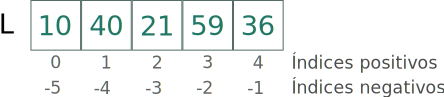

# Listas em Python {.part}


# Definição de Listas em Python

::::::{.block .centered}
:::{.blocktitle}
Definição:
:::
Uma lista (*list*) em Python é uma coleção ordenada de valores modificáveis.
::::::

- Usada para representar conjuntos.
- Vetores: coleção ordenada de valores de mesmo tipo.
    - Conhecidos também como *arrays*.
- Matrizes: vetor bidimensional.
- Matrizes multidimensionais...
- Valores podem ser modificados a qualquer momento.

# Representação de Listas em Python

- **Listas** são representadas entre colchetes.
- Cada elemento da lista é separado por vírgula.
- Seus elementos podem ser de qualquer tipo e misturados.
- Exemplo:

~~~{#ex1 .python}
lista = [1, 2.3, 'A', 'a casa', False]
~~~

# Criação de uma Lista

- Criando lista com elementos previamente conhecidos:

~~~{#ex2 .python}
l1 = [10, 20, 30, 40, 50]
~~~

- Criando lista vazia:

~~~{#ex3 .python}
l2 = []
~~~

# Imprimir Toda a Lista

- Simples e fácil!

~~~{#ex4 .python}
L = ['a', 'b', 'c', 'd', 'e']
print(L)
~~~

- Saída:

~~~{#ex5 .python}
>>>['a', 'b', 'c', 'd', 'e']
~~~

# Operador de Acesso (I)

- Dada uma lista, podemos acessar seus elementos um por um.
- Todo elemento de uma lista tem um índice associado.
  - Este índice sempre começa em 0.

:::::::{.center}
{#lista width=25%}
:::::::

- O acesso é feito via este índice.

#  Operador de Acesso (II)

:::::::{.center}
{#listaInd width=25%}
:::::::

- Por exemplo, imprimir o primeiro elemento:

~~~{#printLista .python}
print(L[0])
~~~

- Outro exemplo: somar o primeiro e o último elemento:

:::::{.columns}
::::{.column width=45%}
~~~{#ListaAcesso .python}
soma = L[0] + L[4]
print(soma)
~~~
::::
::::{.column width=10%}
:::::::{.center}
ou
:::::::
::::
::::{.column width=45%}
~~~{#ListaAcesso2 .python}
print(L[0] + L[4])
~~~
::::

:::::

# Operador de Acesso (III)

- O que acontece quando acessamos um elemento em posição da lista que não existe?
- Por exemplo, na lista `l = [10, 20, 30, 40, 50]`:
    - Acessar elemento na posição 5 (ou 6, 7,...).
        - Ex.: `print(l[5])`
- Isto ocasionará um erro!

<pre style="font-size:14pt; color:red;">
    Traceback (most recent call last):
      File "<stdin>", line 1, in <module>
    IndexError: list index out of range
</pre>

# Operador de Acesso (IV)

- Podemos .alert[**alterar**] o valor de um elemento da lista.
- Exemplo 1: mudar o valor do segundo elemento para 15.

:::::{.columns}
::::{.column width=50%}
~~~{#ListaAcesso3 .python}
l = [10, 20, 30, 40, 50] # criação da lista l.
l[1] = 15 # alteração do segundo elemento.
print(l) # impressão da lista l.
~~~
::::
::::{.column width=5%}

::::
::::{.column width=45%}
```
[10, 15, 30, 40, 50]
```
::::

:::::

- Exemplo 2: mudar o valor do terceiro elemento para 'a'.

:::::{.columns}
::::{.column width=45%}
~~~{#ListaAcesso3 .python}
l = [10, 20, 30, 40, 50]
l[2] = 'a'
print(l)
~~~
::::
::::{.column width=10%}

::::
::::{.column width=45%}
```
[10, 15, 30, 40, 50]
```
::::

:::::

# Tamanho de uma Lista

- Para capturar o tamanho de uma lista, existe a função `len`.
- Exemplo de uso:

~~~{#ListaTamanho .python}
lista = [1, 22, 5, -1, 9, -6, 14, 17]
print(len(lista))
~~~

- A saída será:

```
8
```

# Remover Elemento de Lista

- Função `del` remove elemento especificando sua posição.
- Exemplo de uso:

~~~{#ListaRemocao .python}
lista = [1, 22, 5, -1, 9, -6, 14, 17]
del lista[3]
print(lista)
~~~

- A saída será:

```
[1, 22, 5, 9, -6, 14, 17]
```

- `del` serve para apagar uma lista também.

~~~{#ListaRemocao2 .python}
del lista
~~~

# Exercícios (I)

## Responda:

1. Suponha que tenhas uma lista que varia de tamanho.
    - Qual comando deve ser usado para imprimir o seu último elemento?

## Escreve um programa em Python que:

1. Crie uma lista contendo todas as vogais;
1. Troque a primeira vogal com a última e a a segunda com a penúltima.
    - O que aconteceu com a lista?

# Pertinência em Lista

- O comando `in` pode ser usando para verificar se um elemento está em uma lista.
- Uso:

~~~{#ListaIn .python}
>>> elemento in lista
~~~

- Retorna `True` ou `False`.
- Exemplo de uso:

~~~{#ListaInEx .python}
lista = [3, 5, 7, 8, 12, 15]
if 8 in lista:
    print(8, "está na lista")
else:
    print(8, "não está na lista")
~~~

# Iterar em Lista

- Podemos usar um índice variando de 0 a tamanho da lista.
    - Depois, acessar cada elemento na repetição.
- Exemplo:

~~~{#ListaIterar .python}
lista = [3, 5, 7, 8, 12, 15]
for i in range(len(lista)):
    print(lista[i])
~~~

# Iterar em Lista (II)

- Outra forma: usar o operador `in` em um `for`.
    - A faixa de valores do `for` é a própria lista.
    - A variável de índice do `for` passa a ser o elemento.
    - Portanto, acessa-se o elemento **diretamente** por esta variável.
- Exemplo:

~~~{#ListaIterar2 .python}
lista = [3, 5, 7, 8, 12, 15]
for elem in lista:
    print(elem)
~~~

# Exercícios (II)

## Escreve um programa em Python que:

1. Crie um conjunto com os seguintes elementos: {1, 4, 5, 3, 6, 7, 16, 11, 15}.
2. Imprima os números múltiplos de 3 deste conjunto.
3. Modifique a lista para que todos os números pares sejam alterados para suas metades.
4. Remova da lista todos os múltiplos de 5 usando a função `del`.

# Índices Negativos

- Em Python é possível acessar posições da lista através de índices negativos.
- A correspondência é vista na figura:

:::::::{.center}
{#listaNegativo}
:::::::

- Experimente criar uma lista e acessar a posição -1 ou outro valor negativo.
    - O menor valor possível é `-len(lista)`.

# Operador de Concatenação

- Para juntar duas listas, usamos o operador de soma `+`.
- Exemplo:

~~~{#ListaConcat .python}
lista1 = [1, 2, 3]
lista2 = ['a', 'b', 'c', 'd']
print(lista1 + lista2)
~~~

- Resultado:
```
[1, 2, 3, 'a', 'b', 'c', 'd']
```

# Operador de Multiplicação (I)

- O operador de multiplicação `*` serve para realizar cópias concatenadas de uma lista.
- Exemplo:

~~~{#ListaMult .python}
lista = [1, 2, 3]
print(3*lista)
~~~

- Resultado:
```
[1, 2, 3, 1, 2, 3, 1, 2, 3]
```

# Operador de Multiplicação (II)

- Útil para inicializar uma lista.
    - Exemplo: Criar uma lista de 10 inteiros iniciados com 0.

~~~{#ListaMult2 .python}
lista = 10*[0]
print(lista)
~~~

# Algumas Funções sobre Lista

- `min`: retorna o menor valor de uma lista.
- `max`: retorna o maior valor de uma lista.
- `sum`: retorna a soma dos valores de uma lista.
- Exemplo:

:::::{.columns}
::::{.column width=45%}
~~~{#ListaFuncoes .python}
lista = [1, 4, 7, 5, -7, 12]
print(min(lista))
print(max(lista))
print(sum(lista))
~~~
::::
::::{.column width=10%}
::::
::::{.column width=45%}
-Saída:

```
-7
12
22
```
::::

:::::

# Alguns Métodos de Lista: Append

- Método `append`: adiciona um elemento ao final da lista.

~~~{#ListaAppend .python}
lista = [1, 4, 7]
lista.append(2)
print(lista)
~~~

```
[1, 4, 7, 2]
```

# Alguns Métodos de Lista: Pop (I)


- Método `pop`: remove e retorna o último elemento da lista.

~~~{#ListaPop .python}
lista = [1, 4, 7]
x = lista.pop()
print(x, lista)
~~~

```
7 [1, 4]
```

# Alguns Métodos de Lista: Pop (II)

- O método `pop` também aceita indicar o índice do elemento a ser removido.

~~~{#ListaPop .python}
lista = [1, 4, 7]
x = lista.pop(1)
print(x, lista)
~~~

```
4 [1, 7]
```

# Alguns Métodos de Lista: Pop (III)

- Se tentar realizar o `pop` em um índice que não existe:

~~~{#ListaPop .python}
lista = [1, 4, 7]
x = lista.pop(3)
print(x, lista)
~~~

```
    Traceback (most recent call last):
    File "<stdin>", line 1, in <module>
    IndexError: pop index out of range
```

# Alguns Métodos de Lista: Pop (IV)

- Forma segura de usar o método `pop` com índice:

~~~{#ListaPop2 .python}
lista = [1, 4, 7, 5, 6, 8, 10, 41]
print('Lista ao inicio:')
print(lista)
elem = int(input('Entre com o indice do elemento a ser removido: '))
if elem < len(lista):
    x = lista.pop(elem)
    print('Elemento removido:', x)
elem = int(input('Entre com o elemento a ser removido: '))
if elem in lista:
    x = lista.pop(elem)
    print('Elemento removido:', x)
print('Lista ao final:')
print(lista)
~~~


# Alguns Métodos de Lista: Insert (I)

- Método `insert`: insere um elemento na lista em uma posição específica.

~~~{#ListaInsert .python}
lista = [1, 4, 7]
lista.insert(1, 2)
print(lista)
~~~

```
[1, 2, 4, 7]
```

# Alguns Métodos de Lista: Remove (I)

- Método `remove`: remove a primeira ocorrência de um dado elemento da lista.
  - Elemento deve existir na lista e, caso contrário, ocorrerá erro!

:::::{.columns}
::::{.column width=45%}
~~~{#ListaRemove .python}
lista = [1, 4, 7, 3, 4]
lista.remove(4)
print(lista)
~~~

```
[1, 7, 3, 4]
```
::::
::::{.column width=10%}

::::
::::{.column width=45%}
~~~{#ListaRemove2 .python}
lista = [1, 4, 7, 3, 4]
lista.remove(5)
print(lista)
~~~

```
ValueError: list.remove(x): x not in list
```
::::

:::::


# Alguns Métodos de Lista: Remove (II)


- Forma segura de usar o método `remove`:

~~~{#ListaRemove2 .python}
lista = [1, 4, 7, 3, 4]
if 4 in lista:
    lista.remove(4)
if 5 in lista:
    lista.remove(5)
print(lista)
~~~

# Alguns Métodos de Lista: Count

- Método `count`: retorna quantos de um dado elemento há numa lista.
~~~{#ListaCount .python}
lista = [1, 4, 7, 3, 4]
print("Há", lista.count(4), "número(s) 4 na lista.")
~~~

```
Há 2 número(s) 4 na lista.
```

# Alguns Métodos de Lista: Reverse

- Método `reverse`: inverte uma lista (modifica a lista).
~~~{#ListaReverse .python}
lista = [1, 4, 7, 3, 4]
lista.reverse()
print(lista)
~~~

```
[4, 3, 7, 4, 1]
```

# Alguns Métodos de Lista: Sort

- Método `sort`: ordena crescentemente uma lista (modifica a lista).
~~~{#ListaSort .python}
lista = [1, 4, 7, 3, 4]
lista.sort()
print(lista)
~~~

```
[1, 3, 4, 4, 7]
```

- Para ordenar decrescentemente, usar argumento `reverse=True`:

~~~{#ListaSort2 .python}
lista = [1, 4, 7, 3, 4]
lista.sort(reverse=True)
print(lista)
```

```
[7, 4, 4, 3, 1]
```

# Alguns Métodos de Lista: Index

- Método `index`: retorna o índice da primeira ocorrerá de um elemento.

~~~{#ListaIndex .python}
lista = [1, 4, 7, 3, 4]
print(lista.index(4))
~~~

```
1
```

# Mais Métodos: Copiando Listas (I)


- Usando atribuição, há apenas a **cópia da referência da lista**.
  - Neste caso, uma alteração em uma das listas causa modificação em ambas.

~~~{#ListaCopia .python}
l1 = [1, 4, 7, 3, 4]
l2 = l1
l2[3] = 9
print("l1:", l1, "e l2:", l2)
~~~

```
l1: [1, 4, 7, 9, 4] e l2: [1, 4, 7, 9, 4]
```

# Mais Métodos: Copiando Listas (II)

- Para realmente gerar uma cópia, usa-se o método `copy`.

~~~{#ListaCopia2 .python}
l1 = [1, 4, 7, 3, 4]
l2 = l1.copy()
l2[3] = 9
print("l1:", l1, "e l2:", l2)
~~~

```
l1: [1, 4, 7, 3, 4] e l2: [1, 4, 7, 9, 4]
```

# Exercícios (III)

- **Sem executar**, indique o resultado das impressões do código abaixo.

:::::{.columns}
::::{.column width=50%}

~~~{#Exercico3 .python}
lista = [1, -4, 10, 13, 6]
for i in range(3, 7):
    lista.append(i)
print(lista)
lista.sort()
print(lista)
lista.insert(6, 9)
print(lista)
lista.remove(10)
print(lista)
lista.remove(6)
print(lista)
lista.reverse()
print(lista)
~~~
::::
::::{.column width=5%}
::::
::::{.column width=40%}
<br><br>
- Ao final, execute o programa em um interpretador de Python para verificar sua resposta.
::::

:::::


# Exercícios (IV)

#### Para cada item, escreva um programa Python que:

1. Crie uma lista vazia e adicione valores inteiros positivos que o usuário digitar (leitura termina quando usuário digitar -1 ou um número negativo). Depois, percorra a lista e calcule o somatório dos elementos.
2. Crie uma lista de 10 números inteiros com valores aleatórios entre 1 e 20, peça um número inteiro para o usuário e indique se o número digitado está na lista e qual a sua posição na lista.
