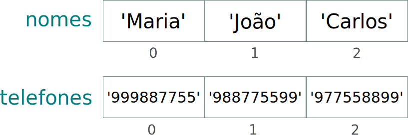

# Tuplas em Python {.part}

# Tuplas em Python

- Tuplas são semelhantes a listas, em Python, porém mais limitadas.
- Elas servem para guardar valores de forma imutável.
  - Isto é, seus valores não podem ser modificados.
- Tuplas podem representar:
  - Vetores
  - Matrizes
  - Mas valores devem ser constantes!

# Declaração de Tuplas

- Declaramos tuplas entre parênteses:

~~~{#ex .python}
vet1 = (1, 2, 5, 3, 6)
vet2 = (1.0, 3.1, 7.6, 8.9, 9.0)
vet3 = (True, False, True)
vet4 = ('A', 'casa', 'é', 'pequena')
t = ('A', 1, 2.3, True)
~~~

- Os valores sempre serão aqueles definidos na declaração.
  - Tuplas nunca aumentam nem diminuem de tamanho.
  - Se a tupla possuir apenas 1 elemento, deve-se **usar a vírgula ao fim**:

~~~{#ex .python}
vet5 = (1, )
~~~

# Declaração de Tuplas (II)

- Os parênteses podem ser omitidos:

~~~{#ex .python}
vet1 = 1, 2, 5, 3, 6
vet2 = 1.0, 3.1, 7.6, 8.9, 9.0
vet3 = True, False, True
vet4 = 'A', 'casa', 'é', 'pequena'
t = 'A', 1, 2.3, True
vet5 = 1,
~~~

- Experimente imprimir o tipo de cada vetor usando o comando `type`.
  - Para todos, deve-se imprimir: `<class 'tuple'>`

# Imprimindo uma Tupla

- Basta usar o comando `print` sobre ela.

~~~{#ex .python}
vet4 = ('A', 'casa', 'é', 'pequena')
print(vet4)
print((3, 2, 1, 0))
~~~

- Os valores impressos também estão entre parênteses:

~~~{#ex .text}
('A', 'casa', 'é', 'pequena')
(3, 2, 1, 0)
~~~

# Acessar Elementos de uma Tupla

- Da mesma forma que em listas, usando colchetes.
  - Mas apenas para obter os valores (leitura).
  - Nunca para alterar os valores (escrita).

~~~{#ex .python}
vet1 = (1, 2, 5, 3, 6)
print(vet1[0])
print(vet1[2])
print(vet1[4])
~~~

- Índices variam de 0 a tamanho menos 1.

# Acessar Elementos de uma Tupla

- Acesso não permitido:

~~~{#ex .python}
vet1 = (1, 2, 5, 3, 6)
vet1[2] = 7 # Esta linha ocasionará erro!
print(vet1)
~~~

<pre style="font-size:18px; color:red;">
Traceback (most recent call last):
  File "<stdin>", line 1, in <module>
TypeError: 'tuple' object does not support item assignment
</pre>

- Embora seja possível redefinir uma tupla:

~~~{#ex .python}
vet1 = (1, 2, 5, 3, 6)
vet1 = (1, 2, 7, 3)
print(vet1)
~~~

# Funções sobre Tuplas

- Algumas funções sobre listas podem ser usadas sobre tuplas.
  - `len`: retorna o tamanho da tupla.
  - `min`: retorna o menor valor de uma tupla numérica.
  - `max`: retorna o maior valor de uma tupla numérica.
  - `sum`: retorna a soma dos valores de uma tupla numérica.

~~~{#ex .python}
vet1 = (1, 2, 5, 3, 6)
print(len(vet1), min(vet1), max(vet1), sum(vet1))
~~~

- Saída:

~~~{#ex .text}
5 1 6 17
~~~

# Pertinência em tuplas

- Assim como em listas, podemos usar o comando `in` para verificar se um elemento está na tupla.
- Lembrando que o retorno é `True` ou `False`.
    - Logo, usar em estruturas que trabalham com condições: `if` ou `while`
- Exemplo:

~~~{#ex .python}
tupla = (1, 2, 5, 3, 6)
if 5 in tupla:
    print('O valor', 5, 'está na tupla.')
~~~

~~~{#ex .text}
O valor 5 está na tupla.
~~~

# Operações sobre Tuplas

- Soma de tuplas com operador +:

~~~{#ex .python}
tupla1 = (4, 5, 2, 1)
tupla2 = (3, -1, 0)
print(tupla1 + tupla2)
~~~

~~~{#ex .text}
(4, 5, 2, 1, 3, -1, 0)
~~~

- Multiplicação de tuplas com operador $*$:

~~~{#ex .python}
tupla = 3*(0, 1)
print(tupla)
~~~

~~~{#ex .text}
(0, 1, 0, 1, 0, 1)
~~~

# Métodos de Tuplas

- Existem apenas dois métodos:
  - `index`: retorna o índice da primeira ocorrência de um dado valor (parâmetro) na tupla.

~~~{#ex .python}
tupla = (5, 5, -1, 3, 0, 2, 1, 2, 5)
print(tupla.index(2))
~~~

~~~{#ex .text}
5
~~~

  - `count`: retorna a quantidade de um dado valor (parâmetro) na tupla.

~~~{#ex .python}
tupla = (5, 5, -1, 3, 0, 2, 1, 2, 5)
print(tupla.count(5))
~~~

~~~{#ex .text}
3
~~~

# Conversão em Tuplas

- Conversão de lista em tupla:

~~~{#ex .python}
lista = [1, 4, 2]
tupla = tuple(lista)
print(tupla)
~~~

~~~{#ex .text}
(1, 4, 2)
~~~

- Conversão de tupla em em lista:

~~~{#ex .python}
tupla = (1, 4, 2)
lista = list(tupla)
print(lista)
~~~

~~~{#ex .text}
[1, 4, 2]
~~~

# Conversão de Range

- Conversão de range em tupla:

~~~{#ex .python}
tupla = tuple(range(10))
print(tupla)
~~~

~~~{#ex .text}
(0, 1, 2, 3, 4, 5, 6, 7, 8, 9)
~~~

- Conversão de range em lista:

~~~{#ex .python}
lista = list(range(10))
print(lista)
~~~

~~~{#ex .text}
[0, 1, 2, 3, 4, 5, 6, 7, 8, 9]
~~~

# Iterar sobre Tuplas

- Da mesma forma que em listas.
- Usando índices:

~~~{#ex .python}
tupla = (2, -3 , 5, 1, 0)
for i in range(len(tupla)):
  print(tupla[i])
~~~

- Nos elementos:

~~~{#ex .python}
tupla = (2, -3 , 5, 1, 0)
for elem in tupla:
  print(elem)
~~~

# Matrizes e Tuplas

- Podemos também representar matrizes usando tuplas.
- Assim como listas, tuplas podem ter qualquer objeto como elemento.
  - Tuplas de tuplas, ...
- Exemplo de definição de matriz $3\times4$ usando tupla:

~~~{#ex .python}
# Declaração:
matriz = ((1, 3, -1, 0), (1, 2, 3, 0), (1, -2, -3, 1))
# Exemplo de acesso a um elemento:
print(matriz[2][1])
~~~

# Exercícios (I)

#### Para cada item, escreva um programa Python que:

1. Calcule a distância entre dois pontos dados pelo usuário. Cada ponto deve ser representado por uma tupla de 2 elementos ($x_1$, $y_1$) e ($x_2$, $y_2$). A distância euclidiana é calculada por:
$$\sqrt{(x_2 - x_1)^2 + (y_2 - y_1)^2}$$
2. Obtenha do usuário 5 pares: nome de um atleta e a altura dele (em metros). Os pares serão armazenados em tuplas e cada par será armazena em uma lista. Ao final, imprima apenas o nome dos atletas que têm altura superior a 1.60 m.

# Dicionários em Python {.part}

# Definição de Dicionário

- **Dicionário** é uma estrutura especial de Python.
- Ele representa um mapeamento chave/valor (*key/value*).
    - A chave funciona como um **índice**.
    - O valor é acessado pela chave.
- Exemplo de representação:

:::::::{.center}
{#dictEx1}
:::::::

# Uso de Dicionário: Exemplo da Agenda

- **Exemplo de problema:** Suponha que você queira escrever um programa em Python para guardar uma agenda telefônica e depois consultar.
  - O que deve ser feito é associar um nome a um (ou mais) telefone.
- Uma forma de fazer isso usando duas listas:
  - Uma para guardar os nomes.
  - Outra para guardar os telefones.

:::::::{.center}
{#dictEx1 width=40%}
:::::::

# Obtendo a agenda do usuário (Usando Listas)

~~~{#ex .python}
nomes = []
telefones = []
nome = input('Entre com um nome (Digite "sair" para sair): ')
while (nome != 'sair'):
  nomes.append(nome)
  tel = input('Entre com o telefone: ')
  telefones.apeend(tel)
  nome = input('Entre com um nome (Digite "sair" para sair): ')
~~~

# Consultando telefone pelo nome (Usando Listas)

~~~{#ex .python}
print('Consulta de telefone:')
nome = input('Entre com um nome (Digite "sair" para sair): ')
while nome != 'sair':
  if nome in nomes:
    indice = nomes.index(nome)
    print('Nome:', nome, 'Tel:', telefones[indice])
  nome = input('Entre com outro nome (Digite "sair" para sair): ')
~~~

# Dicionário em Python (I)

- No exemplo, podemos fazer o nome da pessoa ser o índice do telefone.
  - Usando dicionários.
- **Dicionários** de Python são representados entre chaves ({ }).
- Cada par chave/valor é separado por vírgula (,).
- A chave é separada do valor por dois pontos (:).
  - Deve ser um única.

~~~{#ex .python}
meu_dicionario = {chave1: valor1, chave2: valor2}
~~~

# Dicionário em Python (II)

:::::{.columns}
::::{.column width=45%}
- Representação Gráfica de um dicionário:

:::::::{.center}
{#dictEx3 width=60%}
:::::::

::::
::::{.column width=55%}

- Em Python:

~~~{#ex .python}
agenda = {'Maria': '999887755',
 'João': '988775599', 'Carlos': '977558899'}
~~~

::::
:::::

# Criando Dicionários em Python (I)

- Vazio:

~~~{#ex .python}
dic1 = {}
~~~

- Com chaves sendo strings e valores sendo números:

~~~{#ex .python}
dic2 = {'Ana': 1.75, 'Marcos': 1.71, 'Rita': 1.62, 'Paulo': 1.90}
~~~

# Criando Dicionários em Python (II)

- Com chaves sendo números:

~~~{#ex .python}
dic3 = {1: 65.4, 2: 88.7, 5: 25.0}
~~~

- Misturado:

~~~{#ex .python}
dic4 = {1: 65.4, 'Ana': 1.75, 5.83: False}
~~~

- Entre outras formas...

# Dicionário: Tipos de Chaves e Valores

- A chave (*key*) pode ser qualquer tipo primitivo ou tupla.
  - Lista e dicionário não podem, por exemplo.
- O valor pode ser qualquer coisa: tipos primitivo, tupla, lista, dicionário...
- Exemplos:

~~~{#exDic1 .python }
p1 = {"nome": "Maria", "idade": 25, "altura": 1.62, 
      "telefone": ["99999999", "22222222"]}
p2 = {"nome": "João", "idade": 22, "altura": 1.68, 
      "telefone": ["91111111", "21111111"]}
pessoas = {"12345": p1, "56789": p2}
~~~

# Imprimindo um Dicionário

- O comando `print` sobre um dicionário irá imprimi-lo na forma de dicionário:

~~~{#ex .python}
dic2 = {'Ana': 1.75, 'Marcos': 1.71, 'Rita': 1.62, 'Paulo': 1.90}
print(dic2)
~~~

~~~{#ex .text}
{'Ana': 1.75, 'Marcos': 1.71, 'Rita': 1.62, 'Paulo': 1.90}
~~~

# Acessar Valores de um Dicionário (I)

- O acesso é feito utilizando os colchetes ([ ]), assim como nas listas.
  - O índice deve ser uma chave válida.
- Exemplo de acesso:

~~~{#ex .python}
dic2 = {'Ana': 1.75, 'Marcos': 1.71, 'Rita': 1.62, 'Paulo': 1.90}
print(dic2['Ana'])
~~~

~~~{#ex .text}
1.75
~~~

# Acessar Valores de um Dicionário (II)

- Acesso a uma chave inexistente ocasiona erro:

~~~{#ex .python}
dic2 = {'Ana': 1.75, 'Marcos': 1.71, 'Rita': 1.62, 'Paulo': 1.90}
print(dic2['rita']) # Deveria ser Rita e não rita
~~~

<pre style="font-size:18px; color:red;">
Traceback (most recent call last):
  File "<stdin>", line 1, in <module>
KeyError: 'rita'
</pre>

# Modificar Valores de um Dicionário

- Exemplo de modificação de valores.

~~~{#ex .python}
dic2 = {'Ana': 1.75, 'Marcos': 1.71, 'Rita': 1.42, 'Paulo': 1.90}
dic2['Rita'] = 1.61
print(dic2)
~~~

~~~{#ex .text}
{'Ana': 1.75, 'Marcos': 1.71, 'Rita': 1.61, 'Paulo': 1.9}
~~~

# Inserir Par em um Dicionário (I)

- Basta existir o dicionário e realizar uma atribuição com o novo par.

~~~{#ex .python}
dic = {'Ana': 1.75, 'Marcos': 1.71, 'Rita': 1.42, 'Paulo': 1.90}
dic['Maria'] = 1.56
print(dic)
~~~

~~~{#ex .text}
{'Ana': 1.75, 'Marcos': 1.71, 'Rita': 1.42, 'Paulo': 1.9, 'Maria': 1.56}
~~~

# Inserir Par em um Dicionário (II)

- Diferente de listas (para valores numéricos):

:::::{.columns}
::::{.column width=45%}
Com dicionário:

~~~{#id .language }
dic = {}
dic[1] = 190
print(dic)
~~~

**Funciona!**

::::

::::{.column width=10%}

 

:::::::{.center}
$\times$
:::::::

::::

::::{.column width=45%}

Com lista:

~~~{#ex .python}
lista = []
lista[1] = 190
print(lista)
~~~

Ocorre erro!

::::
:::::

# Obtendo Dados do Usuário (Usando Dicionário)

~~~{#ex .python}
agenda = {}
nome = input('Entre com um nome (Digite "fim" para terminar): ')
while (nome != 'fim'):
  tel = input('Entre com o telefone: ')
  agenda[nome] = tel
  nome = input('Entre com um nome (Digite "fim" para terminar): ')
~~~

# Consultando Telefone pelo Nome (Usando Dicionário)

~~~{#ex .python}
print('Consulta de telefone:')
nome = input('Entre com um nome (Digite "sair" para sair): ')
while nome != 'sair':
  if nome in agenda:
    print('Nome:', nome, 'Tel:', agenda[nome])
  nome = input('Entre com outro nome (Digite "sair" para sair): ')
~~~

# Exercícios (II)

#### Para cada item, escreva um programa em Python que:

1. Peça ao usuário para cadastrar (isto é, guardar) nomes de produtos e o preço correspodente. Depois, permita que o usuário consulte os elementos desta lista.

# Ordem das Chaves/Valores no Dicionário

- Não há uma ordem específica dos pares chave/valor.
- Dicionários em Python guardam os pares em ordem arbitrária.
- Muitas vezes, criamos um dicionário e quando o imprimimos, está em uma ordem diferente.
- Exemplo:

~~~{#ex .python}
>>> dic = {1: 39.2, 4: 23.0, 3: 48.4, 8: 11.0}
>>> print(dic)
~~~

~~~{#ex .text}
{8: 11.0, 1: 39.2, 3: 48.4, 4: 23.0}
~~~

# Funções sobre Dicionários

Função  | Parâmetros   | Retorno
--------|--------------|---------------------
`len`   | o dicionário | Tamanho do dicionário
`min`   | o dicionário | Retorna a menor chave
`max`   | o dicionário | Retorna a maior chave
`sum`   | o dicionário | Soma as chaves (se for valor numérico)

# Funções sobre Dicionários: Exemplos

~~~{#ex .python}
dic = {1: 39.2, 4: 23.0, 3: 48.4, 8: 11.0}
print(len(dic), min(dic), max(dic), sum(dic))
~~~

~~~{#ex .text}
4 1 8 16
~~~

# Remover Elementos de um Dicionário

- `del` remove um elemento do dicionário.
  - Similar a listas.
- Sintaxe: `del dicionario[chave]`
- Exemplo:

~~~{#ex .python}
dic = {1: 39.2, 4: 23.0, 3: 48.4, 8: 11.0}
del dic[4]
print(dic)
~~~

~~~{#ex .text}
{1: 39.2, 3: 48.4, 8: 11.0}
~~~

# Deletar um Dicionário

- Também apaga uma lista (perde a referência):

~~~{#ex .python}
dic = {1: 39.2, 4: 23.0, 3: 48.4, 8: 11.0}
del dic
~~~

# Pertinência em Dicionários (I)

- O comando `in` indica se uma **chave** pertence ao dicionário.
    - Retorna `True` ou `False` (igual a listas).

~~~{#ex .python}
frutas = {'laranja': 102, 'uva': 50, 'banana': 34}
if 'laranja' in frutas:
    print('laranja está no dic frutas')
~~~

# Pertinência em Dicionários (II)

- Pode ser útil para remover ou alterar um par, por ex.:

~~~{#ex .python}
frutas = {'laranja': 102, 'uva': 50, 'banana': 34}
print('Antes da tentativa de remoção:', frutas)
nome = input('Entre com o nome da fruta para remover: ')
if nome in frutas:
    del frutas[nome]
else:
    print(nome, 'não está no dicionário frutas!')
print('Depois da tentativa de remoção:', frutas)
~~~

# Iterar em Dicionários

- Usando a combinação `for` e `in`.
- O índice varia nas **chaves**.
- Exemplo:

~~~{#ex .python}
frutas = {'laranja': 102, 'uva': 50, 'banana': 34}
for i in frutas:
    print(i, frutas[i])
~~~

~~~{#ex .text}
banana 34
laranja 102
uva 50
~~~

# Converter Tupla para Dicionário

- A função `dict` serve para converter uma estrutura em dicionário.
- Tal estrutura **deve estar** em formato similar a um dicionário.
  - Isto é, ter pares chave/valor.
- Exemplo com tupla:

~~~{#ex .python}
tupla = (('laranja', 102), ('uva', 50), ('banana', 34))
dic = dict(tupla)
print(type(dic), dic)
~~~

~~~{#ex .text}
<class 'dict'> {'laranja': 102, 'uva': 50, 'banana': 34}
~~~

# Converter Lista para Dicionário

~~~{#ex .python}
numeros = [['um', 'one'], ['dois', 'two'], ['três', 'three']]
dic = dict(l)
print(type(dic), dic)
~~~

~~~{#ex .text}
<class 'dict'> {'um': 'one', 'dois': 'two', 'três': 'three'}
~~~

# Alguns Métodos de Dicionários (I)

:::{width="50%"}
Método 	| Parâmetros 	| Descrição
--------|-------------|-------------------
`keys` 	| nenhum 	    | Retorna uma estrutura com as chaves do dicionário
`values`  | nenhum 	  | Retorna uma estrutura com os valores do dicionário
`items` 	| nenhum 	  | Retorna uma estrutura contendo tuplas dos pares chave/valor do dicionário
`get` 	| chave 	    | Retorna o valor associado à chave; ou `None`
`get` 	| chave,alt 	| Retorna o valor associado à chave; ou alt
:::

- Relembrando que os métodos são acessados por: `dic.metodo()`

# Alguns Métodos de Dicionários (II)

- Exemplo de uso:

~~~{#ex .python style="font-size: 11 pt;"}
frutas = {'laranja': 102, 'uva': 50, 'banana': 34}
print(frutas.keys())
print(frutas.values())
print(frutas.items())
print(frutas.get('laranja'))
print(frutas.get('caqui'))
print(frutas.get('caqui', 'Não existe!'))
~~~

- Saída:

~~~{#ex .text style="font-size: 11 pt;"}
dict_keys(['laranja', 'banana', 'uva'])
dict_values([102, 34, 50])
dict_items([('laranja', 102), ('banana', 34), ('uva', 50)])
102
None
Não existe!
~~~

# A Função Sorted

- A função `sorted` ordena uma sequência de elementos.
    - Tuplas, listas,
    - e **dicionários**, pelas chaves
- Ela recebe como parâmetro a sequência e retorna uma lista ordenada.
- Exemplo de uso com tuplas:

~~~{#ex .python}
t = (5, 4, 2, 7, 9, 0)
print(sorted(t))
~~~

~~~{#ex .text}
[0, 2, 4, 5, 7, 9]
~~~

# A Função Sorted com Dicionários

- Exemplo de uso com dicionários:

~~~{#ex .python}
frutas = {'laranja': 102, 'uva': 50, 'banana': 34}
print(sorted(frutas))
~~~

~~~{#ex .text}
['banana', 'laranja', 'uva']
~~~

# Exercícios (III)

#### Para cada item, escreva um programa em Python que:

1. Obtenha do usuário nomes de alunos e duas notas de prova. Gere um dicionário para armazenar as notas, com chave igual ao nome do aluno. Suponha que os nomes dos alunos sejam sempre diferentes. A leitura de nomes e notas de alunos termina quando o nome do aluno for vazio.
    - Ao final, apresente o nome de cada aluno e suas respectivas médias aritméticas.
2. Modifique a questão anterior para imprimir em ordem alfabética de nome dos alunos.
