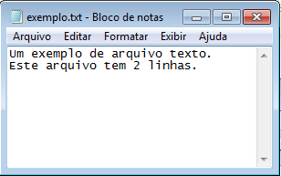

# Ficheiros {.part}

# Básico sobre Ficheiros

::::::{.block .centered}
:::{.blocktitle}
Definição de ficheiro:
:::
É um recurso para armazenamento de informação, que está disponível a um programa de computador.
::::::

:::::::{.center}
{#ficheiro width=30%}
:::::::

# Tipos de Ficheiros

- Muitos dicheiros apresentam seus dados estruturados.
    - Por exemplo, ficheiros .doc apresentam marcadores para formatação.
    - Isto é, dados reais armazenados vão além do conteúdo em si.
- Por conta disto, vamos trabalhar com tipos de ficheiros com estrutura simples.
- Um exemplo são os **ficheiros texto**.
    - Extensão `.txt`

:::::::{.center}
{#ficheiroTexto width=8%}
:::::::

# Armazenamento de Ficheiros

- Normalmente são armazenados em memória secundária.
    - HD, SSD, pendrive, cartão de memória,...
- Queremos **obter** dados de ficheiros!
    - Ou **escrever** dados em ficheiros!
- Ao trabalhar com ficheiros, precisamos saber sua localização.
    - Indicar **caminho do ficheiro**.
    - Exceto quando o ficheiro está no mesmo diretório (pasta) do programa, não é necessário o caminho.

:::::::{.center}
{#ficheiroLocal width=60%}
:::::::

# Leitura e Escrita em Ficheiros Texto em Python {.part}

# Abrir Ficheiros em Python

- Antes de obter ou escrever dados de/em um ficheiro, precisamos **abri-lo**.
    - "Abrir" aqui significa **preparar para leitura ou escrita**.
- Para isso, devemos indicar o modo de operação.
- Veremos três modos:
    - Leitura (*read*): `"r"`
    - Escrita (*write*): `"w"`
    - Adicionar ao fim (*append*): `"a"`
- Em Python, abrimos um ficheiro com o comando `open`:

~~~{#abrirFicheiro .python }
ficheiro = open(nome_do_ficheiro, modo)
~~~

# Abrir Ficheiros para Leitura em Python

- Para apenas ler dados de um ficheiro, usamos o modo `"r"`.

~~~{#abrirFicheiro .python}
ficheiro = open("exemplo.txt", "r")
~~~

- No exemplo, tentamos abrir o ficheiro `exemplo.txt`.
    - Se ele existir, a variável `ficheiro` será uma referência para ele.
    - Caso contrário, ocorrerá erro!
- Mais a frente veremos como contornar esse possível erro.
    - Usando `try-except`.

# Obter Dados de Ficheiro em Python

:::::{.columns}
::::{.column width=50%}

- A função `open()` apenas prepara para a leitura de um ficheiro.
- Para ler dados do ficheiro, Python disponibiliza alguns métodos:
    - `read`: lê todo o ficheiro e retorna uma string com seu conteúdo texto.
    - `readline`: lê apenas a primeira linha e a retorna em forma de string.
    - `readlines`: lê todo o ficheiro e retorna uma lista de linhas (string).
- Para os exemplos a seguir, considere o seguinte conteúdo de ficheiro:
::::
::::{.column width=50%}

:::::::{.center}
{#exFicheiro width=90%}
:::::::
::::
:::::

# Obter Dados de um Ficheiro em Python (II)

- Usando método `read`:
    - Retorna uma string contendo todo o texto do arquivo.

~~~{#ex .python}
ficheiro = open("exemplo.txt", "r")
texto = ficheiro.read()
print(texto)
~~~

~~~{#saida .text}
Um exemplo de ficheiro texto.
Este ficheiro tem 2 linhas.

~~~

# Obter Dados de um Ficheiro em Python (III)

- Usando método `readline`:
    - Retorna a próxima linha do ficheiro.

~~~{#ex .python}
ficheiro = open("exemplo.txt", "r")
linha1 = ficheiro.readline()
print(linha1)
~~~

~~~{#saida .text}
Um exemplo de ficheiro texto.

~~~

# Obter Dados de um Ficheiro em Python (IV)

- Usando método `readlines`:
    - Retorna uma lista com as linhas do ficheiro.
    - Todo o arquivo é copiado para a memória principal!

~~~{#ex .python}
ficheiro = open("exemplo.txt", "r")
lista = ficheiro.readlines()
print(lista)
~~~

~~~{#saida .text}
['Um exemplo de ficheiro texto.\n', 'Este ficheiro tem 2 linhas.\n']
~~~

# Obter Dados de um ficheiro em Python (III)

- Outra forma simples de obter linhas do ficheiro:
    - Iterando sobre ele usando `for`.

~~~{#ex .python}
ficheiro = open("exemplo.txt", "r")
for linha in ficheiro:
    print(linha, end="")
~~~

# Fechar um ficheiro em Python

- Se o ficheiro foi aberto (`open`), ele deve ser fechado depois de usado.
- O método é o `close()`.

~~~{#ex .python style="font-size: 80%;"}
ficheiro = open("exemplo.txt", "r")
linha1 = ficheiro.readline()
print(linha1)
ficheiro.close()
~~~

~~~{#ex .python style="font-size: 80%;"}
ficheiro = open("exemplo.txt", "r")
for linha in ficheiro:
    print(linha, end="")
ficheiro.close()
~~~

- Sempre que houver um *open*, deve haver um *close* associado ao ficheiro.

# Exercício (I)

1. Descarregue o ficheiro texto <a href="ficheiros/numeros.txt" target="_blank">numeros.txt</a>.
2. Escreva um programa que imprima todos os números primos existentes neste ficheiro.
3. Descarregue o ficheiro texto <a href="ficheiros/lista_frutas.txt" target="_blank">lista_frutas.txt</a>.
4. Escreva um programa que leia os elementos nesta lista e a apresente de forma ordenada.
    - Use o método `sort` de lista ou a função `sorted`.
    - Consulte: https://docs.python.org/3/howto/sorting.html
5. Descarregue o ficheiro texto <a href="ficheiros/matriz.txt" target="_blank">matriz.txt</a>.
6. Calcule a soma dos elementos da diagonal principal.

# Abrir Ficheiros para Escrita em Python

- Para apenas escrever dados em um ficheiro, usamos o modo `"w"`.

~~~{#ex .python}
ficheiro = open("exemplo2.txt", "w")
~~~

- No exemplo, tentamos abrir o ficheiro `exemplo2.txt` para escrita.
    - Se não existir, o ficheiro é **criado**.
    - Se existir, o ficheiro é **apagado**!
    - Podem existir casos de erros: quota de disco excedida, falta de permissão,...
- Mais a frente veremos como contornar esses possíveis erros.
    - Usando `try-except`.

# Escrever em um ficheiro em Python (I)

- `write`: escreve uma string.

~~~{#ex .python}
ficheiro = open("exemplo2.txt", "w")
lista = ["Primeira linha.", "Segunda linha."]
for i in lista:
    ficheiro.write(i+"\n")
ficheiro.close()
~~~

# Escrever em um ficheiro em Python (II)

- `writelines`: escreve as strings de uma lista de strings.

~~~{#ex .python}
ficheiro = open("exemplo3.txt", "w")
lista = ["Primeira linha.\n", "Segunda linha.\n"]
ficheiro.writelines(lista)
ficheiro.close()
~~~

- Para adicionar quebra de linha, usar "\n".

# Abrir Ficheiros para Escrita (Append)

- O modo `"a"` de append, também prepara ficheiro para escrita.
    - Mas no final do ficheiro.
- Se ficheiro não existe, cria-se um novo.
- Se ficheiro existe, adiciona dado ao fim (*append*).
    - Portanto, não apaga ficheiro!

~~~{#ex .python}
ficheiro = open("exemplo2.txt", "a")
lista = ["Um exemplo de frase.", "Outro exemplo de frase."]
for i in lista:
    ficheiro.write(i+"\n")
ficheiro.close()
~~~

# Tratar Exceções ao Usar Ficheiros Python

- É correto sempre usar o try-except ao abrir um ficheiro bem como ao ler e escrever conteúdo.
    - Isto é, em todos os casos que exceções podem ser lançadas.
    - Ficheiro é algo externo ao programa!

~~~{#ex .python style="font-size: 90%;"}
try:
    ficheiro = open("exemplo.txt", "r")
    linha1 = ficheiro.readline()
    print(linha1)
    ficheiro.close()
except Exception as mensagem:
    print(str(mensagem))
~~~

# Tratar Exceções: Tipos

:::::{.columns}
::::{.column width=40%}

- Tipos de exceções *built-in* de Python:
    - Segue hierarquia de exceções.
    - Todas herdam de `BaseException`.
    - Exceções de *runtime* herdam de `Exception`.
    - Documentação:
        - [https://docs.python.org/3/library/exceptions.html](https://docs.python.org/3/library/exceptions.html)
::::
::::{.column width=60%}

:::::::{.center}
{#hierarquiaExcecoes width=100%}
:::::::

::::
:::::

# Exercício (II)

1. Escreva um programa que guarde em um ficheiro, linha a linha, o valor de $x$ e $y$, onde:
    - $y = x^2 -2x +\frac{1}{3}$
    - $x$ varia no intervalo de $[-10, 10]$ em passos de 0,1.

<!-- 1. Escreva um programa que guarde em um ficheiro a sequência Fibonacci até um dado índice $n$ (inclusive) e o valor de $n$.
    - O ficheiro deve ser conforme o exemplo abaixo, para $n=10$:

~~~{#exSaida .text}
10
0 1 1 2 3 5 8 13 21 34
~~~ -->

2. Escreva um programa que obtenha textos do utilizador até que ele digite "sair" apenas. Guarde tudo em um ficheiro chamado "texto.txt".
    - Faça com que o conteúdo antigo não seja apagado caso o utilizador execute o programa novamente.
3. Modifique o programa 1 do Exercício (I) para gerar um ficheiro com os nomes das frutas ordenados.
