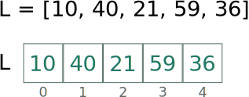

# Listas em Python {.part}


# Definição de Listas em Python

 em Python é uma coleção ordenada de valores modificáveis.
)
- Usada para representar conjuntos.
- Vetores: coleção ordenada de valores de mesmo tipo.
    - Conhecidos também como *arrays*.
- Matrizes: vetor bidimensional.
- Matrizes multidimensionais...
- Valores podem ser modificados a qualquer momento.

# Representação de Listas em Python

- .alert[**Listas**] são representadas entre colchetes.
- Cada elemento da lista é separado por vírgula.
- Seus elementos podem ser de qualquer tipo e misturados.
- Exemplo:

```Python
lista = [1, 2.3, 'A', 'a casa', False]
```

# Criação de uma Lista

- Criando lista com elementos previamente conhecidos:

```Python
l1 = [10, 20, 30, 40, 50]
```

- Criando lista vazia:

```Python
l2 = []
```

# Imprimir Toda a Lista

- Simples e fácil!
```Python
L = ['a', 'b', 'c', 'd', 'e']
print(L)
```
- Saída:

```
>>>['a', 'b', 'c', 'd', 'e']
```

# Operador de Acesso

- Dada uma lista, podemos acessar seus elementos um por um.
- Todo elemento de uma lista tem um índice associado.
  - Este índice sempre começa em 0.

:::::::{.center}
{#lista}
:::::::

- O acesso é feito via este índice.

#  Operador de Acesso (II)

.center[]
- Por exemplo, imprimir o primeiro elemento:
```Python
print(L[0])
```
- Outro exemplo: somar o primeiro e o último elemento:

.col-3[
```Python
soma = L[0] + L[4]
print(soma)
```
]
.col-3[<br>.center[ou]]
.col-3[
```Python
print(L[0] + L[4])
```
]

# Operador de Acesso (III)

- O que acontece quando acessamos um elemento em posição da lista que não existe?
- Por exemplo, na lista `l = [10, 20, 30, 40, 50]`:
    - Acessar elemento na posição 5 (ou 6, 7,...).
        - Ex.: `print(l[5])`
- Isto ocasionará um erro!

<pre style="font-size:14pt; color:red;">
    Traceback (most recent call last):
      File "<stdin>", line 1, in <module>
    IndexError: list index out of range
</pre>

# Operador de Acesso (IV)

- Podemos .alert[**alterar**] o valor de um elemento da lista.
- Exemplo 1: mudar o valor do segundo elemento para 15.


```Python
l = [10, 20, 30, 40, 50] # criação da lista l.
l[1] = 15 # alteração do segundo elemento.
print(l) # impressão da lista l.
```


```
[10, 15, 30, 40, 50]
```

- Exemplo 2: mudar o valor do terceiro elemento para 'a'.


```Python
l = [10, 20, 30, 40, 50]
l[2] = 'a'
print(l)
```


```
[10, 20, 'a', 40, 50]
```

---

slideTitle: Tamanho de uma Lista

- Para capturar o tamanho de uma lista, existe a função `len`.
- Exemplo de uso:


```Python
lista = [1, 22, 5, -1, 9, -6, 14, 17]
print(len(lista))
```
- A saída será:


```
8
```

---

slideTitle: Remover Elemento de Lista

- Função `del` remove elemento especificando sua posição.
- Exemplo de uso:

```Python
lista = [1, 22, 5, -1, 9, -6, 14, 17]
del lista[3]
print(lista)
```
- A saída será:

```
[1, 22, 5, 9, -6, 14, 17]
```

- `del` serve para apagar uma lista também.
```Python
del lista
```

---

slideTitle: Exercícios (I)

#### Responda:

1. Suponha que você tenha uma lista que varia de tamanho.
    - Qual comando você usaria para imprimir o seu último elemento?

#### Escreve um programa em Python que:

1. Crie uma lista contendo todas as vogais.
1. Troque a primeira vogal com a última e a a segunda com a penúltima.
    - O que aconteceu com a lista?

---

slideTitle: Pertinência em Lista

- O comando `in` pode ser usando para verificar se um elemento está em uma lista.
- Uso:
```Python
>>> elemento in lista
```
- Retorna `True` ou `False`.
- Exemplo de uso:

```Python
lista = [3, 5, 7, 8, 12, 15]
if 8 in lista:
    print(8, "está na lista")
else:
    print(8, "não está na lista")
```

---

slideTitle: Iterar em Lista

- Podemos usar um índice variando de 0 a tamanho da lista.
    - Depois, acessar cada elemento na repetição.
- Exemplo:

```Python
lista = [3, 5, 7, 8, 12, 15]
for i in range(len(lista)):
    print(lista[i])
```

---

slideTitle: Iterar em Lista (II)

- Outra forma: usar o operador `in` em um `for`.
    - A faixa de valores do `for` é a própria lista.
    - A variável de índice do `for` passa a ser o elemento.
    - Portanto, acessa-se o elemento **diretamente** por esta variável.
- Exemplo:

```Python
lista = [3, 5, 7, 8, 12, 15]
for elem in lista:
    print(elem)
```

---

slideTitle: Exercícios (II)

#### Escreve um programa em Python que:

1. Crie um conjunto com os seguintes elementos: {1, 4, 5, 3, 6, 7, 16, 11, 15}.
2. Imprima os números múltiplos de 3 deste conjunto.
3. Modifique a lista para que todos os números pares sejam alterados para suas metades.
4. Remova da lista todos os múltiplos de 5 usando a função `del`.

---

slideTitle: Índices Negativos

- Em Python é possível acessar posições da lista através de índices negativos.
- A correspondência é vista na figura:

.center[]

- Experimente criar uma lista e acessar a posição -1 ou outro valor negativo.
    - O menor valor possível é `-len(lista)`.

---

slideTitle: Operador de Concatenação

- Para juntar duas listas, usamos o operador de soma `+`.
- Exemplo:
```Python
lista1 = [1, 2, 3]
lista2 = ['a', 'b', 'c', 'd']
print(lista1 + lista2)
```
- Resultado:
```
[1, 2, 3, 'a', 'b', 'c', 'd']
```

---

slideTitle: Operador de Multiplicação

- O operador de multiplicação `*` serve para realizar cópias concatenadas de uma lista.
    - Exemplo:
    ```Python
    lista = [1, 2, 3]
    print(3*lista)
    ```
    - Resultado:
    ```
    [1, 2, 3, 1, 2, 3, 1, 2, 3]
    ```
- Útil para inicializar uma lista.
    - Exemplo: Criar uma lista de 10 inteiros iniciados com 0.
```Python
lista = 10*[0]
print(lista)
```

---

slideTitle: Algumas Funções sobre Lista

- `min`: retorna o menor valor de uma lista.
- `max`: retorna o maior valor de uma lista.
- `sum`: retorna a soma dos valores de uma lista.
- Exemplo:


```Python
lista = [1, 4, 7, 5, -7, 12]
print(min(lista))
print(max(lista))
print(sum(lista))
```
- Saída:


```
-7
12
22
```

---

slideTitle: Alguns Métodos de Lista

- Método `append`: adiciona um elemento ao final da lista.

```Python
lista = [1, 4, 7]
lista.append(2)
print(lista)
```

```
[1, 4, 7, 2]
```

- Método `pop`: remove e retorna o último elemento da lista.

```Python
lista = [1, 4, 7]
x = lista.pop()
print(x, lista)
```

```
7 [1, 4]
```

---

slideTitle: Alguns Métodos de Lista (II)

- O método `pop` também aceita indicar o índice do elemento a ser removido.

```Python
lista = [1, 4, 7]
x = lista.pop(1)
print(x, lista)
```

```
4 [1, 7]
```

- Se tentar realizar o `pop` em um índice que não existe:

```Python
lista = [1, 4, 7]
x = lista.pop(3)
print(x, lista)
```

<pre style="font-size:14px; color:red">
    Traceback (most recent call last):
      File "<stdin>", line 1, in <module>
    IndexError: pop index out of range
<pre>

---

slideTitle: Alguns Métodos de Lista (III)

- Método `insert`: insere um elemento na lista em uma posição específica.

```Python
lista = [1, 4, 7]
lista.insert(1, 2)
print(lista)
```

```
[1, 2, 4, 7]
```

- Método `remove`: remove a primeira ocorrência de um dado elemento da lista.
  - Elemento deve existir na lista e, caso contrário, ocorrerá erro!

.col-3[
```Python
lista = [1, 4, 7, 3, 4]
lista.remove(4)
print(lista)
```

```
[1, 7, 3, 4]
```
]


.col-2[
```Python
lista = [1, 4, 7, 3, 4]
lista.remove(5)
print(lista)
```

<pre style="font-size:14px; color:red">
ValueError: list.remove(x): x not in list
<pre>
]

---

slideTitle: Alguns Métodos de Lista (IV)

- Forma segura de usar o método `pop` com índice:

```Python
lista = [1, 4, 7]
if 1 < len(lista):
    x = lista.pop(1)
    print('Elemento removido:', x)
if 3 < len(lista):
    x = lista.pop(3)
    print('Elemento removido:', x)
print(lista)
```

- Forma segura de usar o método `remove`:

```Python
lista = [1, 4, 7, 3, 4]
if 4 in lista:
    lista.remove(4)
if 5 in lista:
    lista.remove(5)
print(lista)
```

---

slideTitle: Alguns Métodos de Lista (V)

- Método `count`: retorna quantos de um dado elemento há numa lista.
```Python
lista = [1, 4, 7, 3, 4]
print("Há", lista.count(4), "número(s) 4 na lista.")
```

```
Há 2 número(s) 4 na lista.
```

- Método `reverse`: inverte uma lista (modifica a lista).
```Python
lista = [1, 4, 7, 3, 4]
lista.reverse()
print(lista)
```

```
[4, 3, 7, 4, 1]
```

---

slideTitle: Alguns Métodos de Lista (VI)

- Método `sort`: ordena crescentemente uma lista (modifica a lista).
```Python
lista = [1, 4, 7, 3, 4]
lista.sort()
print(lista)
```

```
[1, 3, 4, 4, 7]
```

- Para ordenar decrescentemente, usar argumento `reverse=True`:

```Python
lista = [1, 4, 7, 3, 4]
lista.sort(reverse=True)
print(lista)
```

```
[7, 4, 4, 3, 1]
```

---

slideTitle: Alguns Métodos de Lista (VII)

- Método `index`: retorna o índice da primeira ocorrerá de um elemento.

```Python
lista = [1, 4, 7, 3, 4]
print(lista.index(4))
```

```
1
```

---

slideTitle: Mais Métodos: Copiando Listas


- Usando atribuição, há apenas a .alert[**cópia da referência da lista**].
  - Neste caso, uma alteração em uma das listas causa modificação em ambas.

```Python
l1 = [1, 4, 7, 3, 4]
l2 = l1
l2[3] = 9
print("l1:", l1, "e l2:", l2)
```

```
l1: [1, 4, 7, 9, 4] e l2: [1, 4, 7, 9, 4]
```

- Para realmente gerar uma cópia, usa-se o método `copy`.
```Python
l1 = [1, 4, 7, 3, 4]
l2 = l1.copy()
l2[3] = 9
print("l1:", l1, "e l2:", l2)
```

```
l1: [1, 4, 7, 3, 4] e l2: [1, 4, 7, 9, 4]
```

---

slideTitle: Exercícios (III)

#### Sem executar, indique o resultado das impressões do código abaixo.

```Python
lista = [1, -4, 10, 13, 6]
for i in range(3, 7):
    lista.append(i)
print(lista)
lista.sort()
print(lista)
lista.insert(6, 9)
print(lista)
lista.remove(10)
print(lista)
lista.remove(6)
print(lista)
lista.reverse()
print(lista)
```

- Ao final, execute o programa em um interpretador de Python para verificar sua resposta.

---

slideTitle: Exercícios (IV)

#### Para cada item, escreva um programa Python que:

1. Crie uma lista vazia e adicione valores inteiros positivos que o usuário digitar (leitura termina quando usuário digitar -1 ou um número negativo). Depois, percorra a lista e calcule o somatório dos elementos.
2. Crie uma lista com valores aleatórios entre 0 e 10, peça um número inteiro para o usuário e indique se o número está na lista e qual a sua posição na lista.

    </textarea>

    <script src="../template/js/remark-latest.min.js" type="text/javascript"></script>
    <script src="../template/js/macros.js" type="text/javascript"></script>
    <script src="../template/js/callbacks.js" type="text/javascript"></script>
    <script src="../template/js/katex.min.js"></script>
    <script src="../template/js/auto-render.min.js"></script>
    <link rel="stylesheet" href="../template/css/katex.min.css">
    <script type="text/javascript">
      var renderMath = function() {
        renderMathInElement(document.body, {delimiters: [
           {left: "$$", right: "$$", display: true},
           {left: "$", right: "$", display: false},
           {left: "\\[", right: "\\]", display: true},
           {left: "\\(", right: "\\)", display: false},
        ]});
      }
      var slideshow = remark.create({highlightStyle: "github", highlightLines: "true", highlightSpans: "true", slideNumberFormat: onSlideCallback}, renderMath);

      slideshow.on('afterShowSlide', function (s) {

          var slide = document.getElementsByClassName('remark-visible')[0];
          var iframeList = slide.getElementsByClassName('scaled-frame-md');

          var i;
          for (i = 0; i < iframeList.length; i++) {

              var iframe = iframeList[i];

              if (typeof iframe.attributes.after !== 'undefined') continue ;

              var src = iframe.src;
              iframe.src = '';
              iframe.src = src;

              var att = document.createAttribute("after");
              att.value = 'true';
              iframe.attributes.setNamedItem(att);
          }

      });
    </script>
</body>
</html>
