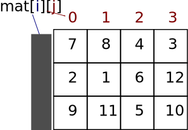

# Vetores em Python {.part}

# Vetores

- Vetor ou *array* é um conjunto de elementos do mesmo tipo.
    - É um conceito.
- Exemplos:
    - um vetor de inteiros &rarr; `vet1 = [1, 2, 3, 6]`
    - um vetor de reais &rarr; `vet2 = [1.0, 3.1, 7.6, 8.9, 9.0]`
    - um vetor de lógicos &rarr; `vet3 = [True, False, True]`
    - um vetor de strings &rarr; `vet4 = ['A', 'casa', 'é', 'pequena']`
- Também chamado de matriz unidimensional.

# Vetores em Python

- Em Python, podemos usar listas para representar.

```Python
vet1 = [1, 2, 3, 6]
vet2 = [1.0, 3.1, 7.6, 8.9, 9.0]
vet3 = [True, False, True]
vet4 = ['A', 'casa', 'é', 'pequena']
```
- Embora listas em Python permite criar conjuntos de quaisquer valores.

# Uso de Vetores/Listas

- Imagine o seguinte problema a ser resolvido de forma algorı́tmica:
    - Calcular a média das notas de 10 alunos de uma disciplina e determinar o número de alunos que tiveram a nota superior à média calculada.
- Como resolver?

# Uso de Vetores/Listas (II)

#### Tentativa 1:

```Python
soma = 0
for i in range(10):
    n = int(input("Entre com a nota " + str(i) + ": "))
    soma = soma + n
media = soma/10
# contar quantos alunos estão acima da média.
```

- Repare que antes de contar, precisamos calcular a média.
    - Mas então, como indicar quantos alunos estão acima da média se não temos mais os valores das notas?

# Uso de Vetores/Listas (III)

- Precisamos **guardar** as notas para isso!
    - Usar vetor/lista!

```Python
notas = 10*[0] # Cria vetor de 10 posições
soma = 0
for i in range(10):
    notas[i] = int(input("Entre com a nota " + str(i) + ": "))
    soma = soma + notas[i]
media = soma/10
cont = 0
for i in range(10):
    if notas[i] > media:
        cont = cont + 1
print("Existem", cont, "alunos acima da média", media)
```

- <a  href="https://repl.it/@fgopassos/media" target="_blank">Solução no Repl.it</a>

# Exercícios (I)

#### Para cada item, escreva um programa Python que:

1. Peça 10 valores reais ao usuário e indique quantos estão acima de (mínimo + máximo)/2. Pode usar as funções min e max.
2. Obtenha a temperatura média de cada mês do ano e mostre todas as temperaturas acima da média anual, e em que mês elas ocorreram (mostrar o mês por extenso: 1 – Janeiro, 2 – Fevereiro,...). Sugestão: usar uma lista para armazenar o nome por extenso de cada mês.

# Matrizes Bidimensionais em Python {.part}

# Matrizes

- Matriz multidimensional é um conjunto multidimensional de elementos do mesmo tipo.
    - Matriz unidimensional é um vetor.
    - Matriz bidimensional corresponde às matrizes comuns na matemática.

:::::::{.center}
{#matriz1}
:::::::

- Em Python, é possível representar matrizes através de .alert[lista de listas].

# Lista como Elemento de uma Lista

- Uma lista também pode ser um elemento de uma lista.
- Exemplo 1:

~~~{#id1 .python }
code
lista1 = [0, 1]
lista2 = [False, True, lista1]
print(lista2)
~~~

```
[False, True, [0, 1]]
```

# Lista como Elemento de uma Lista (II)

- Note que, no slide anterior, a `lista1` está dentro da `lista2`.
  - É, portanto, uma sublista.
- Exemplo 2:

~~~{#id2 .python }
lista = [[1, 3], -1, [3, 2, 6]]
print(lista)
~~~

```
[[1, 3], -1, [3, 2, 6]]
```

# Definindo uma Matriz

- Podemos definir uma matriz usando lista de listas.
- Exemplo: definir a seguinte matriz $3\times4$ em Python:

:::::::{.center}
{#matriz2}
:::::::

```Python
M = [[7, 8, 4, 3], [2, 1, 6, 12], [9, 11, 5, 10]]
```

# Definindo uma Matriz (II)

- Ou, para ficar mais fácil de ler, podemos escrever a matriz desta forma:
    - No entanto, não há nenhuma diferença no resultado em relação ao slide anterior.

```Python
M = [[7,  8, 4,  3],
     [2,  1, 6, 12],
     [9, 11, 5, 10]]
```

# Imprimindo Matriz sem Formato

- Basta usar o `print` da matriz:

~~~{#id3 .python }
M = [[7, 8, 4, 3], [2, 1, 6, 12], [9, 11, 5, 10]]
print(M)
~~~

~~~{#idText1 .text }
[[7, 8, 4, 3], [2, 1, 6, 12], [9, 11, 5, 10]]
~~~

- A saída é sempre sem formato, mesmo se for declarada assim:

~~~{#id4 .python }
M = [[7,  8, 4,  3],
     [2,  1, 6, 12],
     [9, 11, 5, 10]]
print(M)
~~~

# Definindo uma Matriz Vazia

- Da mesma forma que vetor, mas agora criando as duas dimensões.
    - Isto é, usando o operador de  multiplicação!
- Exemplo de uma matriz $3\times5$ (3 linhas e 5 colunas):

:::::{.columns}
::::{.column width=45%}
```Python
M = 3*[None]
for i in range(3):
  M[i] = 5*[0]
```
::::
::::{.column width=10%}
::::
::::{.column width=45%}
```Python
M = 3*[None]
for i in range(3):
  M[i] = 5*[None]
```
::::
:::::

- `None` representa um elemento nulo.
    - É mais genérico que 0 (inteiro).


# Acessando Elementos de uma Matriz

- Em Python, o acesso é realizado através dos índices.
- Por exemplo, na matriz M do slide anterior:
  - imprimir o elemento $M_{1,2}$:
      - `print(M[1][2])`
      - Saída ser: 6
  - imprimir o elemento $M_{2,3}$:
      - `print(M[2][3])`
      - Saída será: 10
- Agora, há dois índices:
  - linhas: variam de 0 a L-1, onde L é o número de linhas.
  - colunas: variam de 0 a C-1, onde C é o número de colunas.

# Modificando Elementos de uma Matriz

- Basta acessar o elemento e atribuir um valor a ele.
- Por exemplo, na matriz M do slide anterior:
  - alterar o elemento $M_{0,0}$ para 20:
      - `M[0][0] = 20`
  - adicionar 1 ao elemento $M_{2,1}$:
      - `M[2][1] = M[2][1] + 1`
  - multiplicar por 3 o elemento $M_{0,3}$:
      - `M[0][3] = M[0][3] * 3`
  - fazer $M\_{0,2} \leftarrow M\_{0,0} + M\_{0,1}$:
      - `M[0][2] = M[0][0] + M[0][1]`

# Acessar Linha da Matriz

- É possível manipular linhas da matriz de forma independente.
    - Afinal, em Python, uma matriz é uma lista de listas.
- Exemplo: imprimir a primeira linha:

```Python
mat = [[7, 8, 4, 3], [2, 1, 6, 12], [9, 11, 5, 10]]
print(mat[0])
```
- Redefinir uma linha:

```Python
mat = [[7, 8, 4, 3], [2, 1, 6, 12], [9, 11, 5, 10]]
mat[1] = [-2, -1, -6, -12]
```

# Dimensões da Matriz

- Para saber o número de linhas, basta usar len na matriz.
  - Exemplo: `len(M)`
- Para saber o número de colunas, basta usar len em alguma linha da matriz.
  - Exemplo: `len(M[0])`
- Note que Python permite ter lista de listas de tamanhos diferentes.
- Para o conceito de matriz, isto não faz sentido!
  - Número de colunas é sempre o mesmo.

# Iterando sobre Elementos de uma Matriz

- Usando índices:
    - i representa a linha;
    - j representa a coluna.

:::::::{.center}
{#acessoMatriz}
:::::::

# Iterando sobre Elementos de uma Matriz

- Exemplo 1: somar todos os elementos da primeira linha da matriz:

```Python
mat = [[7, 8, 4, 3], [2, 1, 6, 12], [9, 11, 5, 10]]
soma = 0
# Devemos variar a coluna.
for j in range(4): # poderia substituir 4 por len(mat[0])
    soma = soma + mat[0][j]
print(soma)
```

- Exemplo 2: somar todos os elementos da primeira coluna da matriz:

```Python
mat = [[7, 8, 4, 3], [2, 1, 6, 12], [9, 11, 5, 10]]
soma = 0
for i in range(3): # poderia substituir 3 por len(mat)
    soma = soma + mat[i][0]
print(soma)
```

# Iterando sobre Elementos de uma Matriz

- Exemplo 3: somar todos os elementos da matriz.
    - Neste caso, precisamos variar linha e coluna.
    - Isto é, para cada linha, variar a coluna.
    - Sendo assim, devemos usar um `for` dentro de outro!

```Python
mat = [[7, 8, 4, 3], [2, 1, 6, 12], [9, 11, 5, 10]]
soma = 0
# Varia linha:
for i in range(3): # poderia substituir 3 por len(mat)
    # Varia coluna para cada linha:
    for j in range(4): # poderia substituir 4 por len(mat[0])
        soma = soma + mat[i][j]
print(soma)
```

# Outra Forma de Iterar

- Usando o comando `in` no `for`.
    - Assim como podemos fazer com vetores/listas.
- Exemplo:

```Python
mat = [[7, 8, 4, 3], [2, 1, 6, 12], [9, 11, 5, 10]]
soma = 0
# Varia linha:
for linha in mat:
    # Varia coluna para cada linha:
    for c in linha:
        soma = soma + c
print(soma)
```

# Exercícios (II)

1. Crie a matriz $A = \left(\begin{array}{rrrr} 1 & 2 & 3 & 4\\\\ 5 & 6 & 7 & 8\\\\ 9 & 10 & 11 & 12 \end{array}\right)$ e apenas a imprima sem formato.
2. Cria uma matriz $3\times3$ e obtenha seus valores do usuário.
    - Apresente o resultado da soma da segunda linha.
    - Modifique os valores da coluna 0 para os valores da última coluna, elemento por elemento.
    - Indique soma dos elementos da diagonal principal.

# Imprimindo uma Matriz Linha por Linha

- Para melhorar a visualização da matriz, podemos imprimir a matriz linha a linha.

```Python
mat = [[7, 8, 4, 3], [2, 1, 6, 12], [9, 11, 5, 10]]
for lin in mat:
    print(lin)
```

```
[7, 8, 4, 3]
[2, 1, 6, 12]
[9, 11, 5, 10]
```

# Imprimindo uma Matriz Linha por Linha

- Ou ainda, elemento por elemento, linha a linha:
    - Neste caso, remove colchetes e vírgulas.

```Python
mat = [[7, 8, 4, 3], [2, 1, 6, 12], [9, 11, 5, 10]]
for lin in mat:
    for c in lin:
        print(c, end=" ")
    print()
```

```
7 8 4 3
2 1 6 12
9 11 5 10
```

# Um Pouco sobre Formatação de String

- Python tem um método de string que a formata.
    - Formatar signfica colocar strings na mesma quantidade de caracteres.
- Sintaxe de uso: `formato.format(valor)`
    - `formato` é uma **string** de formato.
    - `valor` é o valor a ser formatado.
- Exemplos de formato:
    - `'{} {}'.format('casa', 'carro')` : cada valor é associado a um `{}`.
        - Saída: `casa⌷carro`
    - `'{:10}'.format('casa')` : alinhamento à esquerda com 10 caracteres.
        - Saída: `casa⌷⌷⌷⌷⌷⌷`
    - `'{:>10}'.format('casa')` : alinhamento à direita com 10 caracteres.
        - Saída: `⌷⌷⌷⌷⌷⌷casa`
    - `'{:^10}'.format('casa')` : centralização com 10 caracteres.
        - Saída: `⌷⌷⌷casa⌷⌷⌷`
- Consulte: https://pyformat.info/

# Imprimindo uma Matriz Formatada

- Usando o `format` para imprimir matrizes:

```Python
mat = [[7, 8, 4, 3], [2, 1, 6, 12], [9, 11, 5, 10]]
for lin in mat:
    for c in lin:
        print('{:>3}'.format(c), end=" ")
    print()
```
- Resultado da impressão:
```
  7   8   4   3
  2   1   6  12
  9  11   5  10
```

# Exercícios (III)

1. Obtenha do usuário as dimensões de uma matriz e leia também cada elemento. Imprima a matriz no final.
2. Leia duas matrizes A e B e calcule C como sendo a soma delas. Imprima a matriz resultante C.

