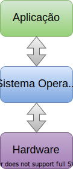
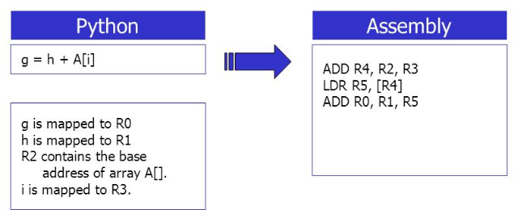
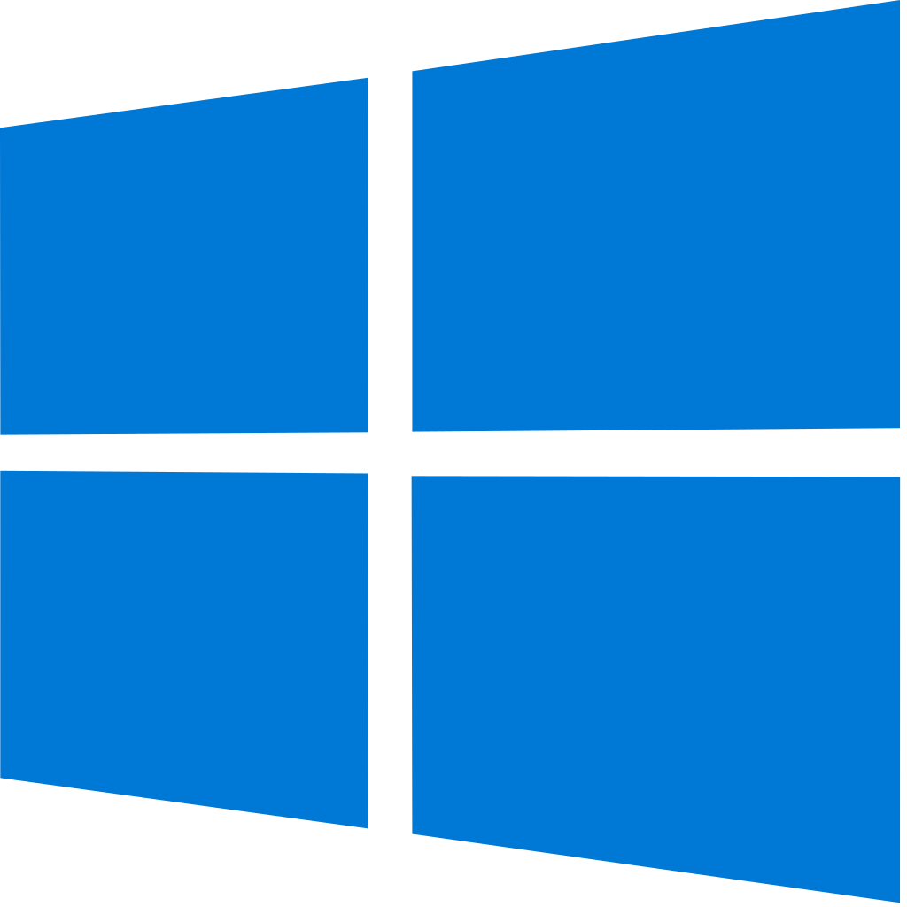
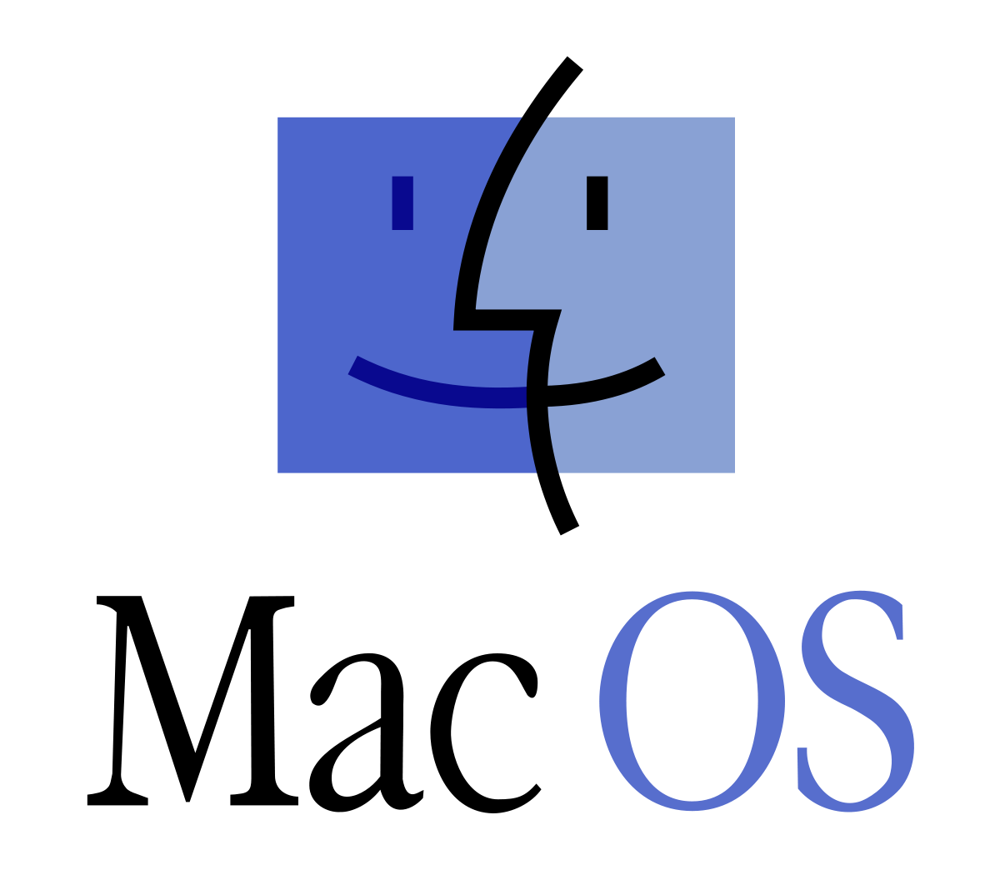
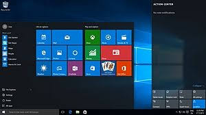
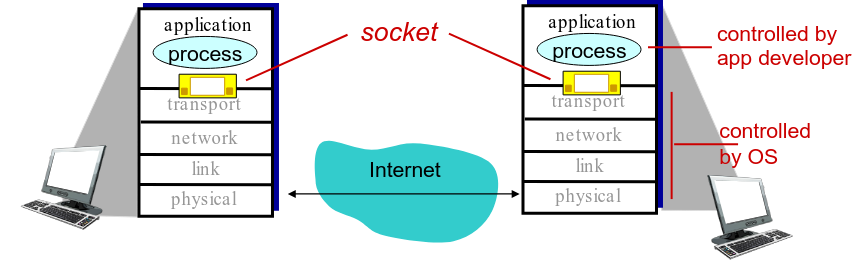

# Aplicações e Sistema Operativo {.part}

# Camadas de Software e Hardware

:::::{.columns}
::::{.column width=60%}
- *Software*:
    - Aplicação: programa(s) do usuário.
        - Firefox, Word, Media Player;
        - Seu programa em Python...
    - Sistema operativo: gerencia *hardwares* e *softwares* do sistema.
- *Hardware*:
    - Dispositivos do computador.
        - Processador, memória;
        - Disco rígido, SSD;
        - Interface de rede;
        - Teclado, *mouse*, monitor...
::::
::::{.column width=40%}

:::::::{.center}
{#camadas width=35%}
:::::::

::::
:::::

# Programa

- Conjunto de instruções que serão executadas pelo processador.
- Sequencialmente: passo a passo.
- Relação direta com o código implementado.

:::::{.columns}
::::{.column width=17%}
::::
::::{.column width=13%}
  
Programa
::::
::::{.column width=5%}
  
→
::::
::::{.column width=50%}
{#programa width=100%}
::::
:::::

# Processo

- Programa em execução no computador.
    - Isto é, é uma instância de um programa.
- Podemos ter vários processos de um mesmo programa.
- Geralmente usa bibliotecas de interface com o S.O.
    - acessar entrada de dados (via teclado, por exemplo);
    - mostrar saída (textual ou gráfica no monitor);
    - acessar ficheiro no disco...
- Sistema operacional é responsável por gerenciar os processos.
    - Criar, executar instruções, escalonar, finalizar...

# A Camada do Sistema Operativo (S.O.)

- É muito mais que um gerenciador de processos.
    - Gerencia processamento, memória, dispositivos de E/S...
- Faz interface entre *hardware*, processos e usuários.
- Tem parte implementada em software e parte implementada em hardware.
- Oferece, para os programas, comunicação com dispositivos.
    - Via **chamadas de sistemas**.
- Usuário não pode operar diretamente sobre o hardware.
    - Ainda bem, pois é complicado!
- É um sistema complexo!

# Sistemas Operativos: Divisão de Tarefas

- S.O. servem para facilitar o uso do computador.
- Antigamente, apenas um programa poderia executar por vez.
- A partir da década de 60 e 70, houve a evolução para o time sharing.
    - Compartilhamento de tempo.
    - Mais de um processo poderia executar “ao mesmo tempo”.
- Processos são divididos em tarefas pequenas (milissegundos).
- Cada tarefa executa no seu tempo.
- Sistemas tornaram-se **multitarefas** e **multiusuários**.

# Sistemas Operativos Existentes

:::::{.columns}
::::{.column width=50%}
- Unix
- MS-DOS
    - Microsoft Disk Operating System
- Windows
- Linux
- Mac OS
- Android
- IOS
- ...
::::
::::{.column width=50%}

{#unix width=30%} &nbsp; &nbsp;
{#dos width=20%} &nbsp;
{#win width=20%}    
{#linux width=20%} &nbsp; &nbsp;
{#mac width=30%} &nbsp;
{#android width=20%}
::::
:::::

# Programas de Interface com Usuário

:::::{.columns}
::::{.column width=55%}
- Rodam sobre o S.O.
- Por linha de comando.
    - MS-DOS, Unix, Linux…
    - Uso de linguagens de script.
    - No Linux, por exemplo, temos o sh e bash.
- GUI: graphical user interface.
    - Por janelas, ícones, menus e mouse.
    - Mais amigável: *user friendly*.
    - Windows, Unix, Linux, Android, MacOS…
- No Linux, por exemplo, pode-se escolher a GUI.
    - X Windows, Gnome, KDE, XFCE,...
::::
::::{.column width=45%}
:::::::{.center}
{#dosGUI width=45%}  &nbsp; &nbsp;
{#winGUI width=45%}     
{#xwindow width=45%}
:::::::
::::
:::::

# Aplicações

- Um ou mais programas de computadores para algum propósito.
    - Exemplos: tocador (*player*) de música, editor de texto, navegador web, ...
- **Aplicações de desktop**: programa que não requer acesso à rede.
    - Não necessitam de serviços externos (outros computadores).
- **Aplicações em rede**: 
    - Necessitam estar conectadas a serviços externos.

# Aplicações em Rede

:::::{.columns}
::::{.column width=50%}
- Web;
- e-mail;
- Acesso e Login remoto;
- Compartilhamento de arquivos;
- Serviços de streaming de vídeo;
- ...
::::
::::{.column width=45%}
:::::::{.center}
{#web width=30%}  &nbsp; &nbsp;
{#email width=20%}  &nbsp; &nbsp;
{#ssh width=25%}    
{#torrent width=20%} &nbsp; &nbsp;
{#skype width=30%}    
{#netflix width=20%} &nbsp; &nbsp;
{#netflix width=20%}
::::
:::::::
::::{.column width=5%}
::::
:::::

# Comunicação entre Sistemas {.part}

# Redes de Computadores: Comunicação entre Máquinas

::::::{.block .centered}
:::{.blocktitle}
Uma definição de redes de computadores:
:::
Conjunto de computadores independentes interconectados de modo que se comuniquem.
::::::

- Computadores (*hosts*) podem ser:
    - pessoais (PCs), portáteis (laptops), servidores, smartphones, ...
- Atualmente existem diversas tecnologias de conexão.
    - **Meio físico** ou **enlaces**: cabo de par trançado, cabo de fibra, radio-frequência, ...
    - **Dispositivos de conexão** ou **nós comutadores**: *switches*, roteadores, ... 

# A Internet

:::::{.columns}
::::{.column width=30%}
:::::::{.center}
{#pilha width=100%}
:::::::
::::
::::{.column width=67%}

- Conexão entre vários nós de conexão através de diferentes enlaces.
    - A nível mundial.
- Modelo de negócio:
    - Provedores de serviço da Internet.
    - Serviços de interconexão entre redes.
    - Pode ser definida como uma rede de provedores de serviço.
- Rede resultante é muito complexa.
    - Evolução guiada por fatores econômicos, políticas nacionais.
::::
::::{.column width=3%}
::::
:::::

# Organização da Internet

:::::{.columns}
::::{.column width=70%}
- É organizada em camadas de uma pilha de protocolos: 
    - TCP/IP.
- Protocolos ditam as regras de comunicação em cada camada.
- Cada camada é resposável por tarefas específicas da rede.
    - TCP (*Transmission Control Protocol*) é protocolo da camada de transporte.
        - Comunicação entre processos.
    - IP (*Internet Protocol*) é protocolo da camada de rede.
        - Comunicação entre máquinas.
::::
::::{.column width=30%}
:::::::{.center}
{#pilha width=60%}
:::::::
::::
:::::

# Dados na Internet

- Dado a ser transmitido é dividido em pedaços chamados de **pacote**.
- Pacotes são encaminhados de dispositivo a dispositivo: seguem rotas definidas pelos comutadores da rede.

:::::::{.center}
{#animacao width=60%}
:::::::

# Serviços Providos pelo IP

- Serviço de **datagrama**: empacotamento de dados.
    - Datagrama = pacote IP.
    - Introduz cabeçalho específico.
- Endereçamento de *hosts* e dispositivos da rede:
    - Número IP (versão 4 ou 6) identifica um host.
        - Exemplo: 123.45.67.89
- Verificação de erro nos pacotes (*checksum*).
- Serviço do melhor esforço:
    - Pacotes podem ser perdidos, duplicados ou desordenados;
    - Não há garantias de atraso.

# Serviços Providos pelo TCP

- Protocolo da camada de transporte.
    - Interface com a aplicação!
    - Isto é, com o processo ou processos da aplicação.
- Responsável por **endereçar** os processos.
- Provê serviço de **entrega confiável de pacotes**:
    - Resolve problema de pacotes perdidos, duplicados e desordenados.
    - Mas ainda não garante tempo máximo de atraso.
- Faz **controle de fluxo** e de **congestionamento**.
- Serviço **orientado a conexão**:
    - Existe etapa inicial de conexão: confirmação de comunicação entre duas máquinas.

# UDP: Outro Protocolo de Transporte

- Na camada de transporte ainda há outros protocolos.
- UDP (*User Datagram Protocol*)
    - Faz o básico: envia pacotes para os processos.
- Não possui nenhum dos serviços que o TCP oferece.
- Por que ele existe?

# Programação em Redes de Computadores {.part}

# Modelos de Arquitetura de Sistemas

- Cliente-servidor:
    - Cliente faz requisições.
    - Servidor aguarda requisições e as atende quando são realizadas.
- Par a par (Peer-to-Peer - P2P):
    - Cada nó da rede age como cliente ou como servidor.
    - Isto é, pode fazer requisições ou atender requisições a outros nós da rede.

# Sockets

::::::{.block .centered}
:::{.blocktitle}
Socket
:::
Janela entre processo da aplicação e protocolo de transporte.
::::::

:::::::{.center}
{#sockets}
:::::::

# Identificação de Processos

- Agora vamos lidar com dois ou mais processos em máquinas diferentes.
    - Além disso, existem outros processos no sistema.
- Máquina é identifica por IP.
- Em um máquina, o processo se associa a um socket identificado por uma **porta**.
    - Um número de 16 bits: valor único para cada socket!
    - Algumas portas são reservadas para serviços específicos, como HTTP (80), SSH (22).

# Comunicação via UDP

- Serviço básico, “mínimo” da camada de transporte da Internet.
- Apenas entrega pacote ao socket correspondente.
- Herda modelo de serviço da camada de redes: “melhor esforço”.
- Pacotes UDP podem ser:
    - Perdidos.
    - Entregues fora de ordem para a aplicação.
- Sem conexão:
    - Não há comunicação inicial entre UDP do transmissor e do receptor.
    - Datagramas são simplesmente enviados.
- Cada pacote UDP é tratado de forma independente dos demais.

# Comunicação via UDP (II)

- Usos do UDP:
    - Aplicações de Streaming multimídia (tolerantes a perda, sensíveis a taxa).
    - DNS: serviço de nomes na Internet.
    - SNMP: protocolo padrão para monitoramento e gerenciamento de redes.
- Transferência confiável sobre UDP:
    - Possível, mas depende da aplicação.
    - Adição de confiabilidade da própria aplicação.
    - Métodos de recuperação de erros específicos de cada aplicação.

# Sockets UDP em Python

:::::{.columns}
::::{.column width=50%}
- Importar módulo: `import socket`
    - Ou `from socket import *`
- Funções:
    - **socket**: cria socket.
        - Para UDP, indicar que é SOCK_DGRAM.
    - **bind**: associa endereço local (porta) ao socket.
        - Usado por processo servidor.
    - **sendto**: envia mensagem para destinatário.
    - **recvfrom**: recebe mensagem de remetente.
    - **close**: termina socket.
::::
::::{.column width=50%}
{#etapasUDP width=90%}
::::
:::::

# Exemplo de Aplicação Cliente-Servidor com UDP

- Aplicação de exemplo:
    - Cliente lê string do teclado e envia o dado para o servidor.
    - O servidor recebe o dado e converte a string para caixa alta.
    - Servidor envia dados modificados para o cliente.
    - Cliente recebe dado modificado e imprime na tela.

# Processo Servidor UDP (I)

~~~{#servidorUDP .python style="font-size: 18pt;"}
from socket import *

# Numero de porta na qual o servidor estara esperando conexoes.
serverPort = 12000

# Criar o socket. AF_INET e SOCK_DGRAM indicam UDP.
serverSocket = socket(AF_INET, SOCK_DGRAM)

# Associar o socket a porta escolhida. Primeiro argumento vazio indica
# que desejamos aceitar conexoes em qualquer interface de rede desse host
serverSocket.bind(('', serverPort))

print ('O servidor esta pronto para receber pacotes.')

# Continua...
~~~

# Processo Servidor UDP (II)

~~~{#servidorUDP2 .python style="font-size: 18pt;"}
# Loop infinito: servidor eh capaz de tratar multiplas conexoes
while 1:
        # Aguardar novo pacote
        print ('Aguardando pacote...')
        sentence, addr = serverSocket.recvfrom(1024)
        print ('Nova pacote recebido!', addr)

        # Processamento
        capitalizedSentence = sentence.decode("ascii").upper()

        # Envio. Repare que o endereco do destinatario eh necessario.
        print ('Realizando envio...')
        serverSocket.sendto(capitalizedSentence.encode("ascii"), addr)

# Fechamento
print ('Fechando socket...')
serverSocket.close()
~~~

# Processo Cliente UDP

~~~{#servidorUDP2 .python style="font-size: 16pt;"}
from socket import *
import os

serverName = 'localhost' # Ou '127.0.0.1'
serverPort = 12000

# Criacao do socket
clientSocket = socket(AF_INET, SOCK_DGRAM)

sentence = input('Input lowercase sentence:')

# Envio de bytes. Repare que o endereco do destinatario eh necessario
clientSocket.sendto(sentence.encode("ascii"), (serverName, serverPort))

# Recepcao
modifiedSentence, addr = clientSocket.recvfrom(1024)
print ('From Server:', addr, modifiedSentence.decode("ascii"))

# Fechamento
clientSocket.close()
~~~

# Alguns Detalhes

- Servidor deve ser iniciado primeiro que cliente.
    - Servidor espera as conexões.
- A troca de mensagens deve ser feita em **bytes**.
- String deve ser convertido para sequência de bytes.
    - `encode`
    - `decode`

# Exercícios

1. Implemente um programa servidor (oráculo) que fique esperando perguntas por mensagens UDP e que responda “sim”, “não” ou “talvez”.
    - Escolha a resposta aleatoriamente.
    - Use a função `randint` do módulo random para escolher entre as 3 possíveis respostas.
    - Use a porta 12345.
2. Implemente um programa cliente para obter perguntas do usuário e enviá-las para o oráculo.
    - IP do servidor é 127.0.0.1
3. Execute os dois programas (primeiro servidor e depois cliente).

