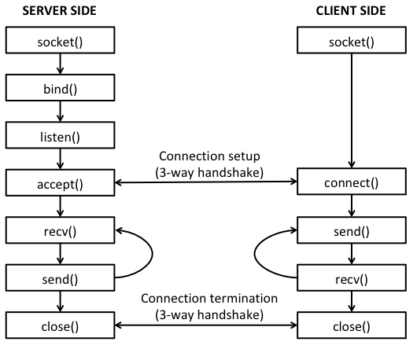

# Comunicação via TCP

- Garantias que pacotes serão entregues na conexão e em ordem.
    - Há processo de abertura e fechamento de conexão.
    - Protocolo orientado a conexões!

:::::::{.center}
{#canal width=55%}
:::::::

# Programação com Sockets TCP (I)

- Cliente deve contactar servidor.
    - Processo do servidor precisa estar previamente em execução.
    - Servidor precisa ter criado socket que aceitará contato do cliente.
- Cliente contacta servidor:
    - Criando socket TCP, especificando **IP** e **número de porta** do processo servidor.
    - Quando cliente cria o socket: TCP do cliente estabelece conexão para o TCP do servidor.

# Programação com Sockets TCP (II)

- Quando contactado pelo cliente, TCP do **servidor cria um novo socket**.
    - Novo socket utilizado para a comunicação do processo servidor com o processo cliente.
    - Este esquema de criação de sockets permite ao servidor falar com **múltiplos clientes**.
- Número de porta de origem são usados para distinguir clientes.
- Ponto de vista da aplicação:
    - TCP provê transferência **confiável** e **ordenada** de fluxo de bytes entre cliente e servidor.

# Diagrama Geral de Programação com Sockets TCP

:::::::{.center}
{#tcpSocket}
:::::::

# Sockets TCP em Python

:::::{.columns}
::::{.column width=50%}
- Métodos para cliente:
    - **socket**: cria socket.
       - Para TCP, indicar SOCK_STREAM.
    - **connect**: conecta ao servidor.
    - **send**: envia mensagem para destinatário.
    - **recv**: recebe mensagem de remetente.
    - **close**: termina socket.
::::
::::{.column width=50%}
- Métodos para servidor:
    - **bind**: associa endereço local (porta) ao socket.
    - **listen**: habilita socket para aceitar conexões.
        - Pode aceitar múltiplos clientes.
    - **accept**: aceita conexão.
    - **socket**, **close**, **send** e **recv** são também usadas pelo servidor.
::::
:::::

# Exemplo: Socket TCP

- Mesma aplicação usada com UDP.
- Aplicação de exemplo:
    - Cliente lê string do teclado e envia o dado para o servidor.
    - O servidor recebe o dado e converte a string para caixa alta.
    - Servidor envia dados modificados para o cliente.
    - Cliente recebe dado modificado e imprime na tela.

# Processo Servidor TCP (I)

~~~{#servidorTCP1 .python style="font-size: 18pt;"}
from socket import *

# Numero de porta na qual o servidor estara esperando conexoes.
serverPort = 12000

# Criar o socket. AF_INET e SOCK_STREAM indicam TCP.
serverSocket = socket(AF_INET, SOCK_STREAM)

# Associar o socket a porta escolhida. Primeiro elemento vazio indica
# que desejamos aceitar conexoes em qualquer interface de rede desse host
serverSocket.bind(('', serverPort))

# Habilitar socket para aceitar conexoes. O argumento 1 indica que havera
# ate uma conexao em espera, caso receba multiplas conexoes simultaneas
serverSocket.listen(1)

print ('O servidor esta pronto para receber conexoes')

# continua...
~~~

# Processo Servidor TCP (II)

~~~{#servidorTCP2 .python style="font-size: 18pt;"}
# Loop infinito: servidor eh capaz de tratar multiplas conexoes
while 1:
    # Aguardar nova conexao
    print ('Aguardando conexao...')
    connectionSocket, addr = serverSocket.accept()
    print ('Nova conexao recebida!')
    # Recepcao de dados
    print ('Aguardando dados...')
    sentence = connectionSocket.recv(1024)
    print ('Dado recebido do cliente')
    # Processamento
    capitalizedSentence = sentence.decode("ascii").upper()
    # Envio
    print ('Realizando envio...')
    connectionSocket.send(capitalizedSentence.encode("ascii"))
    # Fechamento
    print ('Fechando socket...')
    connectionSocket.close()
~~~

# Processo Cliente TCP

~~~{#clienteTCP .python style="font-size: 16pt;"}
from socket import *

serverName = 'localhost'
serverPort = 12000

# Criacao do socket
clientSocket = socket(AF_INET, SOCK_STREAM)
# Conexao com o servidor
clientSocket.connect((serverName,serverPort))

sentence = input('Input lowercase sentence:')
# Envio de bytes
clientSocket.send(sentence.encode("ascii"))

# Recepcao
modifiedSentence = clientSocket.recv(1024)
print ('From Server:', modifiedSentence.decode("ascii"))

# Fechamento
clientSocket.close()
~~~

# Conversão entre Strings e Bytes

- A troca de mensagens deve ser feita em **bytes**.
- String deve ser convertido para sequência de bytes.
- Os métodos para este propósito são:
    - `encode()`
    - `decode()`
- O parâmetro é o nome da codificação, como, por exemplo:
    - “ascii”: caracteres básicos americanos.
    - “utf-8”: caracteres com acentuação.

# Conversão entre Tipos Primitivos e Bytes (I)

- Para converter qualquer tipo primitivo (int, float, ...) para byte:
    - Módulo **struct**.
    - Documentação: https://docs.python.org/3/library/struct.html
    - Função `struct.pack()`: gera byte a partir de um valor.
        - Primeiro parâmetro é o formato.
        - Os parâmetros seguintes são os valores a serem convertidos.
        - Retorna os bytes.
    - Função `struct.unpack()`: desfaz o pack, gerando uma tupla de valores.
        - Primeiro parâmetro é o formato.
        - Segundo parâmetro são os bytes.
        - Retorna uma tupla com os valores, mesmo que seja apenas um.

# Conversão entre Tipos Primitivos e Bytes (II)

:::::{.columns}
::::{.column width=45%}
- Alguns formatos possíveis:

:::::::{.center style="font-size: 22px; line-height: 95%"}
| Formato | Tipo          |
|---------|---------------|
| `"i"`     | int           |
| `"I"`     | unsigned int  |
| `"l"`     | long          |
| `"L"`     | unsigned long |
| `"f"`     | float         |
| `"d"`     | double        |
:::::::

::::
::::{.column width=5%}
 
::::
::::{.column width=50%}
- Exemplo:

~~~{#exUnpack .python style="font-size: 18pt;"}
import struct

x = 2000
# Converte inteiro x para byte
x_byte = struct.pack("i", x)

# Faz algo com os bytes
print(x_byte) # Incompreensível

# Converte bytes para inteiro.
# Note que o retorno é uma tupla!
y, = struct.unpack("i", x_byte)

print(y)
~~~
::::
:::::

# Módulo Marshal (ou Pickle)

- Convertem qualquer estrutura de dados de Python para bytes.
    - Listas, dicionários, tuplas, inteiros, strings...
    - No entanto, adiciona sobrecarga à mensagem.
        - Módulos adicionam informação extra sobre o tipo do dado.
- Link para os módulos:
    - https://docs.python.org/3/library/marshal.html
    - https://docs.python.org/3/library/pickle.html
- As funções normalmente utilizadas são:
    - `marshal.dumps(arg)`: converte elemento `arg` para bytes e os retorna.
    - `marshal.loads(bytes)`: converte `bytes` para o elemento correspondente e o retorna.

# Exemplo Simples de Conversão com Módulo Marshal

~~~{#marshal .python }
import marshal
#import pickle # marshal pode ser trocado por pickle

lista = [0, 1, 2]

bytes = marshal.dumps(lista)

# Em uma comunicação, bytes seriam enviados e
# código abaixo estaria no receptor.

lista2 = marshal.loads(bytes)

print(lista2)
~~~

# Exercício (I)

1. Implemente um programa servidor (oráculo) que fique esperando perguntas por mensagens TCP e que responda “sim”, “não” ou “talvez”.
    - Escolha a resposta aleatoriamente.
    - Use a função `randint` do módulo random para escolher entre as 3 possíveis respostas.
    - Use a porta 12345.
2. Implemente um programa cliente para obter perguntas do usuário e enviá-las para o oráculo.
    - IP do servidor é 127.0.0.1
3. Execute os dois programas (primeiro servidor e depois cliente).

# Exercício (II)

1. Implemente um programa cliente TCP que envie um número inteiro N e espere a resposta X do servidor.
    - Obtenha N do usuário ou por argumento de linha de comando.
    - Use o módulo `struct`.
2. Implemente um programa servidor que aceite conexões TCP e calcule X como sendo a multiplicação entre os dois números primos imediatamente abaixo e imediatamente acima de N.
    - Se N é primo, realizar o cálculo com N e o primo imediatamente acima.
3. Teste sua aplicação.

# Exercício (III)

1. Implemente um programa cliente TCP que requisite a um servidor uma lista de divisores de um dado N.
Obtenha N do usuário ou por argumento de linha de comando.
2. Implemente um programa servidor que aceite conexões TCP e calcule os divisores de um dado N e envie uma lista como resposta.
3. Teste sua aplicação.
