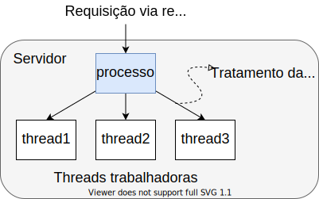

# Motivação: Servidor com Múltiplas Requisições

- É bastante comum servidor ter múltiplos clientes.
- Existem 3 modos diferentes de se implementar o atendimento de múltiplas requisições no servidor:

| Modo                     | Características                                   |
|--------------------------|---------------------------------------------------|
| Threads                  | Paralelismo, chamadas de sistema bloqueantes.     |
| Processo monothread      | Sem paralelismo, chamadas de sistema bloqueantes. |
| Máquina de estado finito | Paralelismo, chamadas de sistema não bloqueantes. |

# Servidor Monothread

:::::{.columns}
::::{.column width=60%}
- Servidor recebe simultaneamente requisições.
- Enquanto trata uma, as outras esperam.
    - Chamada bloqueante.
- Degrada desempenho:
    - Clientes podem esperar muito tempo!
::::
::::{.column width=40%}
{#waitServer width=80%}
::::
:::::

# Servidor com Máquina de Estado Finito

- Servidor recebe simultaneamente requisições.
- Servidor separa o tratamento das requisições em pedaços, para cada cliente.
- Trata pedaço de cada requisição, de múltiplos clientes.
    - Paralelismo.
    - Requer chamadas de sistemas não são bloqueantes.
- Implementação complexa:
    - Servidor precisa guardar estado de cada cliente.
        - Que parte já tratei e que parte falta para cada cliente?
    - Por isto, se chama **máquina de estados finito**.

# Servidor com Threads

:::::{.columns}
::::{.column width=50%}
- Facilita implementação.
- Explora paralelismo.
    - Real (sistema multinúcleos) ou
    - Aproveitamento de ociosidade de CPU.
        - Devido a acesso a disco, por exemplo.
- Servidor faz chamadas de sistema bloqueantes.
    - Mas apenas a thread que fez a chamada é bloqueado.
    - Outras threads continuam executando.
::::
::::{.column width=50%}
{#threadsServidor width=80%}
::::
:::::

# Threads
::::::{.block .centered}
:::{.blocktitle}
Definação:
:::
- Uma thread é um fluxo de controle sequencial dentro de um programa em execução (processo).
    - Um processo é formado por uma ou mais threads.
::::::

:::::{.columns}
::::{.column width=50%}
:::::::{.center}
{#thread1 width=50%}
:::::::
::::
::::{.column width=50%}
:::::::{.center}
{#thread2 width=65%}
:::::::
::::
:::::

# Multithreading

- Um sistema de threads mantém a **mínima informação** para que permita que a CPU possa ser compartilhada por vários threads.
    - Contexto de thread.
- No conceito de *multithreading*, um processo pode possuir vários fluxos de controle (threads).
- Threads de um processo compartilham o mesmo espaço de endereçamento.
- Trocas de contexto de threads de um mesmo processo são mais rápidas.
    - Comparado ao processo.

# Multithreading vs. Multiprocessamento

:::::{.columns}
::::{.column width=49%}
## Prós:

- Menos tempo para criar um thread do que um processo filho.
- Menos tempo para finalizar um thread do que um processo.
- A troca de contexto é mais rápida entre threads do mesmo processo.
- Mais eficiência no compartilhamento de dados através da memória compartilhada dentro de um mesmo processo.

::::
::::{.column width=49%}

## Contras:

- Menos proteção da área de memória entre os threads.
    - Por padrão, processos não têm acesso a área de memória de outros.
- Programador deve proteger dados que não podem ser manipulados simultaneamente.
    - Esforço de programação.
- Por definição, threads de um mesmo processo não podem executar em máquinas diferentes.
::::
::::{.column width=2%}
::::
:::::

# Multithreading em Python 3

:::::{.columns}
::::{.column width=50%}
- Módulo é chamado **multithreading**.
    - `import multithreading`
- Thread é criada com uma função associada.
    - Tal função é o código que o thread irá executar.
    - Pode ter qualquer nome.
    - Deve ser implementada.
    - Aceita parâmetros.
    - Apresenta seu próprio escopo (local) e pode acessar escopo global.
::::
::::{.column width=50%}
{#escopo width=80%}
::::
:::::

# Thread em Python: Definir

~~~{#thread .python style="font-size: 20pt;"}
import threading

# Função que a thread irá executar.
def meu_thread():
    print('Sou um thread')

# Thread (processo) principal irá criar 5 threads.
for i in range(5):
    # Cria thread.
    t = threading.Thread(target=meu_thread)
    # Inicia execução do thread.
    t.start()
~~~

# Thread em Python: Identificar

~~~{#threadsId .python style="font-size: 20pt;"}
import threading

# Função que a thread irá executar.
def meu_thread(id):
    print('Sou um thread de id', id)

# Thread (processo) principal irá criar 5 threads.
for i in range(5):
    # Cria thread com argumento i para identificar.
    t = threading.Thread(target=meu_thread, args=(i,))
    # Inicia execução do thread.
    t.start()
~~~

# Thread em Python: Esperar Término

:::::{.columns}
::::{.column width=40%}
- Programa principal pode esperar pelo término de um thread.
    - Geralmente é uma boa prática!
    - Muitas vezes é necessário!
- Uso do método join() de uma thread.
::::
::::{.column width=60%}

~~~{#threadsJoin .python style="font-size: 18pt;"}
# ...
# Programa principal
t_lista = []
for i in range(5):
    t = threading.Thread(target=meu_thread, args=(i,))
    t.start()
    # Guarda objeto da thread criada.
    t_lista.append(t)

# Espera todos os threads.
for thread in t_lista:
    thread.join()

print("Todos as threads terminaram")
~~~

::::
:::::

# Exemplo: Servidor TCP Multithreading

- Cálculo de divisores:
    - <a href="codigos/divisores_cliente.py"> código do cliente </a>
    - <a href="codigos/divisores_servidor.py"> código do servidor </a>

# Exercício (I)

- Implemente um servidor *multithreading* para atender às múltiplas requisições de clientes do Exercício II da aula passada.
- Relembrando o exercício:
    1. Implemente um programa cliente TCP que envie um número inteiro N e espere a resposta X do servidor.
        - Obtenha N do usuário ou por argumento de linha de comando.
        - Use o módulo `struct`.
    2. Implemente um programa servidor que aceite conexões TCP e calcule X como sendo a multiplicação entre os dois números primos imediatamente abaixo e imediatamente acima de N.
        - Se N é primo, realizar o cálculo com N e o primo imediatamente acima.
