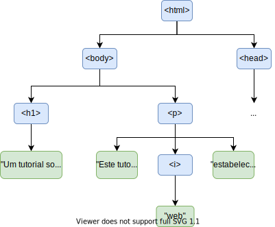

# Conceitos Básicos{.part}

# Aplicação Web: Definição

:::::{.columns}
::::{.column style="width:45%; padding-top: 100px;"}
- Aplicação computacional **distribuída**.
	- **Partes** executadas em **dispositivos diferentes**.
- Nomeadamente:
	- Cliente (navegador).
	- Servidor.
- Comunicação utilizando HTTP.
	- Requisições e respostas.
::::
::::{.column width=55%}

:::::::{.center}
{#appWeb width="50%"}
:::::::

::::

:::::


# Aplicação Web: Características

| Vantagens                    | Desvantagens              |
| ---------------------------- | ------------------------- |
| Dados armazenados na nuvem   | Latência de acesso        |
| Maior capacidade no servidor | Preocupações de segurança |
| ...                          | ...                       |

# Aplicações Web: _Frontend_

- Porção da aplicação executada no _browser_.
- Funções típicas:
	- Renderização do conteúdo.
	- Interface (entrada e saída) com o usuário.
	- Pequenos processamentos.
		- Em geral, para dinamização do conteúdo exibido.

- Três linguagens tipicamente envolvidas:
	- HTML: renderização (estrutura do documento).
	- CSS: renderização (estilo do documento).
	- Javascript: processamento (dinamização do documento).

# Aplicações Web: _Backend_


:::::{.columns}
::::{.column width=50%}
- Porção da aplicação executada no servidor.
- Funções típicas:
	- Armazenamento de dados.
	- Processamento de regras de negócio.
	- Armazenamento e serviço de conteúdos estáticos.
		- Logotipos, _scripts_, folhas de estilo, ...
::::
::::{.column width=50%}
- Várias linguagens/tecnologias populares:
	- CGI (pouco ou não usado atualmente).
	- PHP.
	- ASP/C# (.net).
	- JSP/Servlets/JSF (Java).
	- Node.js.
	- Ruby.
	- **Flask** (Python).
	- ...
::::

:::::

# Aplicações Web: Comunicação

- Protocolo HTTP:
	- Utilizado desde a década de 1990 para acesso web.
		- Inicialmente, conteúdos estáticos.
		- Adaptado ao dinamismo das aplicações web atuais.
	- Dois tipos básicos de mensagem:
		- **Requisição**: pedido feito pelo _browser_ ao servidor.
		- **Resposta**: retorno do servidor.
	- Mensagens operam sobre **objetos**:
		- **Recursos** armazenados ou disponibilizados pelo servidor.
		- Originalmente, ficheiros. Hoje, mais abstratos.

# O Protocolo HTTP {.part}


# O Protocolo HTTP: Requisições

- Diferentes tipos de pedido suportados.
- Os mais comuns:

| Tipo   | Descrição                                           |
| ------ | --------------------------------------------------- |
| GET    | Obter um objeto armazenado no servidor              |
| POST   | Enviar um dado a um objeto armazenado no servidor   |
| HEAD   | Similar ao GET, mas servidor envia apenas metadados |
| PUT    | Armazenar um objeto no servidor                     |
| DELETE | Remover um objeto atualmente armazenado no servidor |

# O Protocolo HTTP: Componentes de uma Requisição

- Requisição HTTP carrega uma série de informações. Exemplos:

| Componente         | Descrição                                              |
| ------------------ | ------------------------------------------------------ |
| Tipo de requisição | GET, POST, HEAD, ...                                   |
| Caminho do objeto  | Onde objeto é armazenado no servidor                   |
| Cabeçalhos         | Metadados da requisição (_e.g._, codificação esperada) |
| Corpo              | Dados a serem enviados ao servidor (se algum)          |


# O Protocolo HTTP: Respostas

:::::{.columns}
::::{.column  style="padding-top:0px; width: 50%;"}

- Resposta traz uma série de informações:
	- Status (sucesso, fracasso, explicações).
	- Metadados (_e.g._, tamanho da resposta, validade, codificação de caracteres)
	- Corpo (conteúdo requisitado, se houver).
- Servidor pode ou não conseguir atender a uma requisição.
	- Informado no campo de _status_.
	- Alguns exemplos de valores comuns na tabela:
::::
::::{.column width=5%}
<br>
::::
::::{.column width=45%}

:::{.center style="font-size: 20px; line-height: 12px;"}

| Código | Descrição                       |
| ------ | ------------------------------- |
| 2XX    | Sucesso                         |
| 200    | Objeto retornado                |
| 204    | Nenhuma resposta necessária     |
| 3XX    | Redirecionamento                |
| 301    | Objeto foi movido               |
| 304    | Objeto não foi modificado       |
| 4XX    | Erro do cliente                 |
| 401    | Acesso não autorizado           |
| 404    | Objeto não encontrado           |
| 5XX    | Outros erros                    |
| 500    | Erro interno do servidor        |
| 501    | Funcionalidade não implementada |

:::
::::

:::::

# O Protocolo HTTP: Exemplo de Interação

:::::{.columns}
:::{.column width=70%}
:::{.center}
{#requisicaoSimples}
:::
:::
:::{.column style="width: 30%; padding-top: 10%;"}
- Detalhes:
	- Servidor: `www.midiacom.uff.br`.
	- Requisição do tipo `GET`.
	- _Status_ da resposta 200.
	- Corpo contém HTML do objeto requisitado.
:::
:::::

# HTML {.part}


# HTML: Visão Geral

:::::{.columns}
::::{.column width=50%}
- Linguagem de **marcação** para documentos **hipertexto**.
	- **Marcação**: anotação feita no conteúdo para alterar suas propriedades.
		- _e.g._, fonte, cor de fundo, tamanho, ...
	- **Hipertexto**: texto que contém referências a outros textos, imagens, sons, ...
::::
::::{.column width=50%}
- Permite criar documentos contendo:
	- Texto.
	- Formatações especiais.
	- Imagens.
	- Tabelas.
	- Vídeos.
	- Sons.
	- Referências a outros documentos.
	- ...
::::

:::::

# HTML: Estrutura de um Documento (I)

- No nível mais alto de abstração, documento HTML contém duas seções:
	- `head`: 
		- Metadados.
		- Configurações.
		- Definições gerais.
	- `body`:
		- O conteúdo textual propriamente dito.


```{.html .numberLines style="width: 40%; position: absolute; right: 60px; bottom: 80px; font-size: 18px;"}
<html>
	<head>
		...
	</head>

	<body>
		...
	</body>
</html>
```

# HTML: Estrutura de um Documento (II)

:::::{.columns}
:::{.column width=60%}

- Documento organizado de forma hierárquica (em árvore).
- Cada nó da hierarquia corresponde a uma _tag_.
	- Exemplo: `<nomeDaTag> filhos </nomeDaTag>`.
- _Tags_ são aninhadas, criando a hierarquia.

```{.html .numberLines style="font-size: 18px;"} 
<html>
	<head>
	</head>

	<body>
		<h1>Um tutorial sobre HTML</h1>

		<p>Este documento <i>web</i> estabelece alguns...</p>
	</body>
</html>
```

:::
:::{.column width=40%}
- Hierarquia:

{style="width: 90%;"}

:::
:::::

# HTML: _Tags_ Aplicáveis ao `head`

| Nome da _Tag_ | Propósito                                            |
| ------------- | ---------------------------------------------------- |
| `script`      | Carrega ou define _script_ executado sobre a página  |
| `title`       | Define um título para a página                       |
| `style`       | Define estilos aplicados aos elementos da página     |
| `meta`        | Define metadados sobre a página                      |
| `link`        | Carrega algum recurso externo à página (_e.g._, CSS) |

# HTML: _Tags_ Típicas de Formatação

:::::{.columns}
:::{.column width=47%}
::::{style="font-size: 16px; line-height: 90%; padding-top: 2%;"}
| Nome da _Tag_         | Propósito                                                    |
| --------------------- | ------------------------------------------------------------ |
| `h1`, `h2`, ..., `h6` | Definir cabeçalhos (_e.g._, de seções)                       |
| `i`, `b`, `s`, `u`    | Fonte em itálico, negrito, tachado, sublinhado               |
| `p`                   | Define um parágrafo                                          |
| `table`               | Define uma tabela                                            |
| `th`                  | Define a linha de cabeçalho de uma tabela                    |
| `tr`                  | Define uma linha normal de tabela                            |
| `td`                  | Define uma célula em uma linha de tabela                     |
| `br`                  | Quebra uma linha                                             |
| `span`                | Define um trecho de texto (_e.g._, para formatação especial) |
| `a`                   | Cria um hiperlink para outro documento                       |
| `ul`, `ol`            | Criam listas de itens (sem ou com numeração)                 |
| `li`                  | Cria um item em uma lista.                                   |

::::
:::
:::{.column width=53%}

```{.html .numberLines style="font-size: 14px;"}
<html>
	<head>
	</head>
	<body>
		<h1>Título</h1>
        <h2>Seção</h2>
        Uma <b>tabela</b>:<br>
		<table>
            <tr><th>Col 1</th><th>Col 2</th></tr>
            <tr><td><s>val 1</s></td><td><u>val 2</u></td></tr>
            <tr><td><a href="outraPagina.html">val 3</a></td><td>val 4</td></tr>
        </table>
		<ul><li>Um item</li><li>Segundo item</li></ul>
	</body>
</html>
```

<iframe src="iframes/Exemplo1.html" style="width: 90%; height: 280px;">

</iframe>

:::
:::::

# Exercício (I)

1\. Usando as tags html, head, body, p, h1 a h6, escreva uma página HTML similar ao exemplo abaixo:

::::{.center}
<iframe src="iframes/exercicios/ex1.html" style="width: 80%; height: 330px;">

</iframe>
::::

# Exercício (II)

2\. Escreva uma página HTML que apresente a seguinte tabela:

::::{.center width=80%}
Caracter | Permissão
:--------|:---------
r        | Permissão de leitura (*read*)
w        | Permissão de escrita (*write*)
x        | Permissão de execução (*execute*)
  -      | Permissão desabilitada
::::

- Note os nomes em itálico na segunda coluna.

# HTML: _Tags_ de Elementos Multimídia

:::::{.columns}
:::{.column width=50%}

| Nome da _Tag_ | Propósito          |
| ------------- | ------------------ |
| `img`         | Inserção de imagem |
| `video`       | Inserção de vídeo  |
| `audio`       | Inserção de áudio  |

:::
:::{.column width=50%}

```{.html .numberLines style="font-size: 14px;"}
<html>
	<head>
	</head>
	<body>
		</img>
	</body>
</html>
```

<iframe src="iframes/Exemplo2.html" style="width: 90%; height: 220px;">

</iframe>

:::
:::::

# HTML: Campos das _Tags_

- Várias _tags_ recebem parâmetros através de seus **campos**.
- Os campos são do tipo `nomeCampo="valor"` e aparecem após o nome da _tag_.
	- Exemplo: ``
	- Campo `src` define o caminho da imagem a ser exibida.
- Cada _tag_ tem seus campos possíveis padronizados.
	- Alguns exemplos típicos:

::::{.center style="font-size: 15px; line-height: 80%;"}
| Nome do campo | Propósito                                    | Algumas _tags_ às quais se aplica |
| ------------- | -------------------------------------------- | --------------------------------- |
| `src`         | Caminho do recurso associado ao elemento     | `img`, `audio`, `video`, `script` |
| `id`          | Define identificador do elemento             | Muitos                            |
| `class`       | Associa elemento a uma classe                | Muitos                            |
| `style`       | Altera características de estilo do elemento | Muitos                            |
| `width`       | Configura a largura do elemento              | Muitos                            |
| `height`      | Configura a altura do elemento               | Muitos                            |
::::

# HTML: Campos das _Tags_ (Exemplo)

:::::{.columns}
:::{.column width=50%}

```{.html .numberLine style="font-size: 16px;"}
<html>
	<head>
	</head>
	<body>
        <table class="tipoTabela" id="tab1" width="50px">
            <tr><th>Col 1</th><th>Col 2</th></tr>
            <tr><td><s>val 1</s></td><td><u>val 2</u></td></tr>
            <tr><td>val 3</td><td>val 4</td></tr>
        </table>

        <table class="tipoTabela" id="tab2" style="width: 150px">
            <tr><th>Col 1</th><th>Col 2</th></tr>
            <tr><td><s>val 1</s></td><td><u>val 2</u></td></tr>
            <tr><td>val 3</td><td>val 4</td></tr>
        </table>

    </body>
</html>
```

:::
:::{.column width=50%}

<iframe src="iframes/Exemplo3.html" style="width: 90%; height: 220px;">

</iframe>

:::
:::::

# Exercício (III)

3\. Adicione uma imagem a uma das páginas criadas nos exercícios anteriores.

4\. Adicione um link na página do exercício I para a página do exercício II.


# HTML: A _Tag_ `div`


::::{}
- Um `div` é um elemento que agrega outros elementos.
	- Cria uma **divisão** no documento contendo uma parte do conteúdo.
- São muito úteis para organizar logicamente o documento.
- Em certas situações, permitem também aplicar regras de estilo a vários elementos de uma só vez.
	- Os elementos filhos do `div`.

::::

:::::{.columns}
:::{.column width=50%}

```{.html .numberLine style="font-size: 16px;"}
<html>
	<head>
	</head>
	<body>
        <div style="color: red; border: 1px solid;">
            <p>Primeiro parágrafo</p>
            <p>Segundo parágrafo</p>
        </div>
    </body>
</html>
```


:::
:::{.column width=50%}

<iframe src="iframes/Exemplo4.html" style="width: 90%; height: 220px;">

</iframe>

:::
:::::

# HTML: Formulários (I)

- Criados com a _tag_ `form`.
- Permitem obter entradas do usuário.
	- Em geral, para envio ao servidor.
- Podem conter elementos como botões, entradas de texto, _checkboxes_, _radiobuttons_, ...
	- Criados com a _tag_ `input`, variando-se o campo `type`.
	- Exemplos:

::::{.center style="font-size: 15px; line-height: 80%;"}
| `type`     | Propósito              | Exemplo                                        |
| ---------- | ---------------------- | ---------------------------------------------- |
| `button`   | Cria um botão          | `<input type="button" value="Carregue aqui!">` |
| `text`     | Cria uma caixa de text | `<input type="text">`                          |
| `checkbox` | Cria um _checkbox_     | `<input type="checkbox" value="opcao1">`       |
::::


# HTML: Formulários (II)

::::{}
- Na maioria dos casos, um `input` pode/deve ter um `label` associado.
	- Associa um texto ao `input`.
- Exemplo:

::::

:::::{.columns}
:::{.column width=50%}

```{.html .numberLines style="font-size: 16px;"}

<html>
	<head>
	</head>
	<body>
        <form>
            <label for="fname">Nome:</label>
            <input type="text" id="nome"><br><br>
            <label for="lname">Apelido:</label>
            <input type="text" id="apelido"><br><br>            
            <input type="checkbox" id="pais1" value="Angola">
            <label for="pais1">Nasci em Angola</label><br>
            <input type="checkbox" id="pais2" value="Brasil">
            <label for="pais2">Nasci no Brasil</label><br>
            <input type="checkbox" id="pais3" value="Portugal">
            <label for="pais3">Nasci em Portugal</label>
        </form> 
	</body>
</html>

```

:::
:::{.column width=50%}

<iframe src="iframes/Exemplo5.html" style="width: 90%; height: 220px;">

</iframe>

:::
:::::

# HTML: Submetendo um Formulário

::::{}
- Informações de formulário são geralmente submetidas a algum objeto HTTP.
	- Um _software_ do _backend_ responsável por processá-lo.
- No HTML, isso é feito em duas partes:
	1. Preenchimento do campo `action` do elemento `form`.
	2. Inclusão de um `input` de tipo `submit`.
::::

:::::{.columns}
:::{.column width=50%}

```{.html .numberLines style="font-size: 16px;"}
<html>
	<head>
	</head>
	<body>
        <form action="/processaForm.php">
            <label for="nome">Nome:</label>
            <input type="text" id="nome"><br><br>
            <label for="apelido">Apelido:</label>
            <input type="text" id="apelido"><br><br>            
            <input type="checkbox" id="pais1" value="Angola">
            <label for="pais1">Nasci em Angola</label><br>
            <input type="checkbox" id="pais2" value="Brasil">
            <label for="pais2">Nasci no Brasil</label><br>
            <input type="checkbox" id="pais3" value="Portugal">
            <label for="pais3">Nasci em Portugal</label><br>
            <input type="submit" value="Enviar">
          </form> 
	</body>
</html>
```


:::
:::{.column width=50%}
<iframe src="iframes/Exemplo6.html" style="width: 90%; height: 220px;">

</iframe>
:::
:::::

# CSS {.part}

# CSS: _Cascading Style Sheets_

- Linguagem usada para aplicar estilos a elementos HTML.
- Permite alterar **diversas** propriedades:
	- Cor, fonte, espaçamento, fundo, ...
- Pode ser usada de três formas:
	1. Diretamente no campo `style` do elemento.
		- Exemplo: `<p style="color: blue;">Algum texto</p>`.
	2. Como conteúdo de uma _tag_ `style` (geralmente no `head`).
	3. Como um ficheiro separado carregado através da _tag_ `link` no `head`.

::::::{.block .centered}
:::{.blocktitle}
Observação
:::
- Duas últimas formas permitem aplicar o mesmo estilo a múltiplas instâncias de uma _tag_ de uma única vez.
::::::

# CSS: Propriedades e Valores

- A sintaxe para alterar um aspecto de estilo de um elemento é simples.
	- Usa a notação `nome-da-propriedade: valor;`
- Cada elemento HTML tem propriedades padronizadas.
- Cada propriedade aceita valores de determinados tipos.
- Exemplos:

::::{.center style="font-size: 15px; line-height: 80%;"}
| Nome da Propriedade | Propósito                                  | Exemplo                 |
| ------------------- | ------------------------------------------ | ----------------------- |
| `width`             | Largura do elemento                        | `width: 70px;`          |
| `height`            | Altura do elemento                         | `height: 50px;`         |
| `color`             | Cor (do elemento ou da fonte)              | `color: green;`         |
| `font-size`         | Tamanho da fonte                           | `font-size: 12px;`      |
| `border`            | Cor, tipo e espessura da borda do elemento | `border: 1px red solid` |
::::

# CSS: Seletores (I)

- Quando usado em um ficheiro separado ou dentro de um `<style>`, devemos indicar a qual ou quais elementos estamos nos referindo.
	- Feito através dos **seletores**.
- Nesses contextos, código CSS toma a seguinte formal geral:

```{.css .numberLines style="font-size: 16px;"}
seletor [, seletor2, ...][:pseudo-classe] {
  propriedade: valor;
 [propriedade: valor;
  ...]
}

seletor [, seletor2, ...][:pseudo-classe] {
  propriedade: valor;
 [propriedade: valor;
  ...]
}

/* Podemos ter um número arbitrário de blocos como os acima. */
```

- Seletores especificam elementos aos quais as regras de um bloco se aplicam.

# CSS: Seletores (II)

- Mas qual é o formato de um seletor?
	- _i.e._, como especificar os elementos selecionados?
- De forma simplificada, elementos pode ser selecionados através:
	1. De seu **id** (**elemento específico**); ou
	2. De seu **tipo** (**todos os elementos daquele tipo**); ou
	3. De sua class (**todos os elementos de uma class**).
- É possível também fazer combinações desses critérios.
- Exemplos:

::::{.center style="font-size: 15px; line-height: 80%;"}
| Seletor       | Descrição                                                      |
| ------------- | -------------------------------------------------------------- |
| p             | Seleciona **todos** os elementos `<p>` no documento            |
| #meuElemento  | Seleciona o elemento de **id** `meuElemento`                   |
| .minhaClasse  | Seleciona **todos** os elementos da classe `minhaClasse`       |
| p.minhaClasse | Seleciona **todos** os elementos `<p>` da classe `minhaClasse` |
::::

# CSS: Um Exemplo

:::::{.columns}
:::{.column width=50%}

```{.html .numberLines style="font-size: 16px;"}
<html>
	<head>
        <style>
            table {color: blue;}
            table, td, th {
				border: 1px solid; 
				border-collapse: collapse;
			}
            .tabelaEspecial {color: red;}
            #tab3 {color: green;}
        </style>
	</head>
	<body>
        <table id="tab1">
            <tr><th>Col 1</th><th>Col 2</th></tr>
            <tr><td><s>val 1</s></td><td><u>val 2</u></td></tr>
        </table>

        <table class="tabelaEspecial" id="tab2">
            <tr><th>Col 1</th><th>Col 2</th></tr>
            <tr><td><s>val 1</s></td><td><u>val 2</u></td></tr>
        </table>

        <table class="tabelaEspecial" id="tab3">
            <tr><th>Col 1</th><th>Col 2</th></tr>
            <tr><td><s>val 1</s></td><td><u>val 2</u></td></tr>
        </table>
    </body>
</html>
```


:::
:::{.column width=50%}

<iframe src="iframes/Exemplo7.html" style="width: 90%; height: 220px;">

</iframe>

:::
:::::

# CSS: Seletores Baseados em Hierarquia

- Quarta forma de selecionar elementos:
	- Posição na hierarquia do documento.
	- Relações com outros elementos.
	- Exemplos:
		- "Selecione elementos do tipo `p` filhos de elementos do tipo `div`".
		- "Selecione elementos do tipo `p` descendentes de elementos do tipo `div`".
		- "Selecione elementos do tipo `p` que são os terceiros filhos de seus pais.
		 
# CSS: Exemplos de Seletores Baseados em Hierarquia

:::::::{.center style="font-size: 15px; line-height: 80%;"}

| Seletor          | Descrição                                                                    |
| ---------------- | ---------------------------------------------------------------------------- |
| `div` > `p`      | Seleciona elementos `<p>` filhos diretos de elementos `<div>`                |
| `div` `p`        | Seleciona elementos `<p>` descendentes (diretos ou não) de elementos `<div>` |
| `div` + `p`      | Seleciona elementos `<p>` declarados imediatamente após elementos `<div>`    |
| `div` ~ `p`      | Seleciona elementos `<p>` declarados após elementos `<div>`                  |
| `p`:first-child  | Seleciona elementos `<p>` que sejam o primeiro filho de seus pais            |
| `p`:last-child   | Seleciona elementos `<p>` que sejam o último filho de seus pais              |
| `p`:nth-child(n) | Seleciona elementos `<p>` que sejam o n-ésimo filho de seus pais             |
| `p`:empty        | Seleciona elementos `<p>` que não tenham filhos.                             |


:::::::

# CSS: Outros Seletores Úteis

- A gama de seletores disponíveis é bem grande. Outros exemplos:


:::::::{.center style="font-size: 15px; line-height: 80%;"}

| Seletor               | Descrição                                                                               |
| --------------------- | --------------------------------------------------------------------------------------- |
| `p[title]`            | Seleciona elementos `<p>` que possuam o atributo `title` definido                       |
| `p[title="teste"]`    | Seleciona elementos `<p>` cujo atributo `title` tenha valor "teste"                     |
| `*`                   | Seleciona **todos** os elementos do documento                                           |
| `p:not(.minhaClasse)` | Seleciona elementos `<p>` que não sejam da classe `minhaClasse`                         |
| `input:checked`       | Seleciona elementos do tipo `input` que estão no estado marcados (_e.g._, _checkboxes_) |


:::::::

# CSS: Carragando CSS de um Ficheiro Externo

- Em geral, melhora a organização.
- Carregamento feito na seção `head`:


```{.html .numberLines style="font-size: 16px;"}
<html>
	<head>
		<link href="caminho/para/o/ficheiro.css" rel="stylesheet" type="text/css">
	</head>
	<body>
		...
    </body>
</html>			
```

# CSS: Exercício (IV)

1. Use um ficheiro CSS para realizar alterações na tabela do Exercício II.
	- Altere a largura das células (_padding_).
	- Mude a cor do título da tabela.
	- Altere as cores de cada linha de forma alternada.
		- Sugestão: usar atributo classe para cada linha.

# Javascript {.part}

# Javascript: Motivação

- Já há muitos anos, páginas web são bastante dinâmicas.
	- Efeitos visuais.
	- Animações.
	- Interação com usuário.
	- Validação de campos de formulário.
	- Alteração dinâmica de estilo.
	- ...
- Aspectos dinâmicos poderiam ser implentados exclusivamente no servidor.
	- _e.g._, submissão de dados em formulários e geração de nova página com conteúdo modificado.
- No entanto:
	- comunicação com servidor tem muita **latência**.
	- **Tempo de resposta** não seria satisfatório.

# Javascript: Conceitos Básicos

- Linguagem interpretada pelo _browser_.
- Permite **execução** de códigos que **interagem com o HTML/CSS** da página.
	- Leitura e modificação.
	- Alteração de conteúdo e/ou forma.
	- Associação de funções Javascript a eventos da página.
- Permite dinamismo sem (necessariamente) envolvimento do servidor.
	- Baixa latência.
	- **Bom tempo de resposta**.

# Javascript: Características

- Sintaxe similar a Java, C.
	- Embora com várias peculiaridades.
- Suporta paradigmas **imperativo**, **orientado a objetos** e **funcional**.
- Tipagem dinâmica:
	- Variáveis podem ter tipos diferentes em momentos diferentes com base em seus valores atuais.
- _Case-sensitive_: maiúsculas e minúsculas **fazem diferença**.

# Javascript: Comentários

- Idêntico a C, Java.
- Dois tipos:
	- Comentários de linha: qualquer coisa após `//` até o final de uma linha.
	- Comentários de bloco: qualquer coisa entre `/*` e `*/`.

# Javascript: Variáveis

- Devem **sempre** ser declaradas antes da primeira utilização.
- Há três formas:
	- Com `const`: variável com valor constante, somente leitura.
	- Com `var`: variável que pode ser lida ou escrita declarada no escopo da função ou global.
	- Com `let`: variável que pode ser lida ou escrita declarada no escopo do bloco atual.
- Nos três casos, a declaração é similar:

```{.javascript .numberLines style="font-size: 16px;"}
var a, b = 3;
const c = 50;
let d;
```

- Por ora, focaremos nas variáveis declaradas com `var`.

# Javascript: Operadores

- Operadores básicos em Javascript são os mesmos de C, Java.
	- Mas há operadores adicionais.

:::::{.columns}
:::{.column width=33%}

:::::::{.center}
**Aritméticos**

::::{.center style="font-size: 15px; line-height: 80%;"}
| Operador | Descrição                |
| -------- | ------------------------ |
| `+`      | Soma                     |
| `*`      | Multiplicação            |
| `-`      | Subtração                |
| `/`      | Divisão                  |
| `%`      | Resto da divisão inteira |
| `++`     | Incremento               |
| `--`     | Decremento               |
| `**`     | Exponenciação            |
::::


:::::::


:::

:::{.column width=33%}

:::::::{.center}
**Lógicos/Booleanos**

::::{.center style="font-size: 15px; line-height: 80%;"}
| Operador | Descrição |
| -------- | --------- |
| `&&`     | `and`     |
| `||`     |  `or`     |
| `!`      | `not`     |
::::
:::::::


:::

:::{.column width=33%}

:::::::{.center}
**Comparação**

::::{.center style="font-size: 15px; line-height: 80%;"}
| Operador | Descrição                |
| -------- | ------------------------ |
| `==`     | Igual a (valor)          |
| `===`    | Igual e mesmo tipo       |
| `!=`     | Diferente (valor)        |
| `!==`    | Diferente (valor e tipo) |
| `<`      | Menor que                |
| `>`      | Maior que                |
| `<=`     | Menor ou igual           |
| `>=`     | Maior ou igual           |
::::
:::::::

:::
:::::

# Javascript: Atribuição

- Variáveis podem ter seus valores alterados através da operação de atribuição.
	- Exceto pelas declaradas com `const`!
	- Resulta em exceção/erro de execução.
- Operador de atribuição é o caractere `=`, comando de atribuição sempre terminado em `;`.
- O valor atrubuído pode ser uma outra variável, uma constante literal, ou qualquer expressão (_e.g._, lógica, aritimética).
- Atribuição pode ser combinada com operadores aritméticos.
- Exemplos:

```{.javascript .numberLines style="font-size: 16px;"}
var a, b = 3;
var c;

a = 15;
a += a - b**2;
a /= 3;
```

# Javascript: Strings

- Permitem armazenar informações textuais.
- Denotadas por sequências de caracteres entre aspas.
	- Duplas ou simples:
		- `"uma string"`.
		- `'outra string'`.
- Podem ser concatenadas com o operador `+`: 
	- `"string" + " concatenada"`.
- Comprimento de uma string pode ser verificado com a propriedade `length`.

```{.javascript .numberLines style="font-size: 16px;"}
var a = "Teste"
var b = "Javascript";
var mensagemCompleta = a + b;
var l = mensagemCompleta.length;
```

# Javascript: Estruturas de Seleção

::::{}
- Testes de condições podem ser feitos com:
	- Estruturas do tipo `if/else`.
	- Estruturas do tipo `switch/case`.
	- O operador ternário `?`.
- Em todos os casos, sintaxe idêntica a de linguagens como C e Java.
- Exemplos:

::::

:::::{.columns}
:::{.column width=33%}

```{.javascript .numberLines style="font-size: 16px;"}
if (a > 0) b = 3;
if (c == 4 && b <= 1) {
	a += 10;
}
else a -= 10;
```

:::

:::{.column width=34%}

```{.javascript .numberLines style="font-size: 16px;"}
switch(a) {
	case 1:
		b = 10;
		break ;
	case 2:
		b *= 2;
		break ;
	default: 
		b = 0;
}
```

:::

:::{.column width=33%}

```{.javascript .numberLines style="font-size: 16px;"}
b = (a < 0) ? -a : a; 
```

:::

:::::

# Javascript: Pontos de Atenção com Estruturas de Seleção 

:::::{.columns}
:::{.column width=50%}

:::::::{.center}
### if
:::::::

- Uso do `else` é opcional.
- Tanto no `if` quanto no `else` pode-se usar **chaves**.
	- Definem **bloco** de comandos a ser executados em cada caso.
	- Se for um único comando, chaves são opcionais.

:::
:::{.column width=50%}

:::::::{.center}
### switch/case
:::::::
- Cláusula `default`: 
	- Executada se nenhuma condição é verdadeira.
- Palavra-chave `break`:
	- Sai imediatamente do `switch/case`.
	- Sem `break`, **execução continua** para as linhas abaixo, **mesmo associadas a outras condições**:

```{.javascript .numberLines style="font-size: 16px;"}
switch(a) {
	case 1:
		b = 10; // b recebe 10 aqui, mas execução continua.
	case 2:
		b *= 2; // Executado mesmo se a == 1.
		break ;
	default: 
		b = 0;
}
```	

:::
:::::

# Javascript: Estruturas de Repetição

- Linguagem suporta repetições definidas e indefinidas:
	- Definidas usando a palavra-chave `for`.
		- Iteração por uma quantidade definida de elementos.
	- Indefinidas usando a palavra-chave `while` ou a construção `do/while`.
		- Não se sabe _a priori_ quantas iterações haverá.

# Javascript: Repetições com `for`


:::::{.columns}

:::{.column width=50%}

- Ao contrário de C, Javascript têm três variantes do `for`.
	- O `for` "básico".
	- O `for in`.
	- O `for of`.
- Num primeiro momento, focaremos apenas no primeiro caso.

:::

:::{.column width=50%}

:::::::{.center}
### Sintaxe Geral
:::::::

```{.javascript .numberLines style="font-size: 16px;"}
for (cmd1 ; cond ; cmd2) {
	// Bloco de código a ser executado.
}
```	

- `cmd1` é executado **antes da primeira iteração**.
- `cond` é uma condição testada **antes de cada iteração**.
- `cmd2` é executado **após cada iteração**.
	- Mas **antes do teste** da condição.
:::

:::::

# Javascript: Exemplo de Repetição com `for`

- Calcular $\displaystyle\sum_{a=0}^{9}{a^2}$:
```{.javascript .numberLines style="font-size: 16px;"}
var a, b = 0;
for (a = 0; a < 10; a++) {
	b += a**2;
}
```	

- Note: assim como no `if`, chaves são opcionais se corpo da repetição tem apenas um comando.

# Javascript: Repetição com `while`

- Sintaxe geral:

```{.javascript .numberLines style="font-size: 16px;"}
while(cond) {
	// Comandos
}
```	

- Note: assim como no `if` e no `for`, chaves são opcionais se corpo da repetição tem apenas um comando.
- Exemplo
```{.javascript .numberLines style="font-size: 16px;"}
var a = 0, b = 0;
while (a < 10) {
	b += a**2;
	a++;
}
```	

# Javascript: Repetição com `do/while`

- Similar à repetição com `do`, mas teste é realizado **após** cada iteração.
	- Garante que **ao menos uma iteração** é executada.
- Sintaxe geral:

```{.javascript .numberLines style="font-size: 16px;"}
do {
	// Comandos
} while(cond);
```	

- Note: assim como no `if` e no `for`, chaves são opcionais se corpo da repetição tem apenas um comando.
- Exemplo
```{.javascript .numberLines style="font-size: 16px;"}
var a = 0, b = 0;
do {
	b += a**2;
	a++;
} while(a < 10);
```	

# Javascript: Funções

- A sintaxe para definição de funções é um pouco diferente em Javascript em relação a C, Java:
```{.javascript .numberLines style="font-size: 16px;"}
function nome([arg1 [, arg2 [, ...]]]) {

	// Corpo da função
	// Opcionalmente, função pode retornar algo:
	return valor;
}
```	

::::::{.block .centered}
:::{.blocktitle}
Observações
:::
- Funções podem ou não ter argumentos.
	- Ainda que tenham, tipos dos argumentos **não** são declarados.
- Funções podem ou não retornar valores.
	- Ainda que retornem valores, tipo do retorno **não** é declarado.
::::::

# Javascript: Chamada de Funções

- A sintaxe para chamada de funções é idêntica a C, Java:
```{.javascript .numberLines style="font-size: 16px;"}
nome([arg1 [, arg2 [, ...]]]);
```	

::::::{.block .centered}
:::{.blocktitle}
Observações
:::
- Se a função retorna algo, valor pode ser atribuído a variável.
	- Ou testada como parte de condição de `if`.
::::::

# Javascript: Exemplo de Uso de Funções

```{.javascript .numberLines style="font-size: 16px;"}
function maior(a, b) {

	if (a > b) return(a);
	else return(b);
}

var a, b, c;

a = 13;
b = 5;
c = maior(a, b);
```	

# Javascript: Mais sobre Funções

- Em Javascript, funções são **valores de primeira classe**.
	- Funções podem:
		- Ser passadas como parâmetros de outras funções.
		- Ser retornadas como valores de retorno de outras funções.
		- Ser atribuídas e armazenadas em variáveis.
- Exemplo:

```{.javascript .numberLines style="font-size: 16px;"}
function sub(a, b) {
	return(a - b);
}
function soma(a, b) {
	return(a + b);
}
function sel(f1, f2, s) {
	return(s == 0 ? f1 : f2);
}
var f = sel(sub, soma, 1); // retorna função soma.
f(10, 4); // executa a função soma.
```	

- Javascript também suporta **recursão**.

# Javascript: Algumas Funções Nativas Úteis

| Função      | Propósito                            | Exemplo        |
| ----------- | ------------------------------------ | -------------- |
| string()    | Converte números em strings          | string(3)      |
| Number()    | Converte string em número            | Number("3")    |
| Math.sin()  | Calcula o seno do argumento          | Math.sin(3.14) |
| Math.cos()  | Calcula o coseno do argumento        | Math.cos(3.14) |
| Math.sqrt() | Calcula a raiz quadrada do argumento | Math.sqrt(17)  |


# Javascript: Integração com HTML

- Código Javascript pode ser integrado a uma página HTML de três formas:
	1. Declarado diretamente como conteúdo da _tag_ `<script>`.
	2. Carregado de um ficheiro externo com o campo `src` da _tag_ `<script>`.
	3. Declarado diretamente em campos referentes a **eventos** de _tags_ que os suportem.
- Exemplos das três abordagens:

```{.html .numberLines style="font-size: 16px;"}
<html>
	<head>
		<script type="text/javascript">
			var a, b = 10;
			a = b % 3;
		</script>
		<script type="text/javascript" src="caminho/para/ficheiro.js"></script>
	</head>
	<body>
		<input type="button" value="Dobrar b" onclick="b *= 2;">
	</body>
</html>
```	

- **Nota**: nas duas primeiras abordagens, código é executado quando página carrega.

# Javascript: Funções de Saída

::::{}
- Muitas vezes, é útil "imprimirmos" valores ou mensagens.
	- Para alertar o usuário de certas condições.
	- Ou para auxiliar na depuração do código.
- Duas funções simples para esse propósito:
	- `alert()`: apresenta uma caixa de alerta para o usuário com a mensagem especificada como argumento.
	- `console.log()`: imprime a mensagem especificada como argumento no _console_ do _browser_
- Exemplo:
::::

:::::{.columns}
:::{.column width=70%}
```{.html .numberLines style="font-size: 16px;"}
<html>
	<head>
	</head>
	<body>
		<input type="button" value="Gerar alert()" onclick='alert("mensagem!");'><br><br>
		<input type="button" value="Gerar console.log()" onclick='console.log("mensagem!");'>
	</body>
</html>
```	
:::
:::{.column width=30%}

<iframe src="iframes/Exemplo8.html" style="width: 90%; height: 220px;">

</iframe>

:::
:::::

# Javascript: Objetos

- Frequentemente, variáveis em Javascript armazenam **objetos**.
- Objetos podem armazenar **múltiplos valores** na forma de **propriedades**:

```{.javascript .numberLines style="font-size: 16px;"}
var carro = {
	fabricante: "Fiat",
	modelo: "Punto",
	ano: 2015,
	portas: 4
};
```	

- Podemos acessar as propriedades de um objeto usando o operador `.` (_i.e._, ponto):
	- _e.g._, `carro.fabricante`.
- Notação alternativa:
	- `carro["fabricante"]`.

# Javascript: Métodos

- Objetos podem armazenar também funções.
	- Nesse caso, chamadas de **métodos**.
- Dentro do **escopo** de um método, palavra-chave `this` referencia o objeto que o contém.

```{.javascript .numberLines style="font-size: 16px;"}
var carro = {
	fabricante: "Fiat",
	modelo: "Punto",
	ano: 2015,
	portas: 4,
	log: function() {
		console.log(this.fabricante + " " + this.modelo + " fabricado em " + string(this.ano));
	} 
};
```	

- Podemos executar o método de um objeto usando o operador `.` (_i.e._, ponto):
	- _e.g._, `carro.log()`.

# Javascript: Vetores

- Vetores permitem armazenar sequeências ou conjuntos de valores relacionados.
- Para incializar um vetor vazio, há várias formas:
```{.javascript .numberLines style="font-size: 16px;"}
var vetorA = [];
var vetorB = Array();
```	
- Pode-se também criar um vetor já preenchido:
```{.javascript .numberLines style="font-size: 16px;"}
var carros = ["Fiat", "BMW", "Volvo"];
var outrosCarros = Array("Fiat", "BMW", "Volvo");
```	

# Javascript: Acesso a Elementos de Vetores

- Elementos de um vetor são referenciados por seu índice usando parênteses retos:
```{.javascript .numberLines style="font-size: 16px;"}
console.log(carros[1]);
```	
- Note que os índices são contados **a partir do 0**.
- Elementos também podem ser adicionados livremente com essa notação:
```{.javascript .numberLines style="font-size: 16px;"}
var carros = ["Fiat", "BMW", "Volvo"];
carros[3] = "Opel";
carros[10] = "Jeep";
```	


# Javascript: Outras Caracterísitcas

::::::{.block .centered}
:::{.blocktitle}
Importante
:::
- Assim como variáveis, vetores em Javascript não tem um tipo explícito.
- Logo, um mesmo vetor pode armazenar, em dado momento, elementos de vários tipos!
- Exemplo:

```{.javascript .numberLines style="font-size: 16px;"}
var carros = ["Fiat", "BMW", "Volvo"];
carros[3] = "57";
```	

::::::

- Internamente, vetores são armazenados como objetos.
- Uma das propriedades armazenadas é a `length`.
	- Armazena o tamanho atual do vetor.

# Exercícios

1. Crie uma página web que contenha um código Javascript que calcule os 10 primeiros números primos.
	- Durante o cálculo, armazene os números em um vetor.
	- Imprima o resultado no console do _browser_.
2. Crie uma página web que contenha um código Javascript que calcule o fatorial de um número.
	- Use recursão.
	- Mostre o resultado com a função `alert()`.
3. Crie um objeto em Javascript para representar um funcionário de uma empresa.
	- Inclua campos para o nome, apelido, ano do nascimento e salário.
	- Inclua um método que calcule a idade do funcionário com base no ano atual (recebido como argumento) e no seu ano de nascimento.

# Javascript e DOM

- DOM: _Document Object Model_.
	- Representação do HTML da página criada pelo _browser_.
	- A partir do _parse_ do documento.
	- Árvore em que os nós são os elementos/_tags_ do documento.
- Javascript disponibiliza funções para interagir com o DOM:
	- Navegar pela hierarquia.
	- Acessar, modificar, remover e adicionar novos nós.

::::::{.block .centered}
:::{.blocktitle}
Utilidades
:::
- Código Javascript pode alterar conteúdo e estilo da página mostrada ao usuário.
- Código Javascript pode ler valores introduzidos pelo usuário em campos de formulário.
::::::

# Javascript e DOM: O Objeto `document`

- Acesso ao DOM pode ser feito pelo objeto `document`.
	- Implicitamente disponível.
	- Representa o documento HTML.
	- Contém (entre outras) a propriedade `documentElement`.
		- Elemento correspondente à _tag_ `<html>`.
		- Ou seja, a raiz da árvore.
- Cada nó do DOM possui (entre outras) as propriedades.
	- `childNodes`: vetor com os seus filhos no DOM.
	- `parentNode`: seu pai no DOM.
	- `nodeName`: identificador do tipo de nó na árvore DOM.

# Javascript e DOM: Navegando através do `document`

- Podemos, portanto, navegar o DOM começando no `document`. Exemplo:

```{.html .numberLines style="font-size: 16px;"}
<html>
	<head>
        <script type="text/javascript">
            function retornaNoEFilhos(no, nivel) {
                var s = "", i;
                if (nivel > 0) {
                    for (i = 0; i < nivel - 1; i++) s += "      ";
                    s += "+---- "
                }
                s += no.nodeName + "\n";
                for (i = 0; i < no.childNodes.length; i++) 
                    s += retornaNoEFilhos(no.childNodes[i], nivel + 1);
                return(s);
            }
        </script>
	</head>
	<body>
		<h1>Título</h1>
        <h2>Seção</h2>
        Uma <b>tabela</b>:<br>
		<table>
            <tr><th>Col 1</th><th>Col 2</th></tr>
            <tr><td><s>val 1</s></td><td><u>val 2</u></td></tr>
            <tr><td><a href="outraPagina.html">val 3</a></td><td>val 4</td></tr>
        </table>
        <input type="button" value="Gerar DOM" onclick="alert(retornaNoEFilhos(document.documentElement, 0));"
	</body>
</html>
```

::::{style="position: absolute; width: 40%; bottom: 150px; right: 50px;"}
<iframe src="iframes/Exemplo9.html" style="width: 90%; height: 300px; background-color: white;">

</iframe>


::::

# Javascript e DOM: A Família de Métodos `getElementBy*`

- Podemos encontrar um elemento no DOM fazendo implementando uma busca na árvore.
- Mas há métodos (do objeto `document`) já disponíveis para isso:

::::{.center style="font-size: 15px; line-height: 80%;"}
| Nome                      | Retorno                                        |
| ------------------------- | ---------------------------------------------- |
| `getElementById()`        | Primeiro (único?) elemento com id especificado |
| `getElementByTagName()`   | Todos os elementos daquela _tag_               |
| `getElementByName()`      | Todos os elementos com aquele nome             |
| `getElementByClassName()` | Todos os elementos pertencentes aquela classe  |
::::

- Note: para o `getElementByClassName()`, múltiplas classes podem ser especificadas separadas por espaço.
	- Retorno: elementos que pertencem a ambas **simultaneamente**.

```{.javascript .numberLines style="font-size: 16px;"}
var el1 = document.getElementById('meuDiv');
var el2 = document.getElementByTagName('div');
var el3 = document.getElementByClass('minhaClasse1 minhaClasse2');
```

# Javascript e DOM: Modificando Conteúdo de Elementos

- Pode ser feito com a propriedade `innerHTML`:

```{.html .numberLines style="font-size: 16px;"}
<html>
	<head>
        <script type="text/javascript">
			var vezesCarregado = 0;
            function carregaBotao() {
				vezesCarregado++;
				var el = document.getElementById("saida");
				if (vezesCarregado == 1)
					el.innerHTML = "Botão foi carregado 1 vez";
				else
					el.innerHTML = "Botão foi carregado " + String(vezesCarregado) +" vezes";
			}
        </script>
	</head>
	<body>
		<h1>Vezes carregado</h1>
		<p id="saida">Botão foi carregado 0 vezes</p>
        <input type="button" value="Carregar" onclick="carregaBotao();"
	</body>
</html>
```

::::{style="position: absolute; width: 40%; bottom: 50px; right: 20px; padding-right: 10px;"}
<iframe src="iframes/Exemplo10.html" style="width: 90%; height: 150px; background-color: white;">

</iframe>
::::

# Javascript e DOM: Modificando Estilo de Elementos

- Pode ser feito com a propriedade `style`:

```{.html .numberLines style="font-size: 16px;"}
<html>
	<head>
        <script type="text/javascript">
			var indiceCor = 0;
            var cores = ["", "blue", "red", "green", "orange"];
            function alteraCor() {
				indiceCor = (indiceCor + 1) % cores.length;
				var el = document.getElementById("meuElemento");
				el.style.color = cores[indiceCor];
			}
        </script>
	</head>
	<body>
		<h1>Mudança de cor</h1>
		<p id="meuElemento">Um texto qualquer</p>
        <input type="button" value="Alterar cor" onclick="alteraCor();"
	</body>
</html>
```

::::{style="position: absolute; width: 40%; bottom: 50px; right: 20px; padding-right: 10px;"}
<iframe src="iframes/Exemplo11.html" style="width: 90%; height: 150px; background-color: white;">

</iframe>
::::

# Javascript e DOM: Inserindo Novos Elementos

- **Objetivo**: criar um novo elemento em determinado ponto do documento.
	- _e.g._, colocar uma tabela dentro de um `div`.
- Técnicamente, pode ser feito com o `innerHTML`:
	1. Acha-se o elemento do DOM correspondente ao `div`.
	2. Adiciona-se o código HTML da tabela ao `innerHTML` do `div`.

```{.html .numberLines style="font-size: 16px;"}
<html>
	<head>
        <script type="text/javascript">
            function adicionaTabela() {
				var el = document.getElementById("meuDiv");
				el.innerHTML += "<table><tr><th>Col 1</th><th>Col 2</th></tr>";
				el.innerHTML += "<tr><td>Dado 1</td><td>Dado 2</td></tr></table>";
			}
        </script>
	</head>
	<body>
		<h1>Tabela Dinâmica</h1>
		<div id="meuDiv"></div>
        <input type="button" value="Adiciona Tabela" onclick="adicionaTabela();"
	</body>
</html>
```

# Javascript e DOM: Inserindo Novos Elementos (II)

- No entanto, Javascript fornece uma API para esse fim.
	- Torna código mais legível.
- Métodos relevantes:

::::{.center style="font-size: 15px; line-height: 80%;"}
| Método                      | Propósito                                                             | Exemplo                                 |
| --------------------------- | --------------------------------------------------------------------- | --------------------------------------- |
| `document.createElement()`  | Cria novo elemento DOM do tipo especificado                           | `document.createElement("table")`       |
| `document.createTextNode()` | Cria novo nó do tipo `text` (_i.e._, conteúdo de tag)                 | `document.createElement("Novo texto!")` |
| `el.appendChild()`          | Acrescenta novo filho ao elemento (como último filho)                 | `el.appendChild(novoDiv)`               |
| `el.insertBefore()`         | Acrescenta novo filho ao elemento (antes de outro filho especificado) | `el.insertBefore(novoDiv, outroFilho)`  |
::::


- **Nota**: na tabela, `el` denota algum nó **já existente** no DOM.

# Javascript e DOM: Exemplos de Inserção

```{.html .numberLines style="font-size: 16px;"}
<html>
	<head>
        <script type="text/javascript">
            var elementosAdicionados = 0;
            function adicionaLinha() {
				var el = document.getElementById("minhaTabela");
                var tr = document.createElement("tr");
                var td1 = document.createElement("td");
                var td2 = document.createElement("td");
                var text1 = document.createTextNode("Texto célula " + String(++elementosAdicionados));
                var text2 = document.createTextNode("Texto célula " + String(++elementosAdicionados));
                td1.appendChild(text1);
                td2.appendChild(text2);
                tr.appendChild(td2);
                tr.insertBefore(td1, td2); // td1 inserido antes do td2!
                el.appendChild(tr);
			}
        </script>
	</head>
	<body>
		<h1>Tabela Dinâmica (II)</h1>
		<table id="minhaTabela">
            <tr><th>Col 1</th><th>Col 2</th></tr>
        </table>
        <input type="button" value="Nova linha ao final" onclick="adicionaLinha();"
	</body>
</html>
```

::::{style="position: absolute; width: 25%; bottom: 100px; right: 0px; padding-right: 0px;"}
<iframe src="iframes/Exemplo13.html" style="width: 90%; height: 350px; background-color: white;">

</iframe>
::::

# Javascript e DOM: Remoção e Substituição

- Por vezes, é útil removermos ou substituirmos um elemento do DOM.
- API provê métodos para isso:

::::{.center style="font-size: 15px; line-height: 80%;"}
| Método              | Propósito                                          | Exemplo                         |
| ------------------- | -------------------------------------------------- | ------------------------------- |
| `el.removeChild()`  | Remove filho especificado do elemento              | `el.removeChild(elFilho)`       |
| `el.replaceChild()` | Substitui filho especificado do elemento por outro | `el.replaceChild(novo, antigo)` |
::::

# Javascript e DOM: Exemplos de Remoção e Substituição

```{.html .numberLines style="font-size: 16px;"}
<html>
	<head>
        <script type="text/javascript">
            function substitui() {
				var lista = document.getElementById("lista");
				var item = document.getElementById("substituido");
                var novo = document.createElement("li");
                novo.appendChild(document.createTextNode("Novo item"));
                lista.replaceChild(novo, item);
			}
            function remove() {
				var lista = document.getElementById("lista");
				var item = document.getElementById("removido");
                lista.removeChild(item);
			}
        </script>
	</head>
	<body>
		<h1>Remoção e Substituição</h1>
		<ul id="lista">
            <li id="substituido">Item 1</li>
            <li>Item 2</li>
            <li id="removido">Item 3</li>
        </ul>
        <input type="button" value="Remove" onclick="remove();"></input>
        <input type="button" value="Substitui" onclick="substitui();"></input>
	</body>
</html>
```

::::{style="position: absolute; width: 25%; bottom: 100px; right: 0px; padding-right: 0px;"}
<iframe src="iframes/Exemplo14.html" style="width: 90%; height: 350px; background-color: white;">

</iframe>
::::

# Javascript: Eventos

- Um dos principais usos de Javascript é **responder a eventos**.
	- Carregamento de botões.
	- Estouro de temporizadores.
	- Término de carregamento da página.
	- Mudança em campo de formuário.
	- ...
- Paradigma de **Programação Orientada a Eventos**.

::::::{.block .centered}
:::{.blocktitle}
_Callback_
:::
- Conceito básico do paradigma.
- Função chamada quando determinado evento ocorre.
::::::

# Javascript: Eventos do DOM

- Boa parte dos elementos HTML suporta vários eventos.
- Propriedades `on*` associam eventos a códigos Javascript.
- Eventos comuns:

::::{.center style="font-size: 15px; line-height: 80%;"}
| Propriedade   | Evento                                     | Observações                 |
| ------------- | ------------------------------------------ | --------------------------- |
| `onclick`     | Usuário carrega no elemento                |                             |
| `onload`      | Página é carregada                         | Usado com elemento `body`   |
| `onunload`    | Usuário deixa a página                     | Usado com elemento `body`   |
| `onchange`    | Campo de formulário tem valor alterado     | Usado com elementos `input` |
| `onmouseover` | Cursor está sobre elemento                 |                             |
| `onmouseout`  | Cursor deixa área do elemento              |                             |
| `onmousedown` | Botão do rato é pressionado sobre elemento |                             |
| `onmouseup`   | Botão do rato é liberado sobre o elemento  |                             |
| `onclick`     | Evento de click é completado               |                             |
::::

# Javascript: Eventos de Temporização

- Em alguns casos, queremos executar após um determinado tempo.
- Para isso, criamos um **temporizador**, associamos uma duração e uma _callback_.
	- Feito com a função `setTimeout()`.
	- Retorna um objeto representando o temporizador.
- Podemos cancelar o temporizador criado usando a função `clearTimeout()`.

# Javascript: Exemplo de Temporizador

```{.html .numberLines style="font-size: 16px;"}
<html>
	<head>
        <script type="text/javascript">
            var timer;
            function iniciar() {
				var botao = document.getElementsByTagName("input")[0];
                botao.value = "Parar";
                botao.onclick = parar;  // Altera callback do botão.
                timer = setTimeout(timerCallback, 1000);
			}
            function parar() {
				var botao = document.getElementsByTagName("input")[0];
                botao.value = "Iniciar";
                botao.onclick = iniciar;  // Altera callback do botão.
                clearTimeout(timer);
			}
            function timerCallback() {
                var el = document.getElementById("titulo");
                if (el.style.color == "red") el.style.color = "";
                else el.style.color = "red";
                timer = setTimeout(timerCallback, 1000);
            }
        </script>
	</head>
	<body>
		<h1 id="titulo">Temporizador</h1>
        <input type="button" value="Iniciar" onclick="iniciar();"></input>
	</body>
</html>
```

::::{style="position: absolute; width: 25%; bottom: 100px; right: 0px; padding-right: 0px;"}
<iframe src="iframes/Exemplo16.html" style="width: 90%; height: 350px; background-color: white;">

</iframe>
::::
